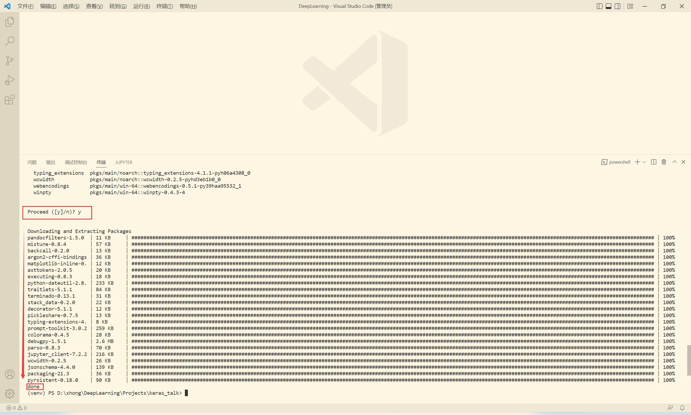
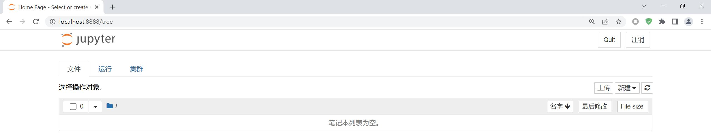
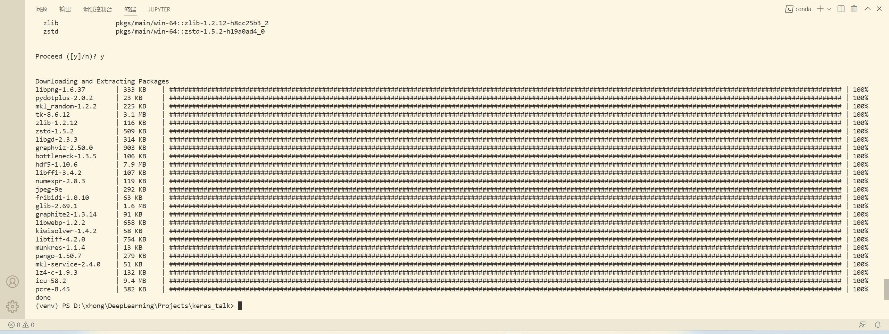

# Keras 安装配置

## 1 安装 Miniconda / Anaconda

&emsp;&emsp;书接上回：[Win11 安装配置 Miniconda](../python/01conda/Win11-Miniconda-install.md)


## 2 创建并激活虚拟环境

### 2.1 创建虚拟环境

> 创建名为 krs01 的 python3.8 虚拟环境

```shell
conda create -n krs01 python=3.8
```

### 2.2 激活虚拟环境

> 激活虚拟环境

```shell
conda activate krs01
```


## 3 安装并运行 Jupyter Notebook

### 3.1 安装 ipython 和 notebook

> 使用 conda 在对应的虚拟环境中安装

```shell
conda install -n krs01 ipython notebook
```



### 3.2 运行 Jupyter Notebook

> 运行 jupyter notebook

```shell
jupyter notebook
```

- vscode 终端界面


- 浏览器运行界面



- 注：按 Ctrl + C 关闭 Notebook


## 4 配置 Keras 环境

### 4.1 安装主要依赖包

```shell
conda install -n krs01 numpy matplotlib pandas pydotplus h5py scikit-learn
```



```shell
conda install -n krs01 scipy mkl-service libpython m2w64-toolchain
```


### 4.2 安装 TensorFlow

> 安装 TensorFlow

```shell
pip install --ignore-installed --upgrade tensorflow==2.10.0 -i https://pypi.tuna.tsinghua.edu.cn/simple
```

- 在安装 TensorFlow 时，Keras 也会随之安装，不用单独安装，且当前的版本中，TensorFlow 会同时安装 CPU 和 GPU 两个版本。
- `--ignore-installed --upgrade` ：忽略已安装的升级
- `-i https://pypi.tuna.tsinghua.edu.cn/simple `：切换清华源

https://www.tensorflow.org/install/source_windows#gpu

> 用 conda 安装 CUDA、cuDNN

```sh
conda install -c conda-forge cudatoolkit=11.2 cudnn=8.1.0
```

- 这里我们指定安装与 `tensorflow 2.10.0` 匹配的 `CUDA11.2` 和 `cuDNN 8.1.0` 


## 5 安装 CUDA

### 5.1 检查当前版本

> 检查当前 nvidia 显卡版本指令

```shell
nvidia-smi
```

- 此时可以看到当前显卡驱动为 `511.69`，支持的最高 CUDA 版本为 `11.6`


### 5.2 官网下载

- 官网：[CUDA 11.2 下载](https://developer.nvidia.com/cuda-11.2.0-download-archive?target_os=Windows&target_arch=x86_64&target_version=10)


### 5.3 安装注意

&emsp;&emsp;与普通软件安装不同，在安装 CUDA 时，需要设置两次。第一次要求设置临时解压目录，第二次才是设置安装目录，这里建议默认即可，也可以自定义。安装结束后，临时解压文件夹会自动删除。<font style="color:red">切记，使用两次设置的路径不能相同，否则安装后会找不到目录。</font>同时，因为是系统级软件，所以最好全程使用默认的安装位置。

- 解压 CUDA 安装包


- 选择自定义安装


- 取消安装 Visual Studio Integration 组件，防止后续报错


- 使用默认安装路径，不做修改


> 检查是否安装成功

- 检查当前 CUDA 版本指令

```shell
nvcc -V
```

- 输出版本即为成功


## 6 安装 cuDNN

### 6.1 官网下载

- 官网：[cuDNN 下载](https://developer.nvidia.com/zh-cn/cudnn)，这里 <font style="color:red">必须登录账号</font> 才能继续下载。


- 首次使用需要注册账号并输入详细信息


### 6.2 下载对应版本

&emsp;&emsp;[cuDNN下载](https://developer.nvidia.com/rdp/cudnn-archive)，因为之前安装的 CUDA 版本号为 11.2，所以我们选择对应版本的 cuDNN 进行下载。


### 6.3 安装 cuDNN

&emsp;&emsp;上面我们下载的内容实际上是压缩包文件，本质上就是对 CUDA 的关于深度学习的补充文件，我们需要将解压后的文件内容找到 CUDA Development 安装目录中对应目录，打开文件夹 <font style="color:red">逐一复制内部内容</font>。需要注意的是：

`lib` 相关文件需要复制到 `lib\x64` 目录中。

1、`cuDNN8.1.0` 解压包内容


2、CUDA Development 安装目录内容


3、逐个复制内容到对应目录中


## 7 配置环境变量

&emsp;&emsp;在成功安装 CUDA 后，系统会自动添加环境变量


> 在环境变量中添加如下内容

&emsp;&emsp;如若在系统环境变量中没有，则需要自行添加如下内容。【注：此处安装目录以实际情况为准】

```
C:\Program Files\NVIDIA GPU Computing Toolkit\CUDA\v11.2\bin
C:\Program Files\NVIDIA GPU Computing Toolkit\CUDA\v11.2\include
C:\Program Files\NVIDIA GPU Computing Toolkit\CUDA\v11.2\lib
C:\Program Files\NVIDIA GPU Computing Toolkit\CUDA\v11.2\libnvvp
```


## 8 测试安装环境

```python
import scipy
import numpy
import matplotlib
import pandas
import sklearn
import pydotplus
import h5py

import theano
import tensorflow
import keras

print('scipy ' + scipy.__version__)
print('numpy ' + numpy.__version__)
print('matplotlib ' + matplotlib.__version__)
print('pandas ' + pandas.__version__)
print('sklearn ' + sklearn.__version__)
print('h5py ' + h5py.__version__)

print('theano ' + theano.__version__)
print('tensorflow ' + tensorflow.__version__)
print('keras ' + keras.__version__)
```


## 参考文章

1. [Build from source on Windows  | TensorFlow](https://www.tensorflow.org/install/source_windows#cpu)
2. [CSDN - CUDA安装](https://blog.csdn.net/oxygenh2o/article/details/122145588)
3. [CSDN - CUDA安装教程（超详细）](https://blog.csdn.net/m0_45447650/article/details/123704930)
4. [CSDN - 深度学习环境搭建超级详解（Miniconda、pytorch安装）](https://blog.csdn.net/weixin_44263674/article/details/125516305)
5. [CSDN - TensorFlow 2.8.0安装 + Miniconda + GPU支持](https://blog.csdn.net/encbkakw1/article/details/123702213)
6. [知乎 - 深度学习GPU环境CUDA详细安装过程（简单快速有效）](https://zhuanlan.zhihu.com/p/358737417)

