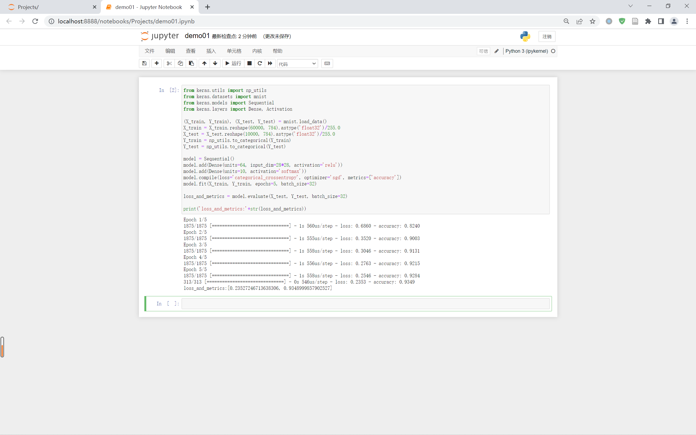
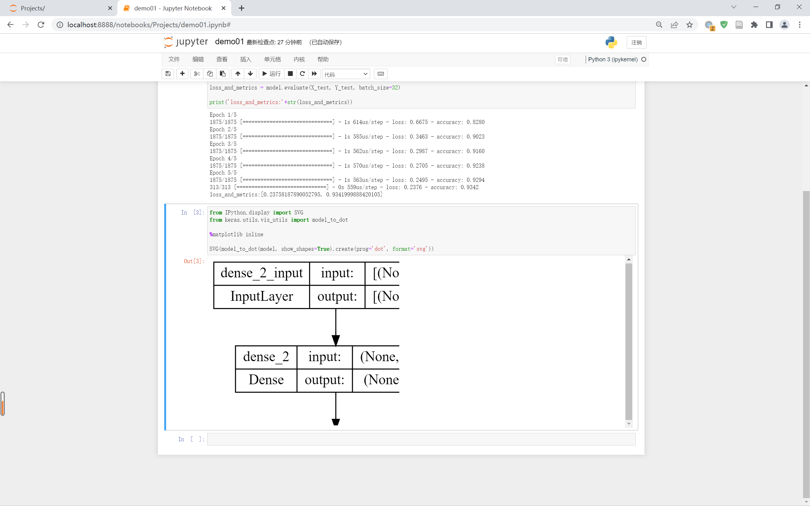
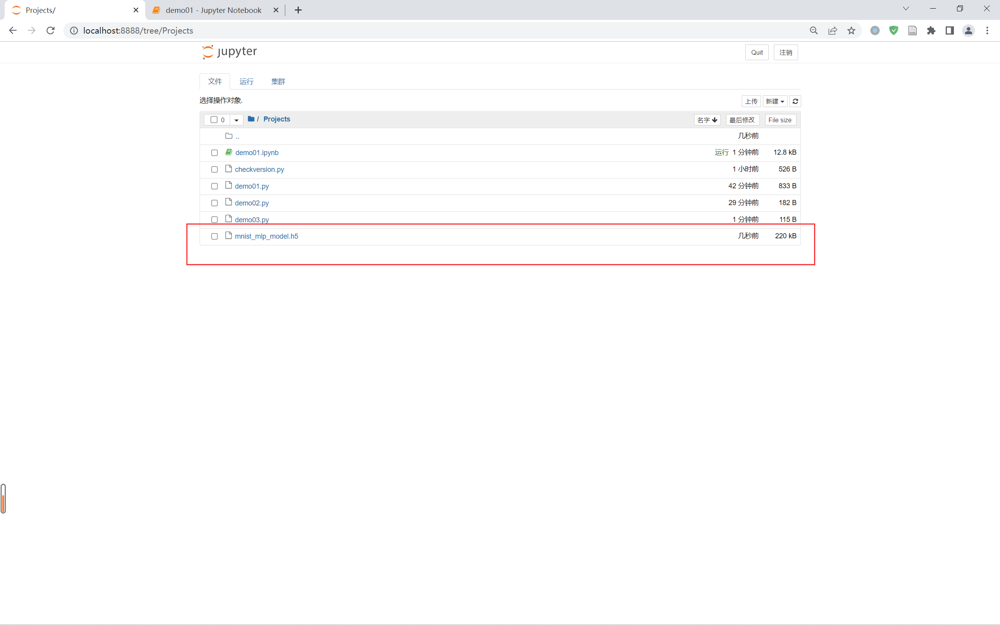

# 0101 测试 Keras 环境

## 1 查看深度学习基本模型驱动

&emsp;&emsp;以下代码基本深度学习模型中，训练手写体数据集并加以评价。

```python
from keras.utils import np_utils
from keras.datasets import mnist
from keras.models import Sequential
from keras.layers import Dense

(X_train, Y_train), (X_test, Y_test) = mnist.load_data()
X_train = X_train.reshape(60000, 784).astype('float32')/255.0
X_test = X_test.reshape(10000, 784).astype('float32')/255.0
Y_train = np_utils.to_categorical(Y_train)
Y_test = np_utils.to_categorical(Y_test)

model = Sequential()
model.add(Dense(units=64, input_dim=28*28, activation='relu'))
model.add(Dense(units=10, activation='softmax'))
model.compile(loss='categorical_crossentropy', optimizer='sgd', metrics=['accuracy'])
model.fit(X_train, Y_train, epochs=5, batch_size=32)

loss_and_metrics = model.evaluate(X_test, Y_test, batch_size=32)

print('loss_and_metrics:'+str(loss_and_metrics))
```

&emsp;&emsp;如果没有错误正常运行，则会显示以下内容。




## 2 查看深度学习基本模型驱动

```python
from IPython.display import SVG
from keras.utils.vis_utils import model_to_dot

%matplotlib inline

SVG(model_to_dot(model, show_shapes=True).create(prog='dot', format='svg'))
```




## 3 查看深度学习模型存储功能

```python
from keras.models import load_model

model.save('mnist_mlp_model.h5')
model = load_model('mnist_mlp_model.h5')
```




上一节：无

下一节：[0102 深度学习基本概念](./0102深度学习基本概念.md)
