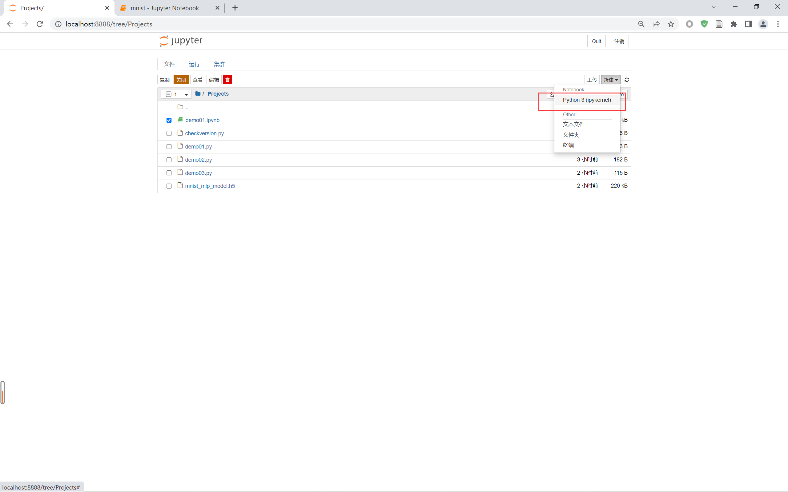
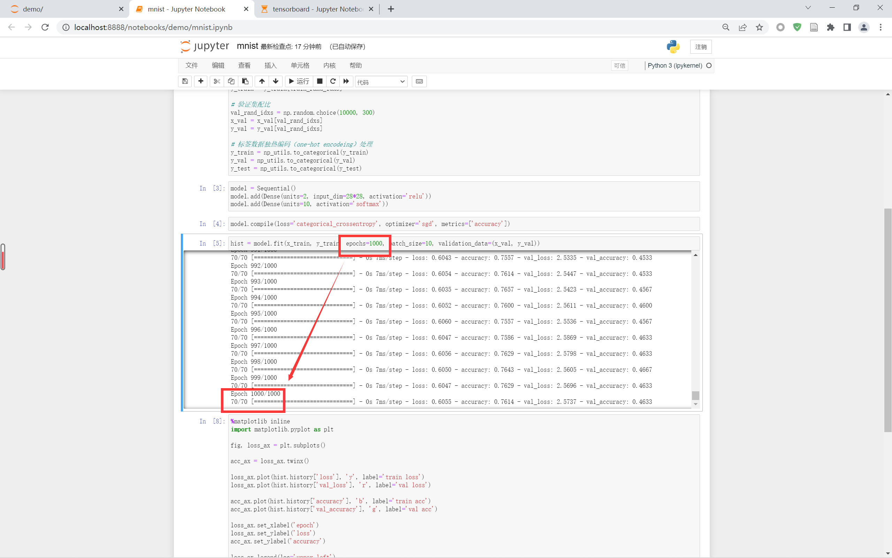
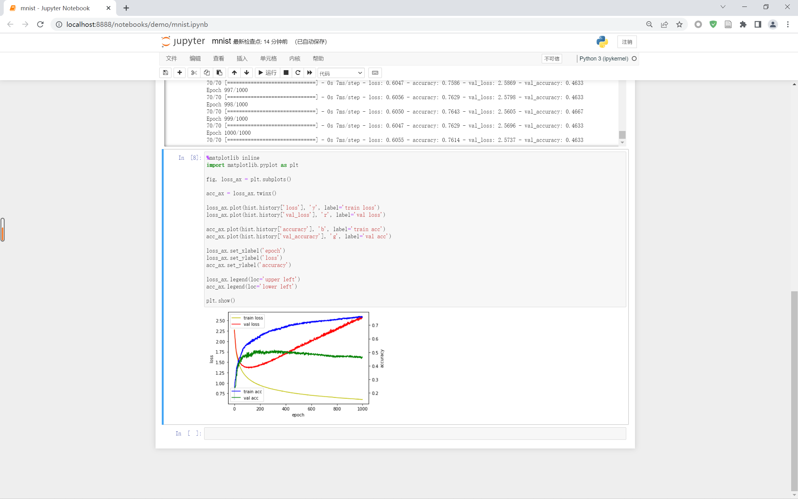
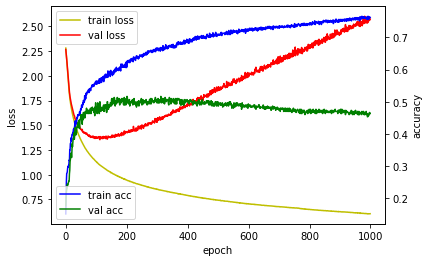

# 0201 多层认知神经网络模型训练 MNIST 手写数据集

说明：以下代码均是在 jupyter 中运行的。

## 1 启动 jupyter 并创建新项目

### 1.1 启动 jupyter

```shell
jupyter notebook
```

### 1.2 创建新项目




## 2 示例代码

### 2.1 调用相关包

```python
from keras.utils import np_utils
from keras.datasets import mnist
from keras.models import Sequential
from keras.layers import Dense, Activation
import numpy as np

np.random.seed(3)
```

### 2.2 生成数据集

```python
# 调用训练集和测试集
(x_train, y_train), (x_test, y_test) = mnist.load_data()

# 分离训练集和测试集
x_val = x_train[50000:]
y_val = y_train[50000:]
x_train = x_train[:50000]
y_train = y_train[:50000]

# 数据集预处理
x_train = x_train.reshape(50000, 784).astype('float32')/255.0
x_val = x_val.reshape(10000, 784).astype('float32')/255.0
x_test = x_test.reshape(10000, 784).astype('float32')/255.0

# 训练集配比
train_rand_idxs = np.random.choice(50000, 700)
x_train = x_train[train_rand_idxs]
y_train = y_train[train_rand_idxs]

# 验证集配比
val_rand_idxs = np.random.choice(10000, 300)
x_val = x_val[val_rand_idxs]
y_val = y_val[val_rand_idxs]

# 标签数据独热编码（one-hot encodeing）处理
y_train = np_utils.to_categorical(y_train)
y_val = np_utils.to_categorical(y_val)
y_test = np_utils.to_categorical(y_test)
```

### 2.3 模型构建

```python
model = Sequential()
model.add(Dense(units=2, input_dim=28*28, activation='relu'))
model.add(Dense(units=10, activation='softmax'))
```

### 2.4 设置模型训练过程

```python
model.compile(loss='categorical_crossentropy', optimizer='sgd', metrics=['accuracy'])
```

### 2.5 训练模型

```python
hist = model.fit(x_train, y_train, epochs=1000, batch_size=10, validation_data=(x_val, y_val))
```

&emsp;&emsp;此处我们设置训练 1000 次。



### 2.6 查看训练过程

```python
%matplotlib inline
import matplotlib.pyplot as plt

fig, loss_ax = plt.subplots()

acc_ax = loss_ax.twinx()

loss_ax.plot(hist.history['loss'], 'y', label='train loss')
loss_ax.plot(hist.history['val_loss'], 'r', label='val loss')

acc_ax.plot(hist.history['accuracy'], 'b', label='train acc')
acc_ax.plot(hist.history['val_accuracy'], 'g', label='val acc')

loss_ax.set_xlabel('epoch')
loss_ax.set_ylabel('loss')
acc_ax.set_ylabel('accuracy')

loss_ax.legend(loc='upper left')
acc_ax.legend(loc='lower left')

plt.show()
```

&emsp;&emsp;**【注】**：这里可能会因为版本问题导致，在 history 函数中的 acc 缩写无法被识别成 accuracy，如果 acc 报错，可以修改为 accuracy。

- jupyter 界面



- 训练模型图



&emsp;&emsp;此时，我们根据图像可以观察出，验证集的误差在 100 个训练周期后开始上升，出现了过拟合现象；同时，验证集的精度也开始下降，所以训练周期控制在 100 左右为此次训练的最佳区间。


## 参考文章

1. [CSDN - KeyError: ‘acc‘、KeyError: ‘val_acc‘、等报错信息的解决方法](https://blog.csdn.net/ccj211985/article/details/121582228)
2. 


上一节：[0102 深度学习基本概念](../01/0102深度学习基本概念.md)

下一节：[0202 TensorBoard 监控模型](./0202TensorBoard监控模型.md)

