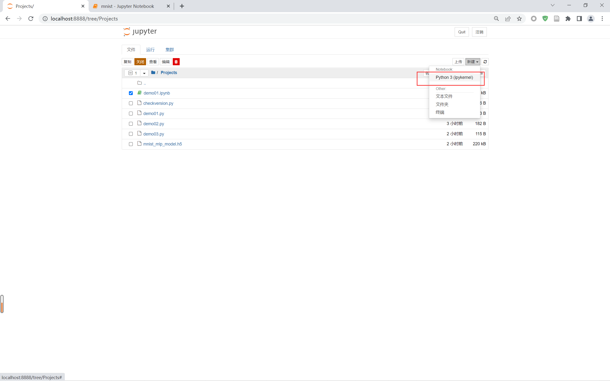

# 0202 TensorBoard 监控模型

说明：以下代码均是在 jupyter 中运行的。

## 1 查看 Keras 配置文件

```shell
cat ~/.keras/keras.json
```


&emsp;&emsp;这里我们可以看到 Keras 已经默认使用了 TensorFlow 作为后端引擎。

## 2 启动 jupyter 并创建新项目

### 2.1 启动 jupyter

```shell
jupyter notebook
```

### 2.2 创建新项目




## 3 示例代码

注：以下代码均在同一个 `*.ipynb` 文件中运行的。

### 3.1 调用相关包

```python
import keras
from keras.utils import np_utils
from keras.datasets import mnist
from keras.models import Sequential
from keras.layers import Dense, Activation
import numpy as np

np.random.seed(3)
```

### 3.2 生成数据集

```python
# 调用训练集和测试集
(x_train, y_train), (x_test, y_test) = mnist.load_data()

# 分离训练集和测试集
x_val = x_train[50000:]
y_val = y_train[50000:]
x_train = x_train[:50000]
y_train = y_train[:50000]

# 数据集预处理
x_train = x_train.reshape(50000, 784).astype('float32')/255.0
x_val = x_val.reshape(10000, 784).astype('float32')/255.0
x_test = x_test.reshape(10000, 784).astype('float32')/255.0

# 训练集 & 验证集配比
train_rand_idxs = np.random.choice(50000, 700)
val_rand_idxs = np.random.choice(10000, 300)

x_train = x_train[train_rand_idxs]
y_train = y_train[train_rand_idxs]
x_val = x_val[val_rand_idxs]
y_val = y_val[val_rand_idxs]

# 标签数据独热编码处理
y_train = np_utils.to_categorical(y_train)
y_val = np_utils.to_categorical(y_val)
y_test = np_utils.to_categorical(y_test)
```

### 3.3 模型构建

```python
model = Sequential()
model.add(Dense(units=2, input_dim=28*28, activation='relu'))
model.add(Dense(units=10, activation='softmax'))
```

### 3.4 设置模型训练过程

```python
model.compile(loss='categorical_crossentropy', optimizer='sgd', metrics=['accuracy'])
```

### 3.5 训练模型

```python
tb_hist = keras.callbacks.TensorBoard(log_dir='./graph', histogram_freq=0, write_graph=True, write_images=True)
model.fit(x_train, y_train, epochs=1000, batch_size=10, validation_data=(x_val, y_val), callbacks=[tb_hist])
```

&emsp;&emsp;这里我们同样训练 1000 次。


### 3.6 查看训练过程

- 启动新的控制台程序，运行如下指令

```shell
tensorboard --logdir=D:/demo/DeepLearning/Projects/graph
```

&emsp;&emsp;注：这里 graph 文件的位置 <font style="color:red">必须使用其所在的绝对路径</font>。

- 控制台界面


- TensorBoard 训练监控结果曲线图


&emsp;&emsp;此时显示的两幅图像，一个是周期训练精度图，另一个是周期训练误差图，可以清晰地观察到训练集和验证集的对比。


## 参考文章

1. [CSDN - KeyError: ‘acc‘、KeyError: ‘val_acc‘、等报错信息的解决方法](https://blog.csdn.net/ccj211985/article/details/121582228)
2. [CSDN - 解决Tensorflow: Could not load dynamic library ‘cudart64_101.dll‘dynamic library ‘cublas64_10.dll‘问题](https://blog.csdn.net/weixin_43031092/article/details/108428238)
3. 


上一节：[0201 训练 MNIST 手写体数据集](./0201训练MNIST手写体数据集.md)

下一节：[0203 回调函数监控训练状态](./0203回调函数监控训练状态.md)

