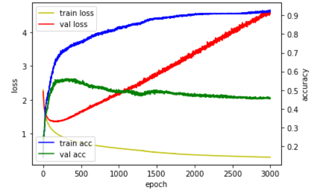
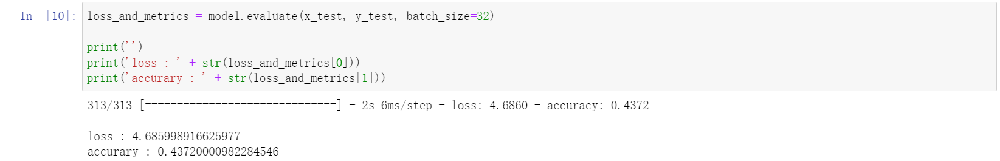
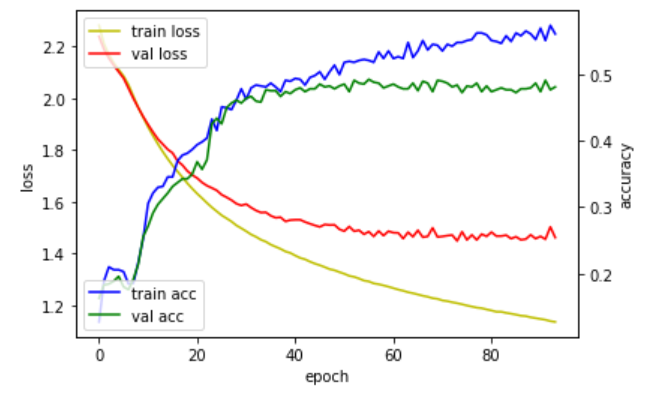
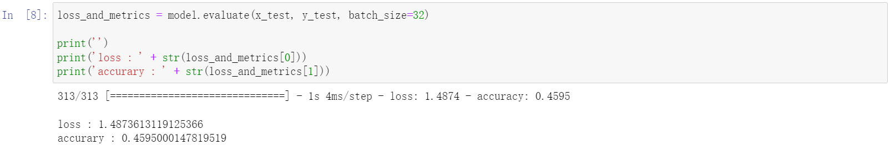

# 0204 训练早停

## 1 过拟合模型

&emsp;&emsp;为了防止过拟合现象，控制训练在某一节点提前结束训练过程。为了形成对比，我们先进行一次过拟合模型演示，随后再对模型进行早停法调整。


## 2 过拟合模型演示

注：以下代码均在同一个 `*.ipynb` 文件中运行的。

### 2.1 调用相关包

```python
import keras
from keras.utils import np_utils
from keras.datasets import mnist
from keras.models import Sequential
from keras.layers import Dense, Activation
import numpy as np

np.random.seed(3)
```

### 2.2 生成数据集

```python
# 调用训练集和测试集
(x_train, y_train), (x_test, y_test) = mnist.load_data()

# 分离训练集和测试集
x_val = x_train[50000:]
y_val = y_train[50000:]
x_train = x_train[:50000]
y_train = y_train[:50000]

# 数据集预处理
x_train = x_train.reshape(50000, 784).astype('float32')/255.0
x_val = x_val.reshape(10000, 784).astype('float32')/255.0
x_test = x_test.reshape(10000, 784).astype('float32')/255.0

# 训练集 & 验证集配比
train_rand_idxs = np.random.choice(50000, 700)
val_rand_idxs = np.random.choice(10000, 700)

x_train = x_train[train_rand_idxs]
y_train = y_train[train_rand_idxs]
x_val = x_val[val_rand_idxs]
y_val = y_val[val_rand_idxs]

# 标签数据独热编码处理
y_train = np_utils.to_categorical(y_train)
y_val = np_utils.to_categorical(y_val)
y_test = np_utils.to_categorical(y_test)
```

### 2.3 模型构建

```python
model = Sequential()
model.add(Dense(units=2, input_dim=28*28, activation='relu'))
model.add(Dense(units=10, activation='softmax'))
```

### 2.4 设置模型训练过程

```python
model.compile(loss='categorical_crossentropy', optimizer='sgd', metrics=['accuracy'])
```

### 2.5 训练模型

```python
hist = model.fit(x_train, y_train, epochs=3000, batch_size=10, validation_data=(x_val, y_val))
```

### 2.6 查看训练过程

```python
%matplotlib inline
import matplotlib.pyplot as plt

fig, loss_ax = plt.subplots()

acc_ax = loss_ax.twinx()

loss_ax.plot(hist.history['loss'], 'y', label='train loss')
loss_ax.plot(hist.history['val_loss'], 'r', label='val loss')

acc_ax.plot(hist.history['accuracy'], 'b', label='train acc')
acc_ax.plot(hist.history['val_accuracy'], 'g', label='val acc')

loss_ax.set_xlabel('epoch')
loss_ax.set_ylabel('loss')
acc_ax.set_ylabel('accuracy')

loss_ax.legend(loc='upper left')
acc_ax.legend(loc='lower left')

plt.show()
```

- 过拟合模型的训练监控结果曲线图



### 2.7 模型评价

```python
loss_and_metrics = model.evaluate(x_test, y_test, batch_size=32)

print('')
print('loss : ' + str(loss_and_metrics[0]))
print('accurary : ' + str(loss_and_metrics[1]))
```

- 过拟合模型的模型评价




## 3 设置早停

### 3.1 早停回调函数 `EarlyStopping()`

&emsp;&emsp;为了形成对比，我们只修改训练模型部分，其余部分代码基本一致。

&emsp;&emsp;同时，由于验证集误差所具有的波动性，我们不能在误差开始回升时马上停止训练，否则就会出过早终止训练没有达到尽可能小的误差。

&emsp;&emsp;我们需要在持续回升时，再停止训练，这里我们设置参数为 `patience = 20` ，即持续 20 个训练周期后，再停止训练。

```python
from keras.callbacks import EarlyStopping
early_stopping = EarlyStopping(patience = 20)
hist = model.fit(x_train, y_train, epochs=3000,batch_size=10,validation_data=(x_val, y_val), callbacks=[early_stopping])
```

### 3.2 早停法下的训练结果

- 早停法下的训练监控结果曲线图



- 早停法下的模型评价



### 3.3 数据对比

&emsp;&emsp;在合适的时间终止训练的模型，精度要高于过拟合模型，数据对比表如下。

| 数据类型 | 过拟合模型 | 适时早停 |
| :------: | :--------: | :------: |
|   误差   |    4.69    |   1.49   |
|   精度   |    0.44    |   0.46   |


上一节：[0203 回调函数监控训练状态](./0203 回调函数监控训练状态.md)

下一节：[暂无]()

