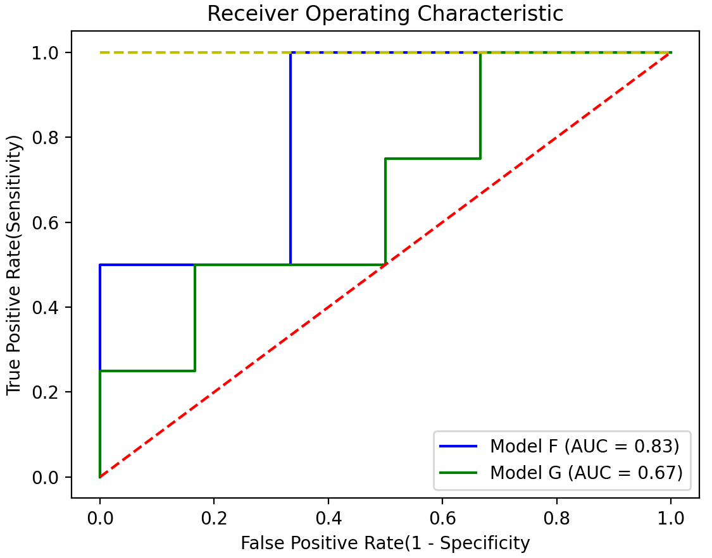

# 0205 AUC 指标计算

## 1 基本概念

- ROC曲线：通过图的形式呈现敏感度与特异度间的变化关系。
- AUC：ROC曲线下方的面积，可以很好地比较模型的性能。

## 2 示例源码

```python
import matplotlib.pyplot as plt
import numpy as np
from sklearn.metrics import roc_curve, auc

class_F = np.array([0, 0, 0, 0, 1, 1, 0, 0, 1, 1])
proba_F = np.array([0.05, 0.15, 0.15, 0.25, 0.35, 0.45, 0.55, 0.65, 0.95, 0.95])

class_G = np.array([0, 0, 1, 0, 1, 0, 0, 1, 0, 1])
proba_G = np.array([0.05, 0.05, 0.15, 0.25, 0.35, 0.45, 0.65, 0.75, 0.85, 0.95])

false_positive_rate_F, true_positive_rate_F, thresholds_F = roc_curve(class_F, proba_F)
false_positive_rate_G, true_positive_rate_G, thresholds_G = roc_curve(class_G, proba_G)
roc_auc_F = auc(false_positive_rate_F, true_positive_rate_F)
roc_auc_G = auc(false_positive_rate_G, true_positive_rate_G)

plt.title('Receiver Operating Characteristic')
plt.xlabel('False Positive Rate(1 - Specificity')
plt.ylabel('True Positive Rate(Sensitivity)')

plt.plot(false_positive_rate_F, true_positive_rate_F, 'b', label='Model F (AUC = %0.2f)' % roc_auc_F)
plt.plot(false_positive_rate_G, true_positive_rate_G, 'g', label='Model G (AUC = %0.2f)' % roc_auc_G)
plt.plot([0, 1], [1, 1], 'y--')
plt.plot([0, 1], [0, 1], 'r--')

plt.legend(loc='lower right')
plt.show()
```

- 绘制图像

