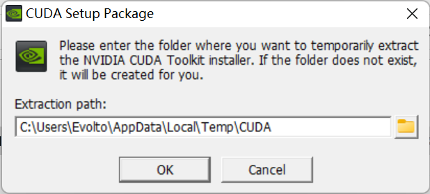
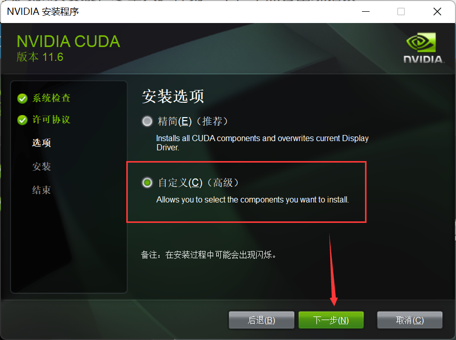
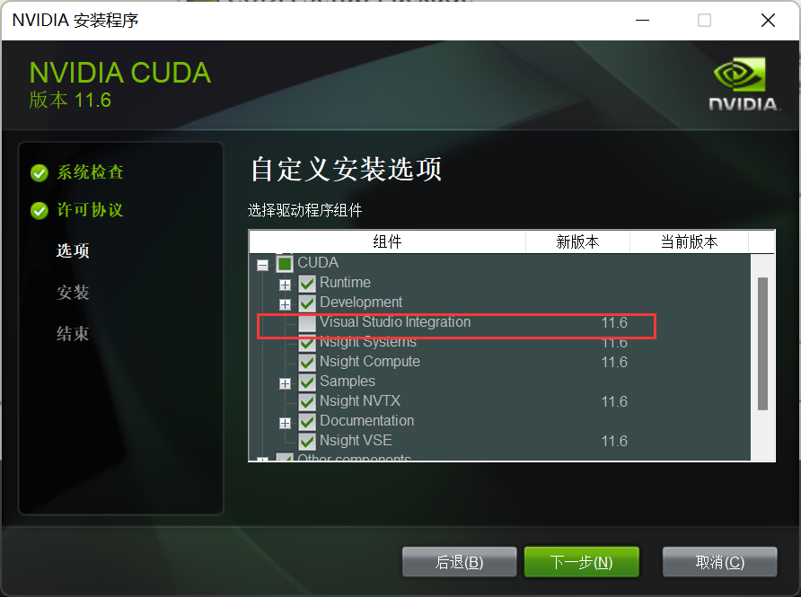
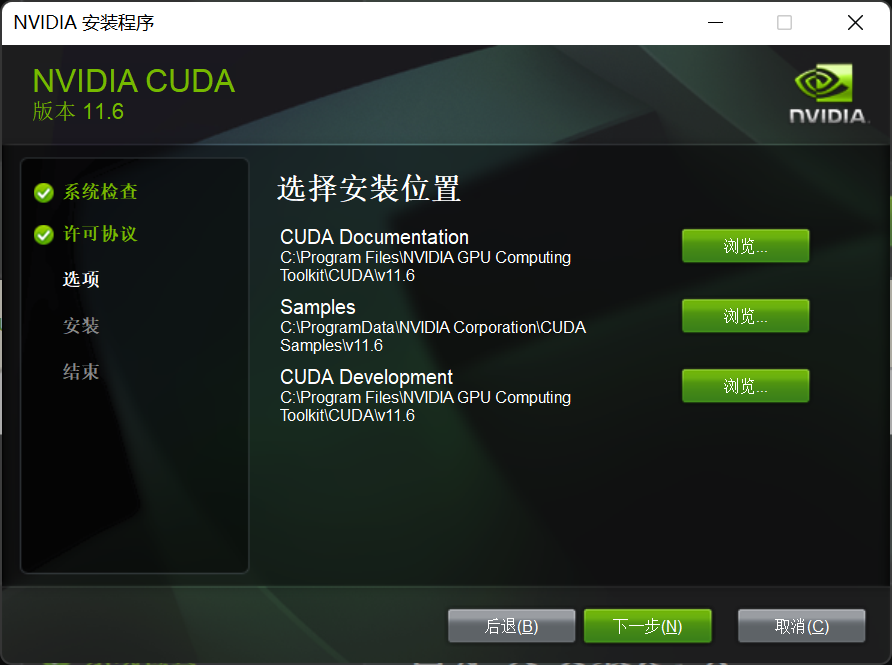

# PyTorch 安装配置

## 1 安装 Miniconda / Anaconda

&emsp;&emsp;书接上回：[Win11 安装配置 Miniconda](../python/01conda/Win11-Miniconda-install.md)


## 2 创建并激活虚拟环境

### 2.1 创建虚拟环境

> 创建名为 pytorchtest 的 python3.9 虚拟环境

```shell
conda create -n pytorchtest python=3.9
```


### 2.2 激活虚拟环境

> 激活虚拟环境

```shell
conda activate pytorchtest
```


## 3 安装 CUDA

### 3.1 检查当前版本

> 检查当前 nvidia 显卡版本指令

```shell
nvidia-smi
```

- 此时可以看到当前显卡驱动为 `511.69`，支持的最高 CUDA 版本为 `11.6`


### 3.2 官网下载

- 官网：[CUDA 下载](https://developer.nvidia.com/cuda-toolkit-archive)


### 3.3 安装注意

&emsp;&emsp;与普通软件安装不同，在安装 CUDA 时，需要设置两次。第一次要求设置临时解压目录，第二次才是设置安装目录，这里建议默认即可，也可以自定义。安装结束后，临时解压文件夹会自动删除。<font style="color:red">切记，使用两次设置的路径不能相同，否则安装后会找不到目录。</font>同时，因为是系统级软件，所以最好全程使用默认的安装位置。

- 解压 CUDA 安装包



- 选择自定义安装



- 取消安装 Visual Studio Integration 组件，防止后续报错



- 使用默认安装路径，不做修改



> 检查是否安装成功

- 检查当前 CUDA 版本指令

```shell
nvcc -V
```

- 输出版本即为成功


##  4 安装 cuDNN

### 4.1 官网下载

- 官网：[cuDNN 下载](https://developer.nvidia.com/zh-cn/cudnn)，这里 <font style="color:red">必须登录账号</font> 才能继续下载。


- 首次使用需要注册账号并输入详细信息


### 4.2 下载对应版本

&emsp;&emsp;[cuDNN下载](https://developer.nvidia.com/rdp/cudnn-archive)，因为之前安装的 CUDA 版本号为 11.6，所以我们选择对应版本的 cuDNN 进行下载。


### 4.3 安装 cuDNN

&emsp;&emsp;上面我们下载的内容实际上是压缩包文件，本质上就是对 CUDA 的关于深度学习的补充文件，我们需要将解压后的文件内容找到 CUDA Development 安装目录中对应目录，打开文件夹 <font style="color:red">逐一复制内部内容</font>。需要注意的是：

`lib` 相关文件需要复制到 `lib\x64` 目录中。

- cuDNN 解压包内容


- CUDA Development 安装目录内容


## 5 配置环境变量

&emsp;&emsp;在成功安装 CUDA 后，系统会自动添加环境变量


> 在环境变量中添加如下内容

&emsp;&emsp;如若在系统环境变量中没有，则需要自行添加如下内容。【注：此处安装目录以实际情况为准】

```
C:\Program Files\NVIDIA GPU Computing Toolkit\CUDA\v11.6\bin
C:\Program Files\NVIDIA GPU Computing Toolkit\CUDA\v11.6\include
C:\Program Files\NVIDIA GPU Computing Toolkit\CUDA\v11.6\lib
C:\Program Files\NVIDIA GPU Computing Toolkit\CUDA\v11.6\libnvvp
```


## 6 安装 torch & torchvision

### 6.1 [下载地址](https://download.pytorch.org/whl/torch_stable.html)

&emsp;&emsp;进入网址，选择适合自己版本的进行下载。保存到路径稍浅的文件夹里面，方面后续调用。


> 版本号说明

- cu116：表示 cuda 版本为 11.6（及以上都可以）
- torch-1.12.1：表示 torch 版本为 1.12.1
- cp39：表示 python 版本为 3.9
- win：表示 windows 系统


### 6.2 在 Miniconda 中安装

> 转到下载目录

&emsp;&emsp;`Ctrl+R` 后调出 cmd 命令行，需要先激活虚拟环境，再转入到下载目录。【注：此处目录以实际情况为准】

```shell
cd ../../
D:
cd Downloads
```


> 安装 torch

```shell
pip install 输入torch并按下Tab键自动补全
```


> 安装 torchvision

```
pip install 输入torchvision并按下Tab键自动补全
```

- 注：这里会安装一些必要相关库，所以显示条文会长一些。


## 7 验证是否安装成功

> 调用 Python

```shell
python
```


> 检查 torch 版本

```python
import torch
print(torch.__version__) #注意，此处下划线"_"是两个下划线"__"
print(torch.cuda.is_available())
```


## 参考文章

1. [CSDN - 深度学习环境搭建超级详解（Miniconda、pytorch安装）](https://blog.csdn.net/weixin_44263674/article/details/125516305)

