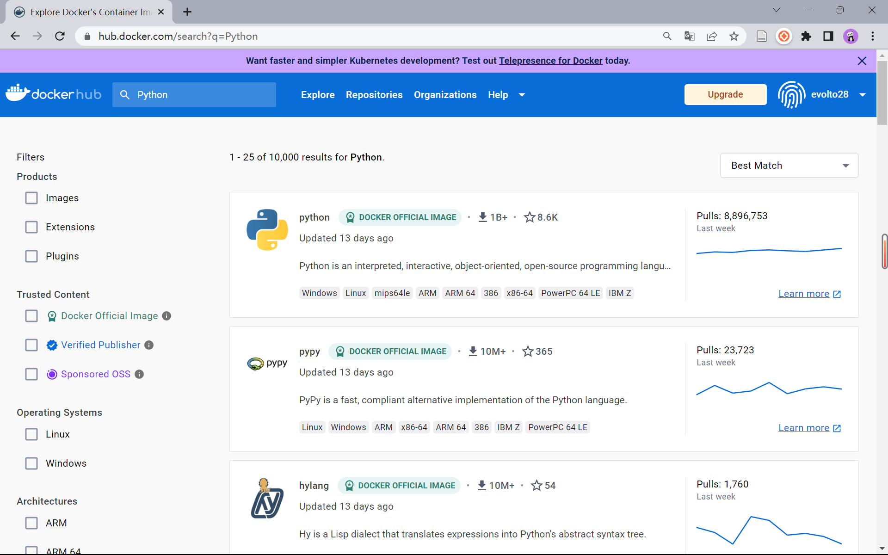

# Docker 学习


## Docker 安装

下载 Docker Desktop

https://docs.docker.com/desktop/install/windows-install/


安装 VS Code Docker 插件


在应用根目录创建 `Dockerfile` 文件

```dockerfile
FROM pangeo/pangeo-notebook:2021.05.15
WORKDIR /app
COPY . .
RUN pip install -r requirements.txt -i https://mirrors.aliyun.com/pypi/simple/
```

- Python 官方镜像：版本号
- 指定之后所有 Docker 命令的工作路径
- `COPY <本地路径> <目标路径>`：将所有程序拷贝到 Docker 镜像工作目录中
- 允许运行任意的 shell 命令

Docker Hub 提供很多镜像：https://hub.docker.com/search?q=Python




创建镜像

```
docker build -t open-geo .
```

- `-t`：指定镜像名，在当前目录下寻找 `Dockerfile`


启动容器

```sh
docker run -it --rm -p 8888:8888 -d open-geo jupyter lab --ip 0.0.0.0
```

- `-p <容器端口>:<主机端口>`：将容器上的端口映射到本地主机
- `-d <容器名称>` ：让容器在后台运行，容器输出不显示在控制台


```
#（选择1）在Linux环境下，用`--net=host`更方便快捷
docker run --rm -it --net=host open-geo
#（选择2）在macOS/windows环境下，只能用-p选项将容器上的端口(例如50923)暴露给主机上的端口
docker run -it --rm -p 50923:50923 open-geo
```


```sh
docker run -it --rm -p 8888:8888 -v E:/github/open-geo-tutorial/:/home/jovyan/repo/ pangeo/pangeo-notebook:2021.05.15 jupyter lab --ip 0.0.0.0
```

这段代码使用了 docker run 命令，它可以从一个镜像创建并运行一个新的容器。这个命令有很多选项：

- -it 表示以交互模式运行容器，即可以在容器中输入命令。
- --rm 表示在容器退出后自动删除容器。
- -p 8888:8888 表示将容器的 8888 端口映射到主机的 8888 端口。
- -v E:/github/open-geo-tutorial/:/home/jovyan/repo/ 表示将主机的 E:/github/open-geo-tutorial/ 目录挂载到容器的 /home/jovyan/repo/ 目录。
- pangeo/pangeo-notebook:2021.05.15 表示要使用的镜像的名称和标签。
- jupyter lab --ip 0.0.0.0 表示要在容器中执行的命令，即启动 jupyter lab 并指定 ip 地址为 0.0.0.0。

综上所述，这段代码的作用是从 pangeo/pangeo-notebook:2021.05.15 镜像创建并运行一个交互式的容器，将主机和容器的 8888 端口连接起来，将主机的一个目录挂载到容器中，并在容器中启动 jupyter lab。

```
172032d3ef1ce8e053d71681eb0343a3d87a3e5597ebd56b
```


## Docker 基本命令

查看最近1000行的容器日志

```
docker logs --tail 1000 <容器ID或名称>
```
