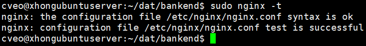

# 项目部署全过程记录

相关文档：[阿里云部署踩坑记录](aliyun部署踩坑记录.md)

## 一、项目所用工具 
`supervisor + gunicorn + django + nginx + vue`
### 项目&环境说明
1. 前端：Vue
2. 后端：Django
3. 服务器：阿里云服务器 Ubuntu20.04.4 Server
4. 数据库：阿里云 MySQL 数据库
5. 服务器连接：Xshell7
6. 服务器文件管理：Xftp7

### 部署环境配置
1. 进程管理：[supervisor](http://supervisord.org/)
2. 运行 Django 项目：[gunicorn](https://gunicorn.org/)
3. 管理静态资源：[nginx](https://nginx.org/en/)
4. 虚拟环境管理：[pipenv](https://docs.pipenv.org/)

## 二、创建用户及项目目录
### 2.1 创建用户


&emsp;&emsp;连接云端数据库后，当前用户是 root 用户，Ubuntu 不提倡直接在 root 用户上进行操作，所以我们要创建一个自己的用户进行后续操作。
<br/>
&emsp;&emsp;创建用户时会自动为创建的用户指定主目录、系统 shell 版本，并配置用户密码。

<div style="height:15px;"></div>

> 创建名为 cveo 的普通用户

```
adduser cveo
```

<div align="center">
	
</div>


### 2.2 授予权限并切换用户

> 赋予 cveo 用户 sudo权限

```
usermod -aG sudo cveo
```

&emsp;注：在 Linux 中没有消息就是好消息。

> 切换 cveo 用户并完全切换工作环境

```
su - cveo
```

### 2.3 创建项目目录

> 项目目录结构


&emsp;&emsp;通过之前的操作，我们已经切换到了 cveo 用户的工作环境中。此时的环境在 ~/ 即 /home/cveo/ 目录中。
<br/>
&emsp;&emsp;在 Linux 中 /home/cveo/ 或 ~/ 两个是一个意思。

<div style="height:15px;"></div>

```
~/dat
   ├── /front (前端代码)
   └── /backend (后端代码)
		└── /.venv (虚拟环境)
   ├── /db (将数据库备份以及存储置于此处)
   └── /scripts (启动脚本等)
```

> mkdir 命令说明


&emsp;&emsp;mkdir 只能创建指定的文件夹
<br/>
&emsp;&emsp;mkdir -p 创建文件夹时可以把全路径的文件夹都创建好

<div style="height:15px"></div>

> 创建项目目录

```
mkdir -p ~/dat/backend/.venv
mkdir ~/dat/front
mkdir ~/dat/db
mkdir ~/dat/scripts
```

### 2.4 查看项目目录

> 转到 dat 目录

```
cd ~/dat
```

> 查看该目录下文件列表

```   
ll          
```

<div align="center">
	
</div>


## 三、安装 git 并克隆远程仓库

&emsp;&emsp;云端的服务器中初始没有安装 git，所以需要先进行全局安装。
第一次使用 git 需要配置用户名和邮箱。


> 全局安装 git

```
sudo apt-get install git
```

> 转到后端项目根目录
```
cd ~/dat/backend
```

> 配置用户名&邮箱 (默认局部配置)
```
git config user.name '***'
git config user.email '***@**.com'
```

> clone 远程仓库
```
git clone 远程仓库地址
```


&emsp;&emsp;此时后端的 Django 项目已经克隆到了配置好的后端目录位置。
前端的 vue 项目可以现在本地打包成 dist 文件，然后通过 Xftp7 直接传送到 ~/dat/front 目录下即可。


## 四、配置后端 python 环境
### 4.1 安装 Python3.9


&emsp;&emsp;因为 Ubuntu 20.04 LTS 默认 python 版本为 3.8.10，
而本次项目开发环境使用 python3.9，所以需要另外安装。


> 刷新安装源

```
sudo apt-get update
```

&emsp;注：建议每次安装新软件时，都操作一次。

> APT 安装 Python3.9

```
sudo apt install python3.9
```

> 检查安装情况

```
python3.9 --version
or
python3.9 -V
```

> 修改 Python3 默认版本


&emsp;&emsp;因为系统默认 python3 使用 python3.8.10，
所以需要添加 python3.9 为 python3 的可选项，并将 python3.9 置于第一位。


```
sudo update-alternatives --install /usr/bin/python3 python3 /usr/bin/python3.9 1
```

> 检查 python3 对应版本

```
python3 -V
```

<div align="center">
	
</div>

### 4.2 安装 pipenv


&emsp;&emsp;pipenv 是一个面向人类的 Python 开发工作流程 (<a href="https://docs.pipenv.org/">官网原文</a>)，它同时结合了 pip 和 virtualenv，可以直接进行对虚拟环境进行安装配置。


> 添加环境变量


&emsp;&emsp;因为在安装中为了安全起见，我们将安装在当前用户目录下，需要先添加环境变量，否则会报如下错误。

<div align="center">
	
</div>


```
echo 'export PATH=/home/cveo/.local/bin:$PATH' >>~/.bashrc
```

```
source ~/.bashrc
```

> 给 cveo 用户安装 pipenv


&emsp;&emsp;此命令属于用户级安装，会将 pipenv 安装到 /home/cveo/.local/bin 路径下


```
pip3 install pipenv --user
```

### 4.3 配置虚拟环境


&emsp;&emsp;创建虚拟环境时，默认会查找当前目录下有没有 .venv 目录。
如果没有，则默认会在用户目录下的 /home/xxxx/.local/share/virtualenvs 中创建虚拟环境目录。
所以我们之前在项目根目录中创建了一个 .venv 文件夹。


#### 4.3.1 创建项目虚拟环境

> 先转到项目根目录下

```
cd ~/dat/backend
```

> 指定使用 Python3.9 创建环境

```
pipenv --python3.9
```


&emsp;&emsp;若项目根目录下有 requirement.txt 文件，pipenv 会读取内部信息生成 Pipfile 文件存放插件版本信息。

<div align="center">
	
</div>

#### 4.3.2 修改 pipenv 安装镜像源

> 使用 vim 编辑器编辑 Pipfile 文件

```
vim Pipfile
```

> 按 i 键进入编辑模式 (只修改下面一行)

```
url = "https://mirrors.aliyun.com/pypi/simple/"
```

> 按 esc 键退出编辑模式，保存并退出

```
:wq!
```

<div align="center">
	
</div>
<div style="height:15px;"></div>

#### 4.3.3 pipenv 的使用

> 激活虚拟环境


&emsp;&emsp;一定要进入项目中 Pipfile 所在目录输入以下命令，激活后命令前面会一直有个 (backend)


```
pipenv shell
```

> 按照 Pipfile 文件中的内容安装对应的包

```
pipenv install
```

<div align="center">
	
</div>
<div style="height:15px;"></div>

> 退出虚拟环境


&emsp;&emsp;退出后命令前面的 (backend) 就没了。


```
exit
```

<div align="center">
	
</div>

### 4.4 安装 Gunicorn 并启动项目


&emsp;&emsp;Gunicorn 是一个用于 UNIX 的 Python WSGI HTTP 服务器。
(<a href="https://gunicorn.org/">官网原文</a>)，在这里为了版本控制，我们安装在将它虚拟环境中。


#### 4.4.1 安装 Gunicorn

> 转到 Django 项目根目录

```
cd ~/dat/backend/
```

> 安装 gunicorn 到项目虚拟环境中

```
pipenv install gunicorn
```

&emsp;注：此时我们已经退出了虚拟环境。

#### 4.4.2 启动项目

> 使用 gunicorn 启动项目

```
pipenv run gunicorn -w 2 Security.wsgi:application -k gthread -b 0.0.0.0:8000 
```

> 参数说明

`-w 2`

启动2个 worker 用于处理请求 (一个 worker 可以理解为一个进程) 通常将 worker 数目设置为 CPU 核心数的 2-4 倍


`Security.wsgi:application`

指定 wsgi application， 其中 wsgi 文件的位置即 appName.wsgi


`-k gthread`

指定每个 worker 处理请求的方式，指定为 gthread 的异步模式能获取比较高的性能


`-b 0.0.0.0:8000`

将服务绑定到 8000 端口，运行通过服务器IP和 8000 端口访问应用


#### 4.4.3 访问网站


&emsp;&emsp;此时，虽然我们成功访问了，但是样式完全乱了。因为此前在本地使用的是 django 自带的开发服务器，它会自动处理静态样式文件，但 Gunicorn 不擅长处理静态文件，需要使用 Nginx 来启动静态样式。

<div align="center">
	
</div>

## 五、配置并运行前端 dist
### 5.1 将打包 dist 上传至服务器


&emsp;&emsp;安装好 Xftp7 后，可以在 Xshell7 中右击数据库连接，使用 Xftp7 打开，然后直接拖拽本地打包好的 dist 文件即可。

<div align="center">
	
</div>

### 5.2 配置 Nginx


&emsp;&emsp;阿里云服务器上已经安装了 Nginx，所以我们直接使用即可。默认配置文件的位置在 /etc/nginx/nginx.conf


> 转到 nginx 配置目录

```
cd /etc/nginx/
```

> 修改 nginx 配置文件

```
sudo vim nginx.conf
```

<div align="center">
	
</div>

> 转到 nginx 项目定制目录


&emsp;&emsp;之前我们已经将项目后端代码和前端 dist 文件上传至服务器安排的对应项目目录，接下来我们需要分别定制项目前后端的 nginx 配置。


```
cd /etc/nginx/conf.d/
```

### 5.3 项目后端的 nginx 配置

> 新建 gunicorn 的 nginx 配置文件

```
sudo vim campus-django-nginx.conf
```

> 详细配置内容

```
server {
    charset utf-8;
    listen 80;
    server_name 服务器的 IP 地址;
    location /static {
        alias /home/cveo/dat/backend/static;
    }
    location / {
        proxy_set_header Host $host;
        proxy_pass http://127.0.0.1:8000;
    }
}
```

### 5.4 项目前端的 nginx 配置

> 新建 vue 的 nginx 配置文件

```
sudo vim campus-vue-nginx.conf
```

> 详细配置内容

```
server {
    listen 8080;
    server_name 服务器的 IP 地址;
    location / {
        root /home/cveo/dat/front/dist;
        try_files $uri $uri/ /index.html; 
        index index.html index.htm index.nginx-debian.html;
        proxy_set_header Host $host;
    }    
    location /admin {
        proxy_pass http://127.0.0.1:8000;
    }
}
```

### 5.5 检查 nginx 配置并重启

> 检查 nginx 配置

```
sudo nginx -t
```

<div align="center">
	
</div>
<div style="height:15px;"></div>

> 重启 nginx (二选一即可)

```
sudo systemctl restart nginx
sudo service nginx restart 
```

### 5.6 收集后端 django 所用的静态文件

> 切换回后端项目根目录

```
cd ~/dat/backend/                             
```

> 未激活虚拟环境时收集静态文件

```
pipenv run python3 manage.py collectstatic
```

> 激活虚拟环境时 (视情况二选一)

```
python3 manage.py collectstatic
```

<div align="center">
	
</div>
<div style="height:15px;"></div>

> 再次启动 gunicorn 并访问网址 (未激活)

```
pipenv run gunicorn -w 2 Security.wsgi:application -k gthread -b 127.0.0.1:8000
```

<div align="center">
	
</div>

## 六、使用 supervisor 管理进程


&emsp;&emsp;因为项目部署在生产环境中时，需要时刻保持运行，挂掉时立刻重启，所以我们需要把项目以进程的形式托管起来。
<br/>
&emsp;&emsp;Supervisor 是一个客户端/服务器系统，它允许其用户监视和控制类 UNIX 操作系统上的许多进程。
(<a href="http://supervisord.org/">官网原文</a>)


### 6.1 安装 supervisor

> 给当前用户安装 supervisor

```
pip3 install supervisor 
```

<div align="center">
	
</div>
<div style="height:15px;"></div>

> supervisor 配置目录

```
~/etc
   ├── supervisor
   │    ├── conf.d (自定义配置文件)
   │    ├── var (存放一些常变的文件)
   │    │    ├── log (存放日志文件)
   │    │    └── ...
   │    └── supervisord.conf (总配置文件)
   └── ...
```

> 创建配置目录

```
mkdir -p ~/etc/supervisor/conf.d
mkdir -p ~/etc/supervisor/var/log
```

> 转到 supervisor 配置目录

```
cd ~/etc/supervisor/
```

> 生成配置文件

```
echo_supervisord_conf > supervisord.conf
```

### 6.2 修改 supervisor 配置文件

#### 6.2.1 修改 [unix_http_server] 版块

vim 基本操作：
<br/>
&emsp;&emsp;按 i 进入编辑模式，按 esc 退出编辑模式，:wq! 保存并退出
<br/>&emsp;&emsp;技巧1：先按 esc 退出编辑模式，shift+d 删除光标至行尾内容
<br/>&emsp;&emsp;技巧2：复制命令后，shift+insert (在键盘右上角) 快速粘贴命令


> 打开 supervisor 配置文件

```
vim supervisord.conf
```

> 修改 file 的值

```
file=/home/cveo/etc/supervisor/var/supervisor.sock
```

#### 6.2.2 修改 [supervisord] 板块

> 修改 logfile 文件的路径

```
logfile=/home/cveo/etc/supervisor/var/log/supervisord.log
```

> 修改 pidfile 文件的路径

```
pidfile=/home/cveo/etc/supervisor/var/supervisord.pid
```

> 将 user 改为当前系统用户

```
user=cveo
```

&emsp;注：这里默认有 ; 注释，把它删了

#### 6.2.3 修改 [supervisorctl] 板块

```
serverurl=unix:///home/cveo/etc/supervisor/var/supervisor.sock
```

#### 6.2.4 修改 [include] 版块


&emsp;&emsp;将此目录下所有以 .ini 结尾的文件内容包含到配置中来，便于配置的模块化管理，
与之前 Nginx 配置文件的处理方式类似。


```
[include]
files = /home/cveo/etc/supervisor/conf.d/*.ini
```

&emsp;注：这里也有 ; 注释，先把它删了。

### 6.3 管理 gunicorn 进程

#### 6.3.1 创建 gunicorn 配置文件

> 转到 conf.d 目录中

```
cd ~/etc/supervisor/conf.d
```

> 创建项目定制配置文件

```
vim gunicorn.ini
```

#### 6.3.2 配置 gunicorn 进程

```
[program:gunicorn]
command=/home/cveo/.local/bin/pipenv run gunicorn Security.wsgi -w 2 -k gthread -b 127.0.0.1:8000
directory=/home/cveo/dat/backend
autostart=true
autorestart=unexpected
user=cveo
stopasgroup=true
stopsignal=QUIT
stdout_logfile=/home/cveo/etc/supervisor/var/log/gunicorn-stdout.log
stderr_logfile=/home/cveo/etc/supervisor/var/log/gunicorn-stderr.err

```

#### 6.3.3 配置内容说明

`[program:gunicorn]`
指明运行应用的进程,自己起个名就成。

`command`
为进程启动时执行的命令，这里我们安装 pipenv 时安装在用户中的，为防止权限问题，所以要详细写。

`directory`
指定执行命令时所在的目录。

`autostart`
随 Supervisor 启动自动启动进程。

`autorestart`
进程意外退出时重启。

`user`
进程运行的用户，防止权限问题。

`stopasgroup` `stopsignal`
停止命令时杀死进程，防止导致手动停止后，再启动 program 错误。

`stdout_logfile` `stderr_logfile`
日志输出和错误文件。

<div align="center">
	
</div>

### 6.4 启动 Supervisor

#### 6.4.1 首次启动并开启控制台

> 启动 Supervisor

&emsp;&emsp;-c 指定 Supervisr 启动时的配置文件。

```
supervisord -c ~/etc/supervisor/supervisord.conf
```

> 进入管理控制台

&emsp;&emsp;进入 supervisorctl 进程管理控制台，第一次运行必须要指定配置文件。

```
supervisorctl -c ~/etc/supervisor/supervisord.conf
```

> 刷新进程并退出控制台

```
update
```
```
exit
```

<div align="center">
	
</div>

### 6.5 Supervisor 常用命令

> 查看进程状态

```
supervisorctl status
```

> 重启所有项目进程

```
supervisorctl restart all
```

&emsp;注：每次更新项目文件后，都要重启对应的进程

## 小结

&emsp;&emsp;本文于 2022年6月14日 记录。