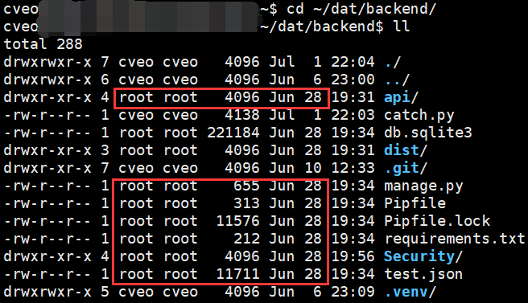
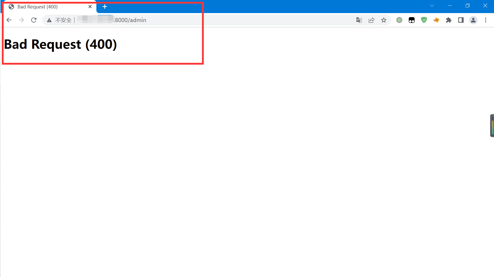
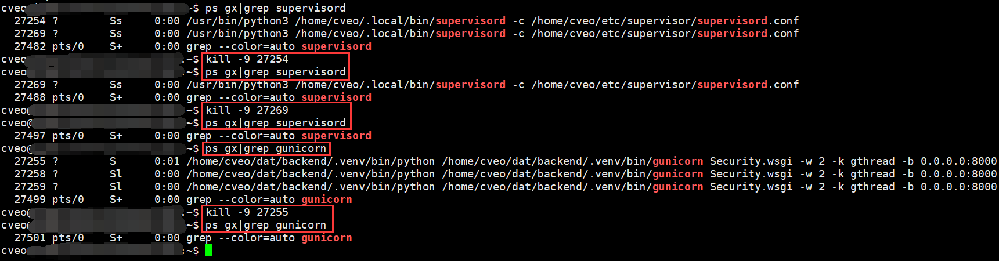
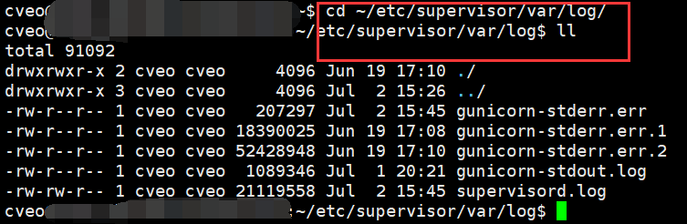
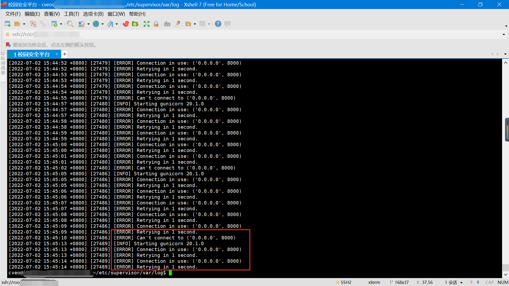
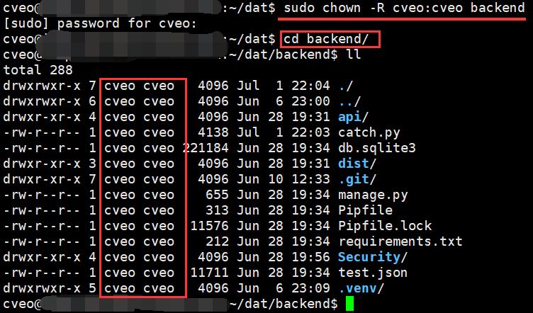
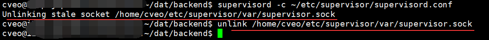

# 阿里云部署踩坑记录

相关文档：[阿里云部署前后端项目全过程记录](aliyun部署前后端分离项目全过程记录.md)

## 一、分离 setting.py

&emsp;&emsp;在线上环境中，为了安全起见，我们将 debug 改为了 False，但在开发环境中又需要改为 True。

&emsp;&emsp;同时，django 的 SECRET_KEY 是很私密的配置，django 的很多安全机制都依赖它，如果不慎泄露，网站将面临巨大安全风险。

&emsp;&emsp;最好是将这个值写入环境变量，从环境变量中取值。


### 1.1 settings 目录结构

&emsp;&emsp;为了解决以上问题，我们可以拆分 settings.py 文件，不同环境对应不同的 settings 文件。

&emsp;&emsp;django 在启动时会从环境变量中读取 DJANGO_SETTINGS_MODULE 的值，以这个值指定的文件作为应用的最终配置。


```
Security\ (项目应用名)
    settings\
        __init__.py (将文件夹识别为 python 包)
		common.py (用于存放通用配置)
        local.py (存放开发环境的配置)
        production.py (存放线上环境的配置)
    settings.py (配置好了直接删了)
```

### 1.2 settings 文件详细配置
#### 1.2.1 配置 `common.py`


&emsp;&emsp;将原先的 settings.py 文件中的内容全部复制到 common.py 里。并将 SECRET_KEY、DEBUG、ALLOWED_HOSTS 这些配置删除。


#### 1.2.2 配置 `local.py`

```python
from .common import *

SECRET_KEY = '本地开发环境的秘钥'
DEBUG = True
ALLOWED_HOSTS = ['*']
```

#### 1.2.3 配置 `production.py`

```python
from .common import *

SECRET_KEY = os.environ['DJANGO_SECRET_KEY']
DEBUG = False
ALLOWED_HOSTS = ['127.0.0.1','服务器 IP 地址','域名']
```

<p style="color:red;">
&emsp;注：这里的 IP 地址一定要填对！
</p>

### 1.3 项目相关配置调整
#### 1.3.1 修改 manage.py 配置

`Security.settings.local` 
- 开发环境中使用 manage.py 启动 Django 项目时，使用 local.py 配置。

```python
def main():
    os.environ.setdefault('DJANGO_SETTINGS_MODULE', 'Security.settings.local')
    try:
        from django.core.management import execute_from_command_line
    except ImportError as exc:
        raise ImportError(
            "Couldn't import Django. Are you sure it's installed and "
            "available on your PYTHONPATH environment variable? Did you "
            "forget to activate a virtual environment?"
        ) from exc
    execute_from_command_line(sys.argv)
```

#### 1.3.2 修改 wsgi.py 配置

`Security.settings.production` 
- 生产环境中使用 gunicorn 启动 Django 项目时，使用 production.py 配置。

```python
import os

from django.core.wsgi import get_wsgi_application

os.environ.setdefault('DJANGO_SETTINGS_MODULE', 'Security.settings.production')

application = get_wsgi_application()
```

#### 1.3.3 修改 `BASE_DIR` 配置项

&emsp;&emsp;此时，在 `common.py` 中存在 `BASE_DIR` 指向项目根目录，其获取方式为根据所在的配置文件向上回溯，找到项目根目录。

&emsp;&emsp;之前的目录结构为 Django/Security/settings.py，向上 2 层就能到达项目根目录。而现在目录结构变为 Django/Security/settings/common.py，需向上 3 层才能到达项目根目录。

&emsp;&emsp;因此需将 BASE_DIR 进行修改，修改前后内容如下：


> 修改前

```
BASE_DIR = os.path.dirname(os.path.dirname(os.path.abspath(__file__)))
```

> <font color="red">修改后</font>

```
BASE_DIR = os.path.dirname(os.path.dirname(os.path.dirname(os.path.abspath(__file__))))
```


&emsp;&emsp;即再在原有的外面再包一层 os.path.dirname，再向上回退一层，到达项目根目录。


### 1.4 设置 Supervisor 环境变量


&emsp;&emsp;由于在之前我们在线上环境中配置 secret_key 从环境变量获取，
因此需要再次修改 supervisor 的配置，将环境变量导入。


> 打开 supervisor 的配置文件

```
vim ~/etc/supervisor/conf.d/gunicorn.ini
```

> 添加环境变量的配置语句

```
environment=DJANGO_SECRET_KEY=项目的秘钥
```

> 保存并更新配置

```
supervisorctl -c ~/etc/supervisord.conf update
```

## 二、Ubuntu 的用户权限问题

### 2.1 sudo 命令


&emsp;&emsp;在 Ubuntu 中，不提倡直接使用最高权限的 root 用户进行实际操作。通常都是通过普通用户 + sudo 命令来实现对应的命令。


### 2.2 文件夹权限

#### 2.2.1 文件所属

&emsp;&emsp;在 Ubuntu 中，拥有最高权限的 root 用户可以对其他用户的文件进行任何操作。而我们在连接远程服务器时，如果直接登录 root 并修改相关文件后，该文件的所属会发生改变，会变成 root 所有。


<div style="aligin">
	
</div>

#### 2.2.2 权限冲突


&emsp;&emsp;由于我们之前在部署项目时，项目的启动均设置为 cveo 用户启动，所以此时会出现权限冲突。此时我们发现再次访问页面时，出现了以下错误。


<div style="aligin">
	
</div>


&emsp;&emsp;接下来，我们需要先查出 supervisord 和 gunicorn的进程序号，然后根据进程号逐个杀死，最后再次查看是否完全关闭。


> 查看进程序号

```
ps gx|grep 进程名称
```

> 杀死进程

```
kill -9 对应进程号
```

<div style="aligin">
	
</div>

<p style="color:red;">
&emsp;注：除恶务尽，一定要查看相关进程是否全部杀死！
</p>

#### 2.2.3 查看日志


&emsp;&emsp;在之前的部署中，我们配置了 supervisor 的日志存放位置，也可以去查看错误日志发现问题。


> 转到日志目录

```
cd ~/etc/supervisor/var/log/
```

<div style="aligin">
	
</div>

> 查看错误日志

```
cat gunicorn-stderr.err
```

<p style="color:red;">
&emsp;注：输入部分字母后按 Tab 键可以自动补全。
</p>

<div style="aligin">
	
</div>

#### 2.2.4 修改文件夹所有者

> 转到目标上方目录 (必须)

```
cd ~/dat
```

> 修改 backend 目录下所有文件的所有者

```
sudo chown -R cveo:cveo backend
```

<div style="aligin">
	
</div>


#### 2.2.5 重启启动项目


&emsp;&emsp;在杀死进程后的首次启动 supervisor，可能会出现错误，按如下步骤操作即可。


> 启动 supervisord

```
supervisord -c ~/etc/supervisor/supervisord.conf
```

> 重新连接

```
unlink /home/cveo/etc/supervisor/var/supervisor.sock
```

<div style="aligin">
	
</div>

> 杀死当前的 supervisord 进程

```
ps gx|grep supervisord

kill -9 进程号
```

> 重新启动 supervisord 进程

```
supervisord -c ~/etc/supervisor/supervisord.conf
```
