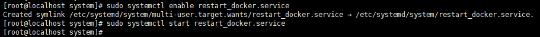
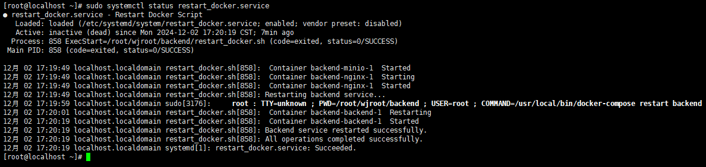

# 部署运维学习


## 一、Linux 基础

### 1.1 基本命令

修改文件名

```shell
mv old-filename new-filename
```

移动文件

```sh
mv old-filepath new-filepath
```

### 1.2 系统配置

开机自启

使用`systemd`（大多数现代 Linux 发行版都是这样），可以创建服务实现开机自启。


## 二、真实项目经历

### 2.1 服务器网络设置

真实经历：因未知情况导致麒麟服务器重启后网络设置被重置，DNS服务器配置被清除

参考文献：[麒麟服务器操作系统--网络配置的五种方式](https://blog.csdn.net/QingTian1024/article/details/143633842)

1. 首先切换到网络配置所在目录，查看当前网口对应的文件

```shell
cd /etc/sysconfig/network-scripts

ls -l
```

2. 找到需要修改的网口文件，以下以`ifcfg-enp0s1`为例，先查看当前内容再进行修改

```shell
cat ifcfg-enp0s1
vim ifcfg-enp0s1
```

3. 文件中有几个关键参数，正确设置后可以保证服务器重启后网络配置不会被重置

```
# 设置系统静态IP地址
IPADDR=192.168.0.6
# 设置系统启动时是否激活该网络接口，yes 表示在系统启动时自动激活该接口，也可以设置成no
ONBOOT=yes
# 设置网关地址
GATEWAY=192.168.0.1
# 设置DNS地址，一般与网关一致，也可以再添加一行DNS2=x.x.x.x设置备用DNS地址
DNS1=192.168.0.1
```

4. 修改完配置文件重启网络连接配置

```shell
ifup ifcfg-enp0s1
sudo systemctl restart network
sudo service network restart
```

### 2.2 设置项目开机自启动

真实经历：在项目部署时使用了脚本`restart_docker.sh`用于启动项目，最终目标是在每次服务器重启时能够自动启动项目。

【！！注意】若脚本中相关命令需要在项目目录下运行，则需要保证后续命令运行均在项目目录内。

1. 创建一个新的服务文件

```shell
sudo vim /etc/systemd/system/restart_docker.service
```

2. 在服务文件中添加以下内容：除第三项`[Install]`不变，其他根据实际情况进行设置

```shell
[Unit]
Description=Restart Docker Script

[Service]
ExecStart=/path/to/restart_docker.sh
Restart=on-failure
RestartSec=30

[Install]
WantedBy=multi-user.target
```

在 `[Service]` 部分：

- `ExecStart` 启动服务命令
- `Restart` 服务崩溃或失败时是否重启
- `RestartSec` 重启服务前等待的时间

3. 启用服务：在 `systemd` 的启动目标（targets）中创建符号链接，将服务设置为在系统启动时自动启动。

```shell
sudo systemctl enable restart_docker.service
```

4. 启动服务：启用服务后，需要手动启动服务才能真正启动项目

```shell
sudo systemctl start restart_docker.service
```



<center>图 1 启用服务并启动服务</center>

5. 其他可能用到的命令：停用服务、检查服务状态、重启服务

```shell
sudo systemctl disable restart_docker.service
sudo systemctl status restart_docker.service
sudo systemctl restart restart_docker.service
```



<center>图 2 重启服务器后查看服务运行情况</center>

### 2.3 Docker 限制 IPv4

1. 强制 Docker 守护进程禁用 IPv6

- 修改 Docker 配置文件 `daemon.json`

```bash
sudo vim /etc/docker/daemon.json
```

- 添加以下内容（若文件不存在则新建）：

```json
{
  "ipv6": false,          // 关闭 Docker 的 IPv6 支持
  "iptables": true,       // 确保 iptables 规则仅处理 IPv4
  "userland-proxy": false // 避免 Docker 的 IPv6 代理
}
```

- 重启 Docker 服务

```bash
sudo systemctl restart docker
```

2. 配置容器仅绑定 IPv4 地址

在 `docker-compose.yml` 中显式指定 `0.0.0.0`（IPv4 通配地址）：
```yaml
services:
  your_app:
    image: your_image
    ports:
      - "0.0.0.0:80:80"  # 强制绑定到 IPv4
    networks:
      - my_network

networks:
  my_network:
    enable_ipv6: false   # 可选：禁用自定义网络的 IPv6
```

3. 验证 Docker 的 IPv4 配置

- 检查容器端口映射

```bash
docker-compose ps
# 输出应显示 "0.0.0.0:80->80/tcp"
```

- 查看容器监听的端口，进入容器内部执行：

```bash
docker exec -it <容器ID> sh
netstat -ntlp
# 应仅显示 `tcp`（IPv4）监听，如 `0.0.0.0:80`
```

4. 处理容器内应用的 IPv6 回退问题

如果容器内的应用仍尝试监听 IPv6（如 `::`），需修改其配置：
- Nginx：
  
  ```nginx
  server {
    listen 80;       # 默认监听 IPv4
    # listen [::]:80; # 注释 IPv6 监听
  }
  ```
  
- 通用方案：在启动命令中指定 IPv4 地址
  ```yaml
  # docker-compose.yml
  command: ["--bind", "0.0.0.0:80"]
  ```

5. 防火墙与安全组规则：确保防火墙允许 IPv4 流量

```bash
# 检查 iptables 规则
sudo iptables -L -n
# 放行 Docker 相关端口（如 80）
sudo iptables -A INPUT -p tcp --dport 80 -j ACCEPT
```

6. 最终验证

- 从内网其他机器访问服务

```bash
curl http://<服务器IPv4地址>:80
```

- 检查主机端口监听

```bash
netstat -ntlp | grep 80
# 应显示 `tcp`（而非 `tcp6`）的监听
```
