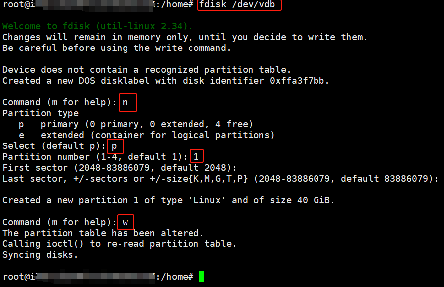

# 部署运维学习


## 1 安装 WSL2 与 Docker

### 1.1 安装 WSL2

- 微软官方教程：https://learn.microsoft.com/en-us/windows/wsl/install
- 详细视频教程：【超详细的WSL教程：Windows上的Linux子系统】https://www.bilibili.com/video/BV1tW42197za/?share_source=copy_web

第一次安装需要重启

```sh
wsl --install
```


查看支持的Linux系统列表

```sh
wsl --list --online
```


下载系统镜像，默认安装最新的Ubuntu（当前为Ubuntu 24.04）

```sh
wsl --install 镜像名称 --web-download
```

查看当前已安装的系统

```sh
wsl --list -v
```


进入子系统，初次进入系统需要设置用户名（非root）与密码

```sh
wsl -d Ubuntu
```


退出子系统

```sh
exit
```


### 1.2 安装 Docker

- Docker官方安装教程：https://docs.docker.com/desktop/install/windows-install/

下载exe安装包后直接安装即可，安装完成后会重启电脑。

再次查看当前的子系统，出现一个新的子系统docker-desktop


### 1.3 WSL 基本操作

将WSL中指定文件复制到外部的Windows系统中

```sh
cp WSL内的指定文件路径 /mnt/盘符/具体路径
```

- `/mnt/盘符/具体路径`：外部Windows文件系统在WSL中的映射

启动子系统后，一般会默认开机自启动，可以手动关闭。

```sh
wsl --shutdown
```

需要注意的是docker子系统可以马上关闭，但Ubuntu系统一般需要8s后才可以正常关闭。


## 2 Linux 基础

### 2.1 基本命令

修改文件名

```shell
mv old-filename new-filename
```

移动文件

```sh
mv old-filepath new-filepath
```

### 2.2 系统配置

开机自启

使用`systemd`（大多数现代 Linux 发行版都是这样），可以创建服务实现开机自启。


## 3 真实项目经历

### 3.1 服务器网络设置

真实经历：因未知情况导致麒麟服务器重启后网络设置被重置，DNS服务器配置被清除

参考文献：[麒麟服务器操作系统--网络配置的五种方式](https://blog.csdn.net/QingTian1024/article/details/143633842)

1. 首先切换到网络配置所在目录，查看当前网口对应的文件

```shell
cd /etc/sysconfig/network-scripts

ls -l
```

2. 找到需要修改的网口文件，以下以`ifcfg-enp0s1`为例，先查看当前内容再进行修改

```shell
cat ifcfg-enp0s1
vim ifcfg-enp0s1
```

3. 文件中有几个关键参数，正确设置后可以保证服务器重启后网络配置不会被重置

```
# 设置系统静态IP地址
IPADDR=192.168.0.6
# 设置系统启动时是否激活该网络接口，yes 表示在系统启动时自动激活该接口，也可以设置成no
ONBOOT=yes
# 设置网关地址
GATEWAY=192.168.0.1
# 设置DNS地址，一般与网关一致，也可以再添加一行DNS2=x.x.x.x设置备用DNS地址
DNS1=192.168.0.1
```

4. 修改完配置文件重启网络连接配置

```shell
ifup ifcfg-enp0s1
sudo systemctl restart network
sudo service network restart
```

### 3.2 设置项目开机自启动

真实经历：在项目部署时使用了脚本`restart_docker.sh`用于启动项目，最终目标是在每次服务器重启时能够自动启动项目。

【！！注意】若脚本中相关命令需要在项目目录下运行，则需要保证后续命令运行均在项目目录内。

1. 创建一个新的服务文件

```shell
sudo vim /etc/systemd/system/restart_docker.service
```

2. 在服务文件中添加以下内容：除第三项`[Install]`不变，其他根据实际情况进行设置

```shell
[Unit]
Description=Restart Docker Script

[Service]
ExecStart=/path/to/restart_docker.sh
Restart=on-failure
RestartSec=30

[Install]
WantedBy=multi-user.target
```

在 `[Service]` 部分：

- `ExecStart` 启动服务命令
- `Restart` 服务崩溃或失败时是否重启
- `RestartSec` 重启服务前等待的时间

3. 启用服务：在 `systemd` 的启动目标（targets）中创建符号链接，将服务设置为在系统启动时自动启动。

```shell
sudo systemctl enable restart_docker.service
```

4. 启动服务：启用服务后，需要手动启动服务才能真正启动项目

```shell
sudo systemctl start restart_docker.service
```


<center>图 1 启用服务并启动服务</center>

5. 其他可能用到的命令：停用服务、检查服务状态、重启服务

```shell
sudo systemctl disable restart_docker.service
sudo systemctl status restart_docker.service
sudo systemctl restart restart_docker.service
```


<center>图 2 重启服务器后查看服务运行情况</center>

### 3.3 Docker 限制 IPv4

1. 强制 Docker 守护进程禁用 IPv6

- 修改 Docker 配置文件 `daemon.json`

```bash
sudo vim /etc/docker/daemon.json
```

- 添加以下内容（若文件不存在则新建）：

```json
{
  "ipv6": false,          // 关闭 Docker 的 IPv6 支持
  "iptables": true,       // 确保 iptables 规则仅处理 IPv4
  "userland-proxy": false // 避免 Docker 的 IPv6 代理
}
```

- 重启 Docker 服务

```bash
sudo systemctl restart docker
```

2. 配置容器仅绑定 IPv4 地址

在 `docker-compose.yml` 中显式指定 `0.0.0.0`（IPv4 通配地址）：
```yaml
services:
  your_app:
    image: your_image
    ports:
      - "0.0.0.0:80:80"  # 强制绑定到 IPv4
    networks:
      - my_network

networks:
  my_network:
    enable_ipv6: false   # 可选：禁用自定义网络的 IPv6
```

3. 验证 Docker 的 IPv4 配置

- 检查容器端口映射

```bash
docker-compose ps
# 输出应显示 "0.0.0.0:80->80/tcp"
```

- 查看容器监听的端口，进入容器内部执行：

```bash
docker exec -it <容器ID> sh
netstat -ntlp
# 应仅显示 `tcp`（IPv4）监听，如 `0.0.0.0:80`
```

4. 处理容器内应用的 IPv6 回退问题

如果容器内的应用仍尝试监听 IPv6（如 `::`），需修改其配置：
- Nginx：
  
  ```nginx
  server {
    listen 80;       # 默认监听 IPv4
    # listen [::]:80; # 注释 IPv6 监听
  }
  ```
  
- 通用方案：在启动命令中指定 IPv4 地址
  ```yaml
  # docker-compose.yml
  command: ["--bind", "0.0.0.0:80"]
  ```

5. 防火墙与安全组规则：确保防火墙允许 IPv4 流量

```bash
# 检查 iptables 规则
sudo iptables -L -n
# 放行 Docker 相关端口（如 80）
sudo iptables -A INPUT -p tcp --dport 80 -j ACCEPT
```

6. 最终验证

- 从内网其他机器访问服务

```bash
curl http://<服务器IPv4地址>:80
```

- 检查主机端口监听

```bash
netstat -ntlp | grep 80
# 应显示 `tcp`（而非 `tcp6`）的监听
```

### 3.4 磁盘占用

查看磁盘总占用情况

```sh
df -h
```

查看指定目录的占用情况，`-s`表示统计文件夹总大小（默认统计每一个文件大小），`-h`将结果转换为GB

```sh
du -sh 完整路径
```

清除缓存

```sh
sudo apt clean
```

确认磁盘vdb状态

```sh
sudo fdisk -l /dev/vdb
```

创建磁盘分区vdb1：vdb是整个磁盘，vdb1是磁盘的一个分区，切换到`/dev`目录后可以看到新增的vdb1分区

```sh
sudo fdisk /dev/vdb
```

依次输入：n，p，1，w



在磁盘vdb的vdb1分区创建文件系统

```sh
sudo mkfs.ext4 /dev/vdb1
```

创建目录并挂载到分区

```sh
sudo mkdir /home/data
sudo mount /dev/vdb1 /home/data/
```

检查挂载情况

```sh
df -h | grep data
```


获取磁盘分区UUID，此处需要手动复制ID

```sh
sudo blkid /dev/vdb1
```

编辑fstab

```sh
sudo vim /etc/fstab
```

添加下面一行并保存文件

```
UUID=磁盘ID /home/data ext4 defaults 0 2
```

检查配置，若无报错即为正确

```sh
sudo mount -a
```

检查磁盘挂载结果

```sh
sudo lsblk 指定的磁盘/默认显示所有磁盘
```


### 3.4 更换磁盘挂载


卸载挂载点并再次检查，若结果为空则卸载成功

```sh
sudo umount /home/data
sudo mount | grep vdb
```


若需要对已有数据的文件夹重新挂载到大容量磁盘，需要先备份数据，防止数据被覆盖。

将待迁移目录内所有内容复制到已挂载的目录中

```sh
sudo cp -a /home/cveo/dat/backend/media/ /home/data/
```

检查完整性

```sh
sudo diff -r /home/cveo/dat/backend/media/ /home/data/media/
```

删除原目录内所有文件

```sh
sudo rm -rf /home/cveo/dat/backend/media/*
```

挂载指定目录

```sh
sudo mount /dev/vdb1 /home/cveo/dat/backend/media/
```

将备份数据恢复，并删除备份数据

```sh
sudo cp -a /home/data/media/* /home/cveo/dat/backend/media/
sudo rm -rf /home/data/media/
```

再次编辑fstab，修改挂载目录

```sh
sudo vim /etc/fstab
```


