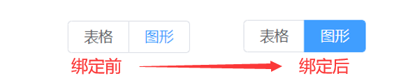

## 1 Element UI + Vue2 转化 Element Plus + Vue3

### 1.1 完整代码对比

​		这里我们以上传组件 `Upload` 为例进行转化。

> vue2 `<script>` 中

```vue
<template>
  <el-upload
    ref="uploadRef"
    action="https://jsonplaceholder.typicode.com/posts/"
    :file-list="fileList"
    :auto-upload="false">
    <el-button slot="trigger" size="small" type="primary">选取文件</el-button>
    <el-button style="margin-left: 10px;" size="small" type="success" @click="submitUpload">上传到服务器</el-button>
  </el-upload>
</template>
<script>
  export default {
    data() {
      return {
        fileList: [{
            name: 'food.jpeg',
            url: 'https://fuss10.elemecdn.com/3/63/4e7f3a15429bfda99bce42a18cdd1jpeg.jpeg?imageMogr2/thumbnail/360x360/format/webp/quality/100'
        }]
      };
    },
    methods: {
      submitUpload() {
        this.$refs.uploadRef.submit();
      }
  }
</script>
```

> vue3 `<script setup>` 中

```vue
<template>
  <el-upload
    ref="uploadRef"
    action="https://run.mocky.io/v3/9d059bf9-4660-45f2-925d-ce80ad6c4d15"
    :auto-upload="false"
    :file-list="fileList"
  >
    <template #trigger>
      <el-button :icon="FolderAdd"></el-button>
    </template>
    <el-button
      type="success"
      @click="submitUpload"
      :icon="UploadFilled"
    >
    </el-button>
  </el-upload>
</template>
<script setup>
import { FolderAdd, UploadFilled } from '@element-plus/icons-vue'
import { ElMessage, ElMessageBox } from 'element-plus'
import { ref } from 'vue'
const fileList = ref([
  {
    name: 'food.jpeg',
    url: 'https://fuss10.elemecdn.com/3/63/4e7f3a15429bfda99bce42a18cdd1jpeg.jpeg?imageMogr2/thumbnail/360x360/format/webp/quality/100'
  }
])
const uploadRef = ref()
const submitUpload = () => {
  uploadRef.value.submit()
}
</script>
<style lang="scss" scoped></style>
```

### 1.2 逐项对比

1. vue2 中 `this.$refs.uploadRef` 在 vue3 setup 语法中将转化为 `uploadRef.value` 
2. vue2 中 `slot="trigger"` 在 vue3 语法中将转化为 `<template #trigger></template>` 
3. `script` 标签内容的差异

> vue2 `<script>` 中   

```vue
<script>
export default {
    data() {
        return {

        }
    },
    methods: {
      submitUpload() {
        this.$refs.uploadRef.submit();
      }
    }
}
</script>
```

> vue3 `<script setup>` 中

```vue
<script setup>
import { ref } from 'vue'
const uploadRef = ref()
const submitUpload = () => {
  uploadRef.value.submit()
}
</script>
```

从 `this.$refs.uploadRef.submit();` ，到 vue3 setup 中的 `uploadRef.value.submit()`


## 2 vue2 中 `slot` 插槽在 vue3 中的使用

参考文章：

1. [CSDN - vue3的slot插槽用法，`slot-scope` are deprecated](https://blog.csdn.net/qq_41619796/article/details/122847424)
2. [vue 插槽，`slot`和 `slot-scope`已被废弃](https://segmentfault.com/a/1190000019683759)


## 3 v-model 数据绑定

&emsp;&emsp;这里我们以循环生成 `el-radio` 单选框为例，绑定之后才能正常显示按钮的选择样式。

> 标签内容

```vue
<!-- 切换数据显示:图/表 -->
<el-radio-group v-model="autoType">
    <el-radio-button v-for="item in typeRadios" :key="item.value" :label="item.label">
    </el-radio-button>
</el-radio-group>
```

> js 脚本

```js
import { ref } from 'vue';
// 选择显示数据类型,默认为图形
const autoType = ref("图形");
const typeRadios = ref([
  {
    value: "table",
    label: "表格",
  },
  {
    value: "chart",
    label: "图形",
  },
]);
```




## 4 `mount()` 函数

> vue2 `<script>` 中  

```js
export default {
  mounted() {},
};
```

>vue3 <script setup> 中

```js
import { onMounted } from "vue";
onMounted(()=>{

})
```


## 5 `props` 属性

> vue2 `<script>` 中

```js
export default {
    props: {
        width: String,
        height: String,
    },
};
```

>vue3 `<script setup>` 中

```js
const props = defineProps({
  width: String,
  height: String,
});
```

在 `script setup` 中使用 `props` 和 `emit` 要使用 `defineProps`，`defineEmits` ，直接使用会报未定义。


## 参考文章

1. [CSDN - vue3 setup（详细）使用教程](https://blog.csdn.net/bsegebr/article/details/123219332)
2. [CSDN - vue3 ＜script setup＞ props 使用与讲解](https://blog.csdn.net/lijiahui_/article/details/122725791)
3. 
