# vue 前端环境配置全过程记录

## 1 安装 node.js

&emsp;&emsp;[Node.js 中文网](http://nodejs.cn/download/)

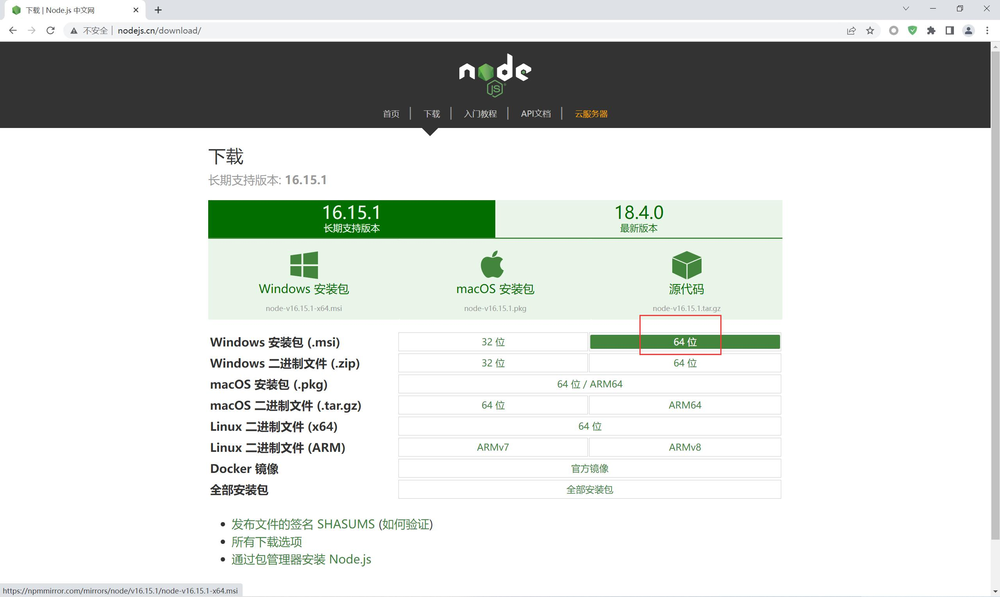

&emsp;&emsp;安装过程很简单，中途注意修改安装位置到其他盘，其余下一步即可。
安装结束后在 cmd 命令窗口中输入指令，查看是否安装成功。【要求：安装路径不得有空格和中文】

```
node -v
```

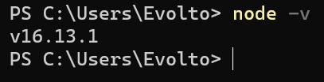

## 2 配置 npm 全局安装包路径

### 2.1 查看 npm 全局安装包路径

> 查看默认安装路径

```
npm root -g
```

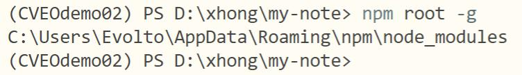

> 在 nodejs 文件夹中创建文件夹

&emsp;&emsp;创建 `node_global` `node_cache` 两个新文件夹。

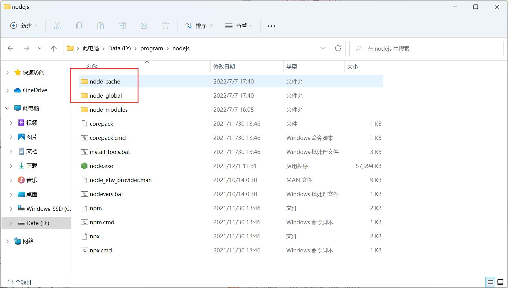

### 2.2 修改 npm 全局安装包路径

> 修改 npm 全局安装位置

&emsp;&emsp;这里的位置以当前刚刚创建的文件夹位置为准，不唯一。

```
npm config set prefix "D:\program\nodejs\node_global"
```

> 修改 npm 缓存位置

```
npm config set cache "D:\program\nodejs\node_cache"
```

### 2.3 配置相关环境变量

> 环境变量 → 系统变量 → path → 新建

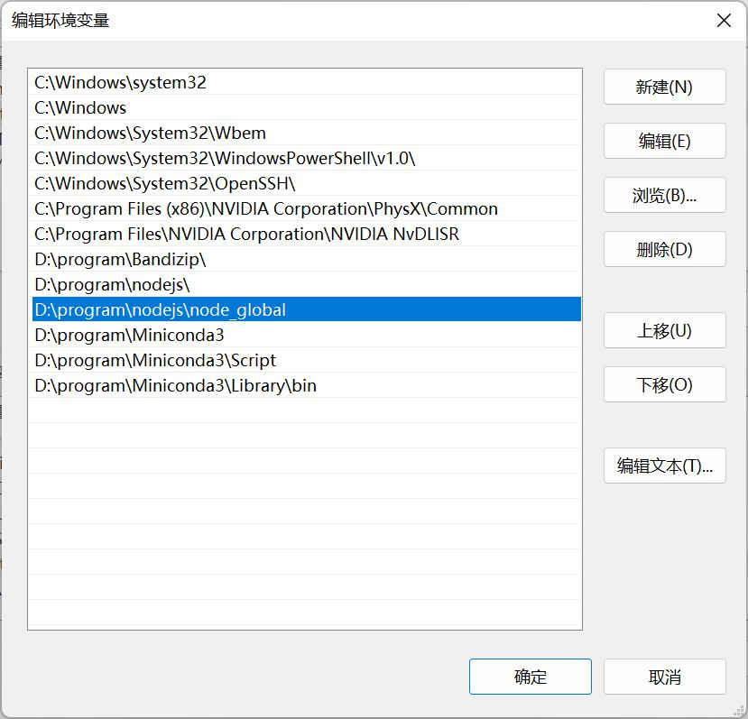

> 环境变量 → 系统变量 → 新建 → node_path

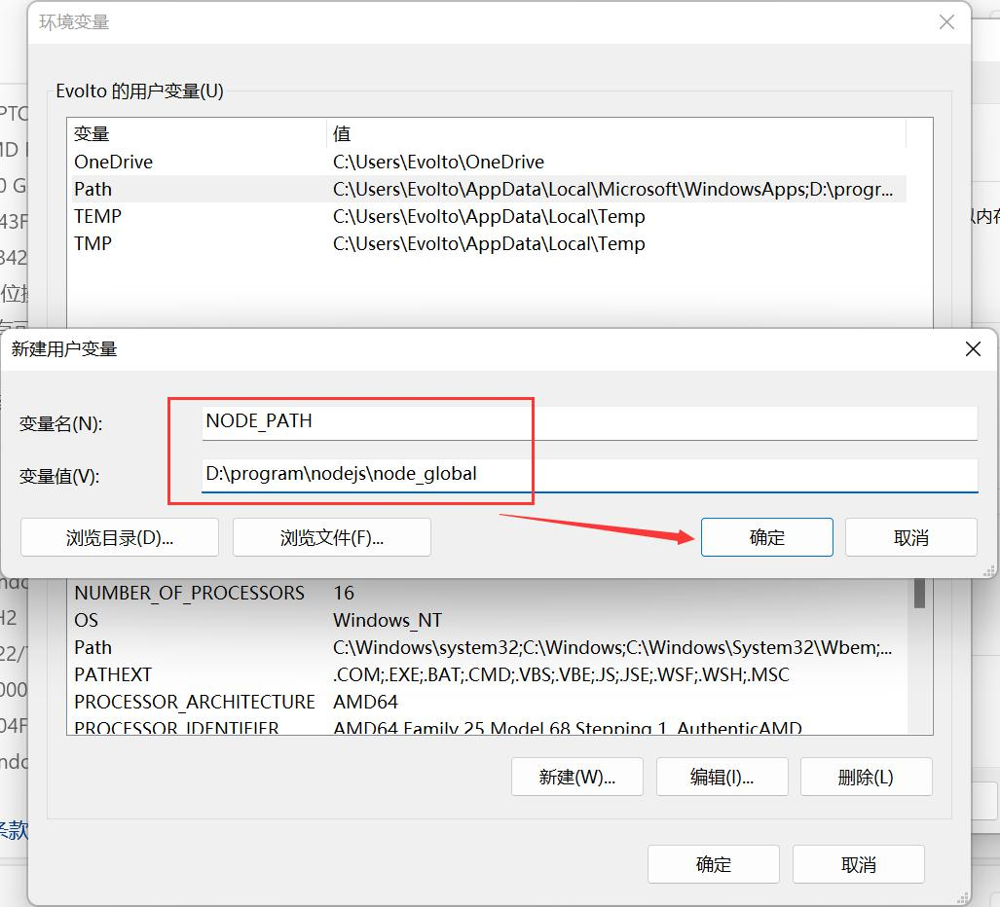

> 再次查看默认安装路径

```
npm root -g
```

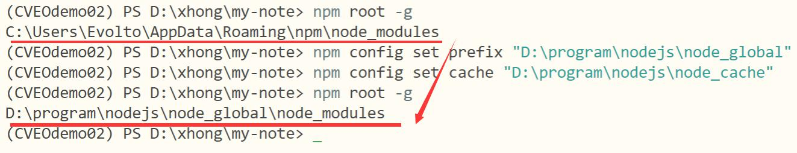

## 3 安装并配置 yarn

### 3.1 安装 yarn

> 安装 yarn 1.x

```
npm i -g yarn
```

> 检查是否安装成功

```
yarn -v
```

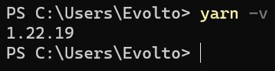

### 3.2 查看 yarn 的默认配置

> 查看全局安装目录

```
yarn global dir
```

> 查看缓存目录

```
yarn cache dir
```

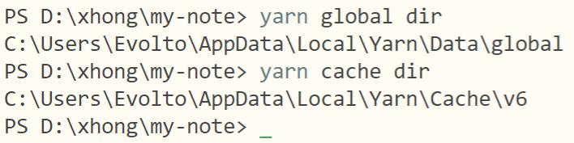

### 3.3 创建相应文件夹

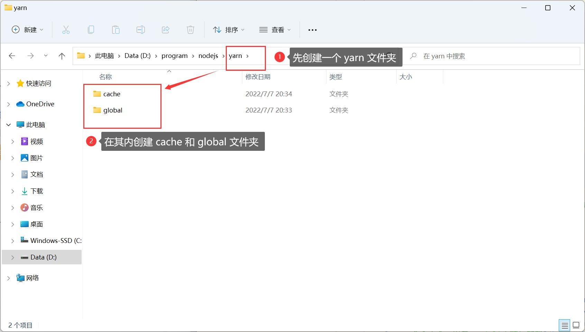

### 3.4 修改 yarn 全局安装位置和缓存位置

> 修改 yarn 全局安装位置

```
yarn config set global-folder "D:\program\nodejs\yarn\global"
```

> 修改 yarn 缓存位置

```
yarn config set cache-folder "D:\program\nodejs\yarn\cache"
```

### 3.4 再次检查 yarn 的默认配置

```
yarn global dir
yarn cache dir
```

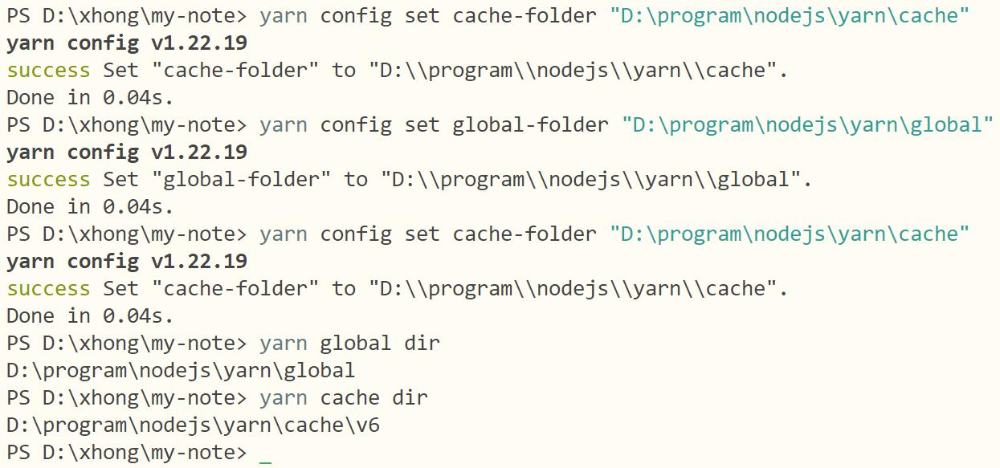

### 3.5 修改镜像源

```
yarn config set registry https://registry.npmmirror.com
```

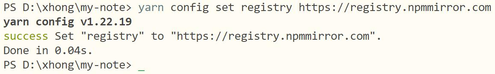

注：此处是淘宝镜像源的最新位置。[npmmirror 中国镜像站](https://npmmirror.com/)

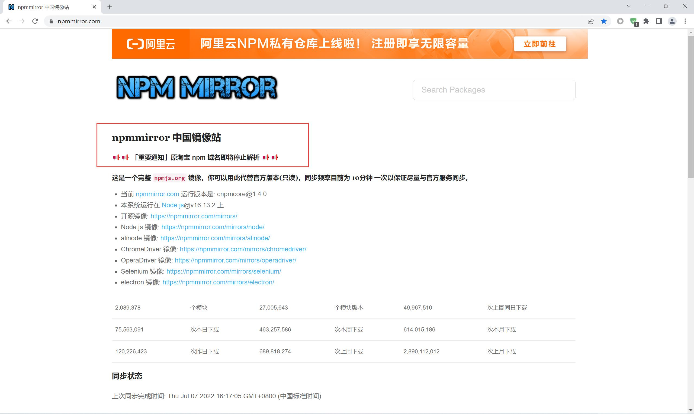

## 4 安装 cnpm

&emsp;&emsp;因为 npm 安装插件是从国外服务器下载，可能出现异常，所以我们需要使用国内的淘宝镜像 cnpm 来加快包的下载速度。
cnpm 完全沿用之前 npm 的所有配置，无需另外配置。

```
npm install -g cnpm --registry=https://registry.npmmirror.com
```

## 5 安装 vue 

> cnpm 安装 vue 和 vue/cli

```
cnpm install -g vue@3.2.13
cnpm install -g @vue/cli
```

> yarn 安装 vue 和 vue/cli

```
yarn global add vue@3.2.13
yarn global add @vue/cli
```

> 检查安装情况

```
vue -V
or
vue --version
```

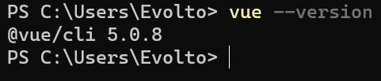

## 参考文章

1. [修改npm全局安装包的位置路径](https://blog.csdn.net/bealei/article/details/115658300)
2. [npm、yarn设置全局安装位置和缓存位置](https://www.jianshu.com/p/30ba1da2bde1)
3. [yarn设置镜像源](https://blog.csdn.net/zhudingfengshen/article/details/121512841)
4. [yarn 命令大全，以及vue/cli安装与卸载](https://blog.csdn.net/jw19950424/article/details/108280351)
5. [使用yarn安装vue项目（在idea中）](https://blog.csdn.net/wwppp987/article/details/106784422)