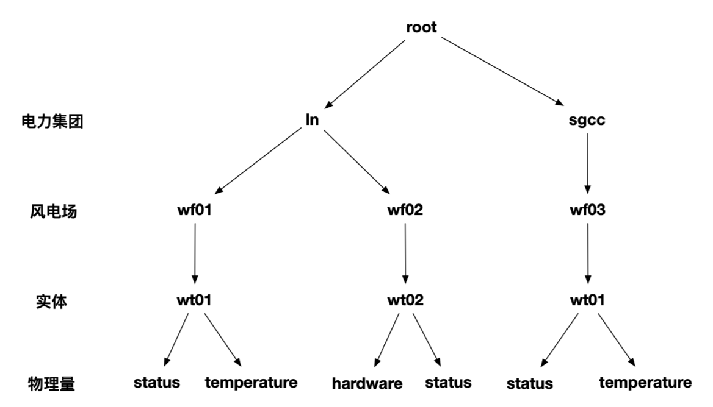
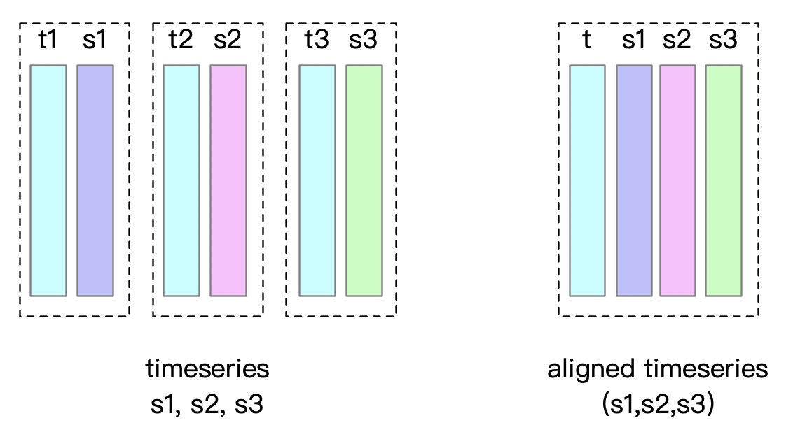

# IOTDB快速上手学习


## 一、基本概念



数据库结构：IoTDB 采用树形结构定义数据模式

测点：多个数据点按时间戳递增排列形成的一个时间序列，通常一个测点代表一个采集点位，能够定期采集所在环境的物理量。

元数据模板：具有相同的字段名称和类型的采集物理量，如上图中的status，可以采用模板

storage_group：存储组，存放同类型的物联网设备，设备以节点的形式存储。

Timeseries：时间序列，一个物联网设备节点有多个时间序列，一次观测为一个时间序列，一个“时间戳-值”对。

- 默认时间序列，单个物理量的时间序列
- 对齐时间序列，同一时间序列下存在多个物理量

Tablet： 是一个设备若干行数据块，每一行的列都相同

- 写入效率高
- 支持写入空值

示例：ln 电力集团、wf01 风电场的实体 wt01 有名为 status 的物理量，其时间序列表示为：`root.ln.wf01.wt01.status`



## 二、官网教程

- Python 原生接口：https://iotdb.apache.org/zh/UserGuide/latest/API/Programming-Python-Native-API.html
- GitHub示例代码：https://github.com/apache/iotdb/blob/master/iotdb-client/client-py/session_example.py

核心代码示例如下：

```python
# 创建存储组sg_test_01
session.set_storage_group("root.sg_test_01")
# 删除存储组sg_test_02
session.delete_storage_group("root.sg_test_02")
# 创建sg_test_01存储组的d_01设备的s_01测点的时间序列
session.create_time_series(
    "root.sg_test_01.d_01.s_01", TSDataType.BOOLEAN, TSEncoding.PLAIN, Compressor.SNAPPY
)
# 按列表删除时间序列
session.delete_time_series([
    "root.sg_test_01.d_01.s_07",
    "root.sg_test_01.d_01.s_08",
    "root.sg_test_01.d_01.s_09",
])
# 检查时间序列是否存在
print(
    "s_07 expecting False, checking result: ",
    session.check_time_series_exists("root.sg_test_01.d_01.s_07"),
)
```


## 三、数据库交互步骤

1、连接数据库

2、查询数据库中是否已有该节点数据

- 若有，则向该节点添加时间序列数据
- 若没有，则创建一个新的节点，并添加时间序列数据