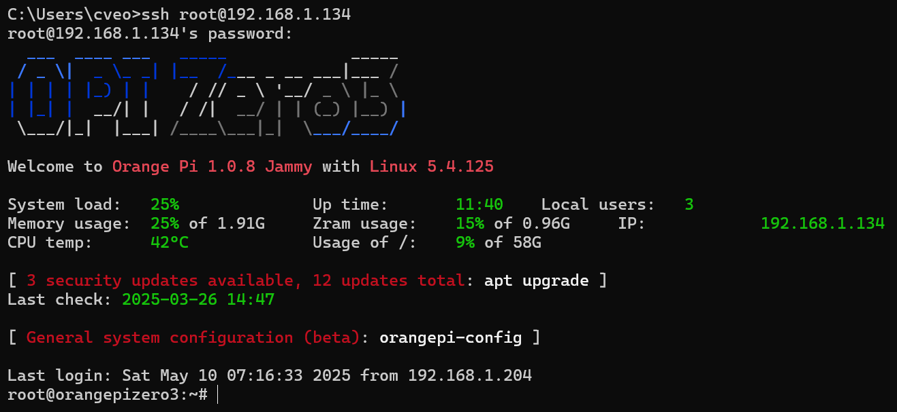

# 边缘计算


## 1 基本概念

边缘计算（Edge Computing）

- 核心思想：将计算、存储和数据处理从云端下沉到靠近数据源（如传感器、IoT设备）的本地设备或边缘节点，减少延迟、节省带宽、增强隐私。
- 数据就近处理 + 低延迟响应 + 资源受限设备优化。

微控制器（Microcontroller Unit，MCU）

- 微型计算核心：集成CPU、内存、I/O的单一芯片（如STM32、ESP32），功耗低至毫瓦级，适合边缘设备。

微型机器学习（TinyML）

- 在MCU上运行超低功耗ML模型（如关键字检测、异常监测），典型框架：TensorFlow Lite Micro、Edge Impulse
- 嵌入式系统+机器学习算法
- 传感器获取数据→算法处理→输出结果

Edge Impulse：https://edgeimpulse.com/

- 为IoT设备提供端到端ML开发平台，支持数据采集→训练→部署轻量级模型（如TensorFlow Lite for Microcontrollers，TFLite）。

边缘计算 vs 云计算

|   **维度**   |     **边缘计算**     |     **云计算**     |
| :----------: | :------------------: | :----------------: |
|   **延迟**   |  毫秒级（本地处理）  |  秒级（远程传输）  |
| **带宽消耗** | 低（仅上传关键数据） | 高（原始数据上传） |
|  **隐私性**  | 数据本地处理，更安全 | 依赖云端，风险集中 |


## 2 基于嵌入式平台的边缘算法部署

### 2.1 乐鑫 ESP32 芯片方案

乐鑫 ESP32-S3：https://www.espressif.com/zh-hans/products/socs/esp32-s3

- 参考 GitHub 仓库：https://github.com/LFF8888/AudioSort_TFLM/
- 详细视频教程：【单片机深度学习：教你在ESP32上实现TensorFlow Lite Micro模型部署！】https://www.bilibili.com/video/BV1uX8veJEGi/?share_source=copy_web

ESP32 模拟器：https://wokwi.com/

### 2.2 华为昇腾 AI 芯片方案

华为云 AI开发平台ModelArts：https://www.huaweicloud.com/product/modelarts/ascend-cloud.html

香橙派 OrangePi AIpro(8T)：http://www.orangepi.cn/html/hardWare/computerAndMicrocontrollers/service-and-support/Orange-Pi-AIpro.html

华为云 CANN

- 类似 CUDA 的 cuDNN
- https://www.hiascend.com/software/cann

模型转换 onnx to om：

- 配置模型转换环境：https://github.com/kaylorchen/Docker/tree/master/ascend_atc
- 详细视频教程：【昇腾技术路线 onnx模型转换成om模型】https://www.bilibili.com/video/BV1qsN6e2EXv/?share_source=copy_web

构建模型转换的 Docker 镜像

```
docker buildx build -t atc:latest -f Dockerfile ./
```

启动容器

```
docker run -it -v ${PWD}:/root/ws atc bash
```

查看 NPU 版本

```sh
npu-smi info
```

onnx 转换为 om

```
source /usr/local/Ascend/ascend-toolkit/set_env.sh
export LD_LIBRARY_PATH=/usr/local/Ascend/ascend-toolkit/latest/x86_64-linux/devlib/:$LD_LIBRARY_PATH
atc --model=模型名称.onnx --framework=5 --output=模型名称 --soc_version=NPU版本
```

昇腾AI+香橙派，让 DeepSeek 跑在边缘 AI 开发板 - Gitee的文章 - 知乎：https://zhuanlan.zhihu.com/p/23534786926

MindIE+香橙派，边缘开发板部署DeepSeek系列蒸馏模型：https://www.hiascend.com/zh/developer/techArticles/20250225-3

### 2.3 恩智浦云芯片测试方案

恩智浦云实验室

- 开发板测试云平台
- https://aiotcloud.nxp.com.cn/

视频教程：【新手教程 五分钟教你在嵌入式平台部署YOLO】https://www.bilibili.com/video/BV1Qm421g7g1/?share_source=copy_web

恩智浦cloudlab部署yolo模型：https://hexchip.com/archives/8jDjR3F

### 2.4 Orange Pi Zero3

官方资料：http://www.orangepi.cn/html/hardWare/computerAndMicrocontrollers/service-and-support/Orange-Pi-Zero-3.html

Docker镜像构建：https://github.com/wukongdaily/OrangePiShell



内网穿透cpolar：http://192.168.1.134:9200/

## 3 Qemu 虚拟机模拟方案

### 3.1 Qemu 模拟 Orange Pi PC

目前 Qemu 仅支持香橙派 Orange Pi PC 的模拟。

香橙派 Orange Pi PC：http://www.orangepi.cn/html/hardWare/computerAndMicrocontrollers/service-and-support/Orange-Pi-PC.html

Qemu 模拟 OrangePi PC：https://www.qemu.org/docs/master/system/arm/orangepi.html

下载Ubuntu镜像：`Orangepipc_2.0.8_ubuntu_bionic_server_linux5.4.65.img`

- 系统版本：Ubuntu 18.04 LTS (Bionic Beaver)
- Linux内核：`linux 5.4.65`

进入WSL

```sh
wsl
```

安装编译Linux内核所需的环境，缺一不可

```sh
sudo apt install make gcc flex bison gcc-arm-linux-gnueabi net-tools qemu-system
```

获取指定版本号的Linux内核源码，这里指定为与镜像保持一致，源码将下载到当前目录

```sh
git clone --depth=1 --branch linux-5.4.y https://git.kernel.org/pub/scm/linux/kernel/git/stable/linux.git
```

切换到当前目录下的Linux源码目录中

```sh
cd linux/
```

清空编译缓存

```sh
ARCH=arm CROSS_COMPILE=arm-linux-gnueabi- make mrproper
```

编译 `sunxi_defconfig`

```sh
ARCH=arm CROSS_COMPILE=arm-linux-gnueabi- make sunxi_defconfig
```

编译Linux内核

```sh
ARCH=arm CROSS_COMPILE=arm-linux-gnueabi- make
```

将编译结果复制到外部Windows中

```sh
cp ~/linux/arch/arm/boot/dts/sun8i-h3-orangepi-pc.dtb /mnt/d/vms/OrangePiPC
```

构建OrangePiPC镜像

```sh
qemu-system-arm -M orangepi-pc -cpu cortex-a7 -kernel ~/linux/arch/arm/boot/zImage -append 'console=ttyS0,115200 root=/dev/mmcblk0p1' -dtb  ~/linux/arch/arm/boot/dts/sun8i-h3-orangepi-pc.dtb -drive file="/mnt/d/vms/OrangePiPC/Orangepipc_2.0.8_ubuntu_bionic_server_linux5.4.65.img",format=raw,if=sd -global allwinner-rtc.base-year=2000 -nographic -serial mon:stdio
```


