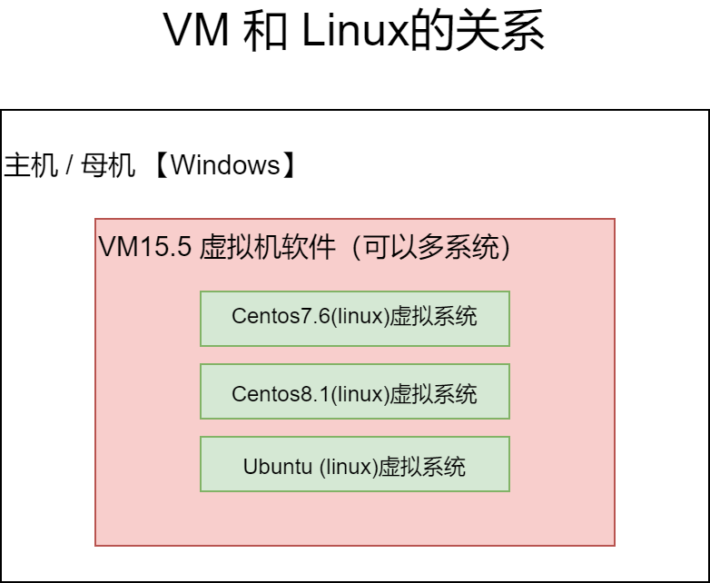
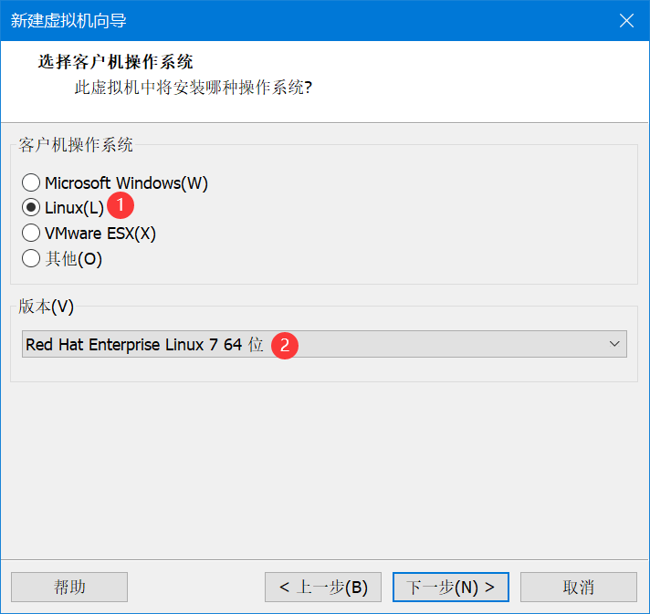
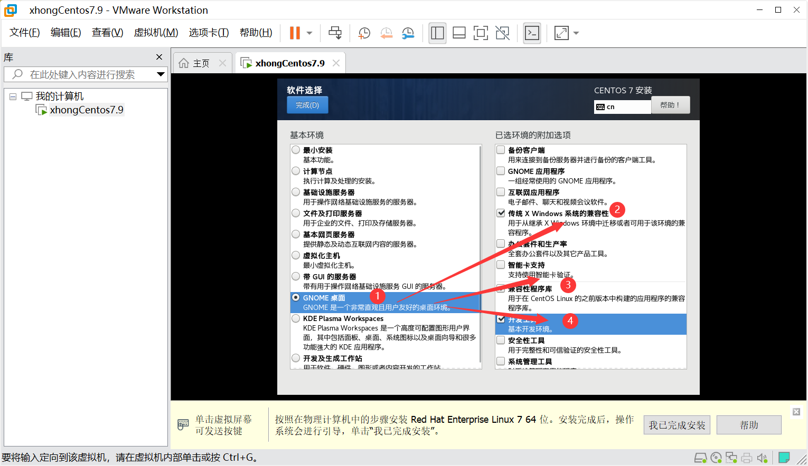
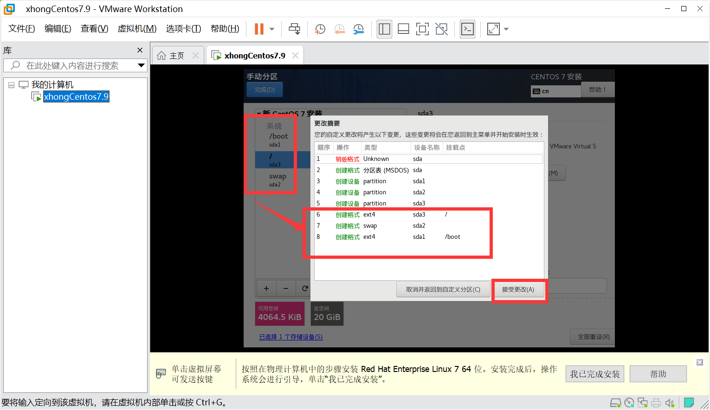
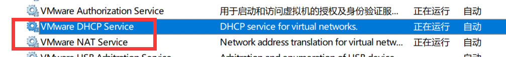
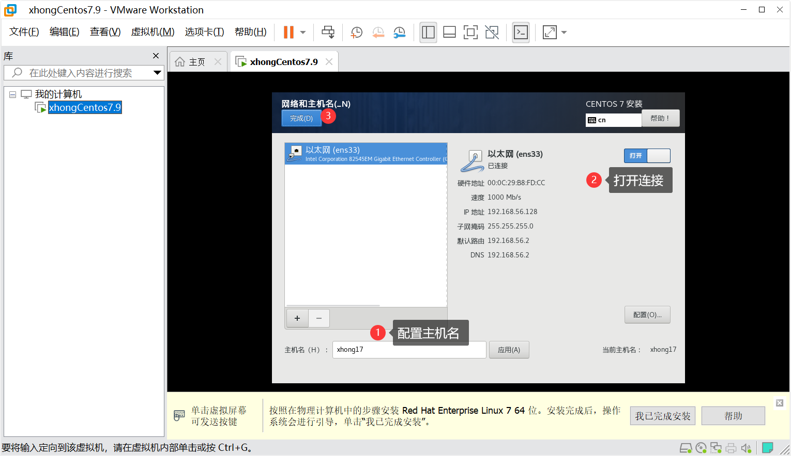

# 0101 安装配置 Linux

以下内容为 [B站 - 韩顺平 2021 Linux 教程](https://www.bilibili.com/video/BV1Sv411r7vd) 学习笔记。

## 一、真机安装

## 二、安装虚拟机 Virtual Machine 16.2.3

###  2.1 下载地址

&emsp;&emsp;VM官网：https://www.vmware.com/cn/products/workstation-pro/workstation-pro-evaluation.html

&emsp;&emsp;注：VM 非免费软件，可以免费试用 30 天，dddd。

###  2.2 安装步骤

1. 去BIOS里修改设置开启 ==**虚拟化设备支持**==
2. 管理员运行安装包

###  2.3 版本说明

&emsp;&emsp;只有 VM16 以上的版本可以在 Windows10 家庭版上使用。

## 三、安装Linux（CentOS 7.6 / CentOS 8.1）

###  3.1 下载地址

&emsp;&emsp;CentOS 7.9：https://mirrors.aliyun.com/centos/7.9.2009/isos/x86_64/

## 四、新建虚拟机

###  4.1 选择操作系统与版本

###  4.2 网络适配器

###  4.3 新 CD/DVD 安装

&emsp;&emsp;选择下载好的 iso 文件

## 五、在虚拟机中安装系统

###  5.1 软件选择

1. 开发工具：默认安装 GCC，JDK，MySQL
2. 配置需要等待时间， ==**不要乱点**==，否则容易卡死

###  5.2 磁盘分区（全盘最大20G）

1. 引导分区（boot）：1G
2. 交换分区（swap）：一般与内存大小一致，2G，可以临时充当内存
3. 根分区：存放安装的软件

###  5.3 网络与主机

1. 若不显示IP，则需将以下两个相关服务启动

2. 配置完成

