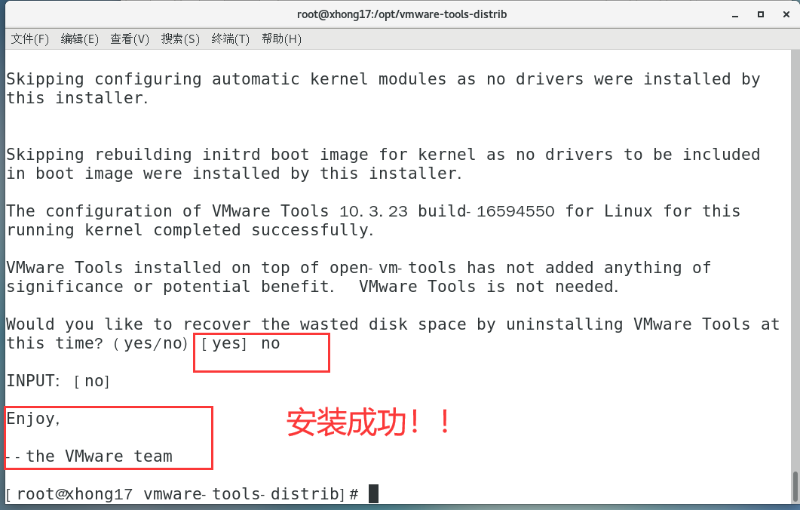

# 0102 虚拟机基本操作

以下内容为 [B站 - 韩顺平 2021 Linux 教程](https://www.bilibili.com/video/BV1Sv411r7vd) 学习笔记。


## 一、虚拟机克隆


## 二、虚拟机快照


## 三、虚拟机迁移删除


## 四、vmtools

### 4.1 介绍

1. 安装后，可以在 Windows 下更好地管理 vm 虚拟机
2. 可以设置 Windows 和 CentOS 的共享文件夹
3. CentOS7.9 以上版本无需再安装

### 4.2 安装步骤

1. 上方工具栏 —> 安装 vmware tools
2. [CSDN - 安装VMware Tools显示灰色正确解决办法](https://blog.csdn.net/zhengmilian5572/article/details/78195245)
3. 打开VMware Tools，复制 tar.gz 文件到 其他位置 —> opt 目录
4. 打开终端输入指令

> 查看 gcc 版本(安装前提)

```sh
gcc -v
```

> 进入 opt 文件夹

```sh
cd /opt/ 
ls
```

> 解压文件

```sh
tar -zxvf xx.tar.gz
```

> 进入解压的目录

```sh
cd vmware...
ls
```

> 安装文件

```sh
./vmware-install.pl
```



### 4.3 设置共享文件夹

1. 在 Windows 中创建共享文件夹 myshare
2. 在虚拟机中右击系统  —> 设置  —> 选项  —> 共享文件夹  —> 连接 myshare 文件夹
3. 共享文件夹在 CentOS 的 /mnt/hgfs/ 下

### 4.4 注意事项

1. 实际开发中，文件上传下载一般都是使用 **远程方式**（如Xshell、Xftp）完成