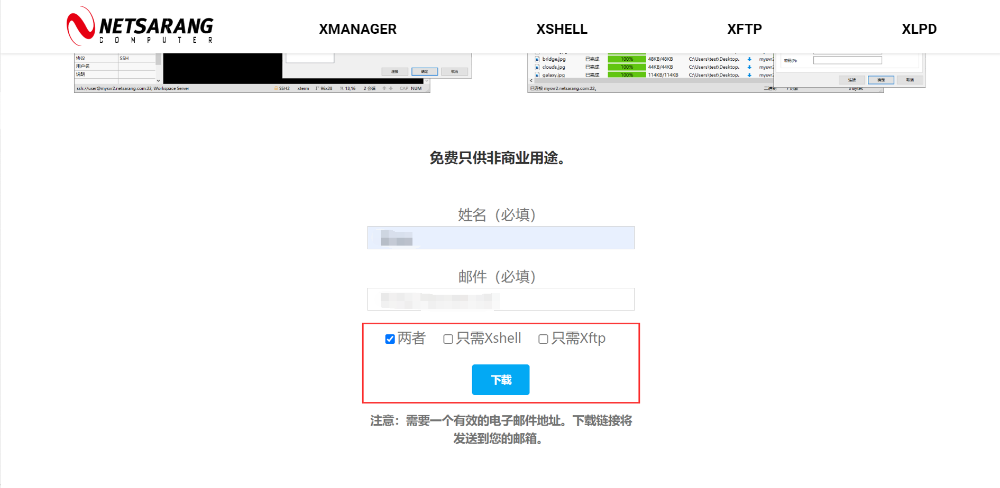
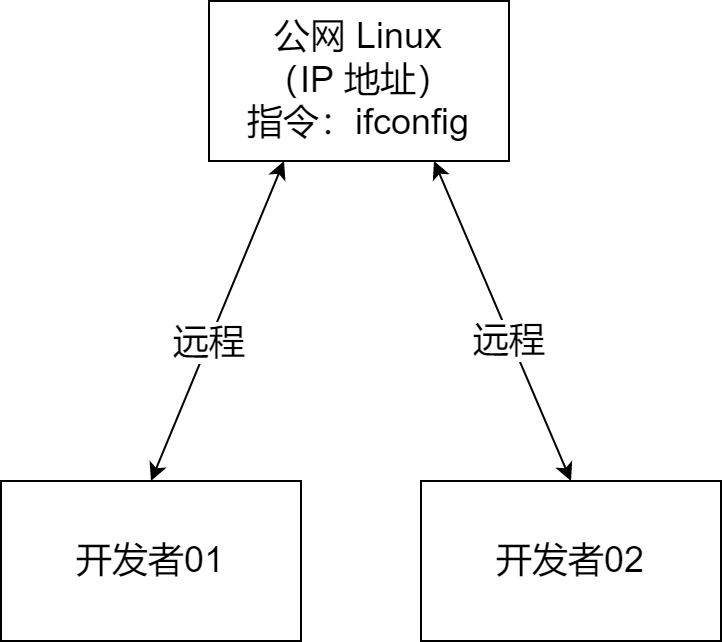

# 0201 Linux 远程操作

以下内容为 [B站 - 韩顺平 2021 Linux 教程](https://www.bilibili.com/video/BV1Sv411r7vd) 学习笔记。


## 一、远程登录 Linux

### 1.1 说明

1. 正式上线项目运行在公网
2. 需要远程登录进行开发

### 1.2 工具准备

1. 远程登录 Xshell7
2. 文件上传/下载 Xftp7
3. XShell 官网：https://www.xshell.com/zh/free-for-home-school/



### 1.3 远程连接

#### 1.3.1 测试远程连接是否畅通

> 在 Linux 中获取公网 IP 地址

```sh
ifconfig
```

> 在本机 ping 测试

```sh
ping ip地址
```

#### 1.3.2 Linux 远程操作示意图


