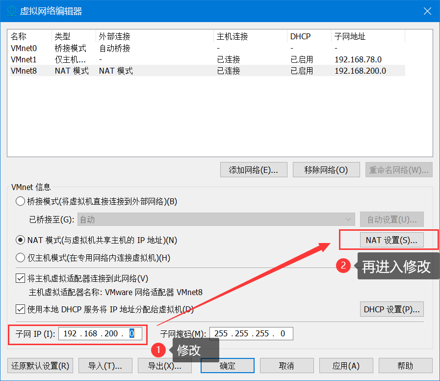
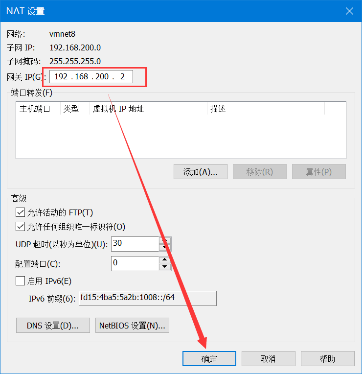
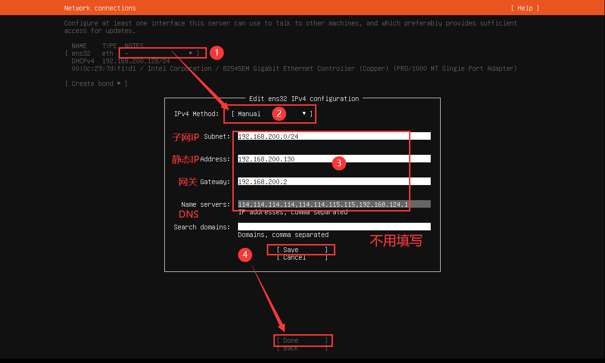

# 0203 Linux 网络配置

以下内容为 [B站 - 韩顺平 2021 Linux 教程](https://www.bilibili.com/video/BV1Sv411r7vd) 学习笔记。


## 一、Linux 网络配置原理


## 二、查看网络 IP 和网关


## 三、Linux 网络环境配置

###   3.1 自动获取 (DHCP)

1. 登录后自动获取 IP
2. 每次获取的 IP 地址可能不一样

###   3.2 指定静态 IP 地址

1. 情况说明：

- Ubuntu18.04 开始不采用在 `/etc/network/interfaces` 里固定 IP 的配置，而是改成 `netplan` 方式网卡配置文件

- 直接修改配置文件来指定 IP，并可以连接到外网

2. 使用 vim 编辑器打开网卡配置文件 

> CentOS7 版本

```sh
vim /etc/sysconfig/network-scripts/ifcfg-ens33
```

> Ubuntu20 版本以上

```sh
sudo vim /etc/netplan/00-installer-config.yaml
```

3. Ubuntu20.04 下的 00-installer-config.yaml 文件

&emsp;&emsp;注意 `yaml` 的格式，冒号之后要有个空格。

- 按 `i` 进入编辑模式

```yaml
network:    
  renderer: networkd
  ethernets:
    ens32:    #网卡名
      dhcp4: no
      addresses: [192.168.200.130/24]     #IP地址+子网掩码 
      gateway4: 192.168.200.2   #网关
      nameservers:
        addresses: [114.114.114.114,114.114.115.115,192.168.124.1]    #DNS
  version: 2
```

- 按 `esc` 键退出编辑，保存并退出

```sh
:wq!
```

4. 重启网络服务

```sh
sudo netplan apply
```

5. 虚拟机网络配置中修改





6. 重启虚拟机

```sh
sudo reboot
```

###  3.3 安装时配置静态 IP

1. 按需填写 IP 即可


