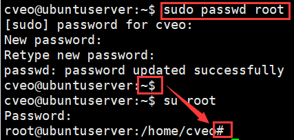

# 0301 Linux 下的 Python

以下内容为 [B站 - 韩顺平 2021 Linux 教程](https://www.bilibili.com/video/BV1Sv411r7vd) 学习笔记。


## 一、Python 开发平台 Ubuntu

###  1.1 介绍

1. Python 开发一般使用 Ubuntu 作为开发环境
2. 下载地址：https://cn.ubuntu.com/download/desktop
3. 安装步骤：https://blog.csdn.net/yanchenyu365/article/details/124406337

###  1.2 问题1 - 无法连接网络

1. 先关闭虚拟机
2. 顶部编辑栏 —> 虚拟网络编辑器 —> 更改设置 —> 还原默认设置

###  1.3 问题2 - 分辨率太小

1. 返回桌面
2. 右击 —> 显示设置 —> 分辨率 —> 调整合适的分辨率

###  1.4 root 用户

1. Ubuntu 不提倡使用 root 用户
2. 使用前需要给 root 用户设置初始密码
3. 提示符 $ 代表普通用户，# 代表 root 用户

> 使用 sudo 权限给 root 用户设置密码

```sh
sudo passwd root
```

> 切换到 root 用户

```sh
su root
```

> 退出并返回一般用户

```sh
exit
```



###  1.5 APT 软件管理

#### 1.5.1 基本介绍

1. 介绍：类似 Windows 中的软件管理工具
2. 阿里云镜像官网：[https://developer.aliyun.com/mirror/ubuntu](https://developer.aliyun.com/mirror/ubuntu?spm=a2c6h.13651102.0.0.3e221b11rqYqGy)

#### 1.5.2 更新源服务器列表

【以下操作均在 root 用户中实现】

> 切换到目标目录

```sh
cd /etc/apt
```

> 备份 Ubuntu 默认的源地址

```sh
cp /etc/apt/sources.list /etc/apt/sources.list.backup
```

> 清空 sources.list 文件

```sh
echo '' > sources.list
```
> vim 打开 sources.list 文件

```sh
vim sources.list
```

--- 粘贴对应版本的镜像源 ---

> 修改内容 - 对应版本的镜像源

```
deb http://mirrors.aliyun.com/ubuntu/ focal main restricted universe multiverse
deb-src http://mirrors.aliyun.com/ubuntu/ focal main restricted universe multiverse

deb http://mirrors.aliyun.com/ubuntu/ focal-security main restricted universe multiverse
deb-src http://mirrors.aliyun.com/ubuntu/ focal-security main restricted universe multiverse

deb http://mirrors.aliyun.com/ubuntu/ focal-updates main restricted universe multiverse
deb-src http://mirrors.aliyun.com/ubuntu/ focal-updates main restricted universe multiverse

# deb http://mirrors.aliyun.com/ubuntu/ focal-proposed main restricted universe multiverse
# deb-src http://mirrors.aliyun.com/ubuntu/ focal-proposed main restricted universe multiverse
deb http://mirrors.aliyun.com/ubuntu/ focal-backports main restricted universe multiverse
deb-src http://mirrors.aliyun.com/ubuntu/ focal-backports main restricted universe multiverse
```

> 保存并退出
```sh
:wq
```

> 刷新源

```sh
sudo apt-get update
```

###  1.6 远程登录

1. 安装 net-tools 工具

```sh
sudo apt install net-tools
```

2. 查看正在监听 LISTEN 的端口

```sh
netstat -anp | more
```

3. 安装 SSH 并启用

- Ubuntu20 版本在安装时，可自选提前安装

- 如未提前安装，则需要同时安装 SSH 服务端和客户端 

```sh
sudo apt-get install openssh-server
```


## 二、Python 环境配置

###   2.1 APT 配置 Python 环境

####     2.1.1 移除 Python3.8

&emsp;&emsp;若服务器内置的 Python3.8 版本，但开发环境使用 Python3.9 

&emsp;&emsp;则需要先移除 3.8 版本再进行重新安装 3.9 （以下 **三选一** 即可）

> 卸载自带的 python3.8 (但保留配置文件)

```sh
sudo apt-get remove python3.8
```

> 卸载 python3.8 及其依赖

```sh
sudo apt-get remove python3.8 
```

> 彻底清除 python3.8 (推荐使用,以下 **二选一** 即可)

```sh
sudo apt-get purge python3.8
or
sudo apt-get purge --auto-remove python3.8
```

####   2.1.2 APT 安装 Python3.9

```sh
sudo apt-get install python3.9 -y
```

注：`-y` 指后续安装全部默认 yes

###  2.2 编译安装 Python 环境

####   2.2.1 情况说明

1. Ubuntu 20.04 LTS 默认 Python 版本为 3.8.10
2. 本次项目开发环境使用 Python3.9，所以需要另外安装

####   2.2.2 生成项目依赖

1. 在本机 VS Code 安装 pipreqs 包

```sh
pip3 install pipreqs
```

2. 生成当前工程需要的环境包

```sh
pipreqs ./ --encoding=utf-8 --force
```

####   2.2.3 创建 `/src` 目录

> 创建 /src 文件夹,用于软件安装包存放源码

```sh
mkdir -p ~/src
```

> 转进 /src 文件夹

```sh
cd ~/src
```

#### 2.2.4 安装依赖并下载 Python3.9.13 源码

> 刷新软件包目录

```sh
sudo apt update
```

> 安装 GCC 编译器

```sh
sudo apt install gcc
```

> 安装依赖

```sh
sudo apt install build-essential zlib1g-dev libncurses5-dev libgdbm-dev libnss3-dev libssl-dev libreadline-dev libffi-dev libbz2-dev liblzma-dev sqlite3 libsqlite3-dev tk-dev uuid-dev libgdbm-compat-dev
```

> 下载 Python 3.9.13 的源码

```sh
wget https://www.python.org/ftp/python/3.9.13/Python-3.9.13.tgz
```

注：wget 是一种下载工具，下载可能会卡，多试几次

> 解压源码

```sh
tar -zxvf Python-3.9.13.tgz
```

> 转进到解压目录

```sh
cd Python-3.9.13/
```

#### 2.2.5 编译与安装

1. 配置与编译

> 检查依赖与配置编译

```sh
sudo ./configure --enable-optimizations --with-lto --enable-shared
```

> 编译 (二选一,推荐 **第一个**)

```sh
sudo make -j 2
or
sudo make
```

注：-j 后面的数字为参与编译的CPU核心数，根据个人机器配置调整，过程非常慢，多等一会

2. 后续安装教程及原理：https://blog.csdn.net/mziing/article/details/124475877
