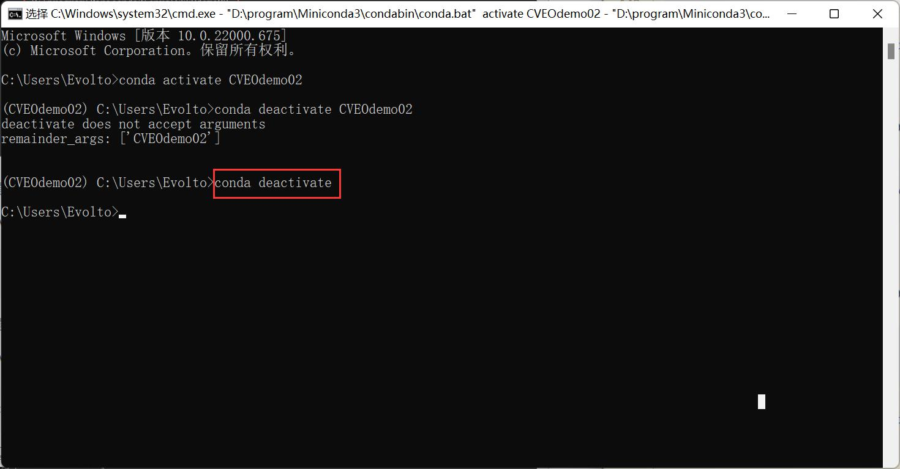

# Win11 安装配置 Miniconda 全过程记录

## 1 多版本 conda 间的区别

&emsp;&emsp;参考：[简书 - 关于bioconda,miniconda,conda,anaconda的区别](https://www.jianshu.com/p/0534043b4471)


## 2 下载 Miniconda

&emsp;&emsp;下载链接：[清华镜像](https://mirrors.tuna.tsinghua.edu.cn/anaconda/miniconda/)【这里我们选择 python3.9 版本】


## 3 安装 Miniconda

### 3.1 修改安装位置

&emsp;&emsp;在安装时，右击 → 以管理员身份运行。同时，软件默认安装在 C 盘，所以需要修改文件安装位置。【要求：位置不在 C 盘，且文件名为英文。】


### 3.2 安装成功


### 3.3 添加环境变量

&emsp;&emsp;由于在安装时，添加环境变量的选项是灰色不可选状态，所以需要我们自行添加。

- 右击此电脑 → 属性 → 高级系统设置 → 环境变量


- 添加环境变量 Path

&emsp;&emsp;这里的文件位置信息以安装时设置位置为准，不唯一。

```
D:\program\Miniconda3
D:\program\Miniconda3\Scripts
D:\program\Miniconda3\Library\bin
```


&emsp;&emsp;到这里才算是正式完成 miniconda 的安装，即软件安装 + 环境配置，下面我们需要对 conda 进行初始化。


## 4 conda 初始化

> 初始化 PowerShell

```
conda init powershell
```


> 初始化 cmd

```
conda init cmd.exe
```


## 5 更换国内镜像源

### 5.1 生成下载源文件的配置文件

&emsp;&emsp;打开一个新的 cmd 窗口，输入下方指令，随后在 C 盘的用户目录下会生成一个 .condarc 文件。

```
conda config --set show_channel_urls yes
```


### 5.2 生成下载源文件的配置文件

> 修改前内容

&emsp;&emsp;在 C 盘用户目录下找到文件后，右击使用记事本打开。


> 修改后内容

&emsp;&emsp;修改内容包括：创建虚拟环境默认安装的位置，以及清华大学镜像源

```
envs_dirs:
  - D:\program\Miniconda3\envs
channels:
  - defaults
show_channel_urls: true
channel_alias: https://mirrors.tuna.tsinghua.edu.cn/anaconda
default_channels:
  - https://mirrors.tuna.tsinghua.edu.cn/anaconda/pkgs/main
  - https://mirrors.tuna.tsinghua.edu.cn/anaconda/pkgs/free
  - https://mirrors.tuna.tsinghua.edu.cn/anaconda/pkgs/r
  - https://mirrors.tuna.tsinghua.edu.cn/anaconda/pkgs/pro
  - https://mirrors.tuna.tsinghua.edu.cn/anaconda/pkgs/msys2
custom_channels:
  conda-forge: https://mirrors.tuna.tsinghua.edu.cn/anaconda/cloud
  msys2: https://mirrors.tuna.tsinghua.edu.cn/anaconda/cloud
  bioconda: https://mirrors.tuna.tsinghua.edu.cn/anaconda/cloud
  menpo: https://mirrors.tuna.tsinghua.edu.cn/anaconda/cloud
  pytorch: https://mirrors.tuna.tsinghua.edu.cn/anaconda/cloud
  simpleitk: https://mirrors.tuna.tsinghua.edu.cn/anaconda/cloud
```

> 清除索引缓存，保证用的是镜像站提供的索引

```
conda clean -i
```

> 修改虚拟环境默认安装位置

&emsp;&emsp;找到 miniconda 目录下的 envs 文件夹，右击打开属性。


## 6 conda 常用命令

### 6.1 检查当前环境信息

```
conda info
```


### 6.2 创建并查看虚拟环境

> 创建新的虚拟环境

&emsp;&emsp;创建一个名为 CVEOdemo02 的 python3.9 的环境。

```
conda create -n CVEOdemo02 python=3.9
```

> 查看已创建的虚拟环境

```
conda info -e
```


### 6.3 移除虚拟环境

&emsp;&emsp;移除名为 CVEOdemo02 的虚拟环境。

```
conda remove -n CVEOdemo02 --all
```

### 6.4 激活 & 关闭虚拟环境

> 激活虚拟环境

&emsp;&emsp;激活名为 CVEOdemo02 的虚拟环境，激活后如下图所示，前面多一个 (CVEOdemo02)。

```
conda activate CVEOdemo02
```


> 关闭虚拟环境

&emsp;&emsp;关闭名为 CVEOdemo02 的虚拟环境，在激活后不能直接使用以下命令退出虚拟环境，否则会出现下图情况。

```
conda deactivate CVEOdemo02
```




## 参考文章

1. [关于bioconda,miniconda,conda,anaconda的区别](https://www.jianshu.com/p/0534043b4471)
2. [Win11 安装 Miniconda 配置 powershell](https://blog.csdn.net/qq_40597075/article/details/122560335)
3. [Windows 中 miniconda 安装以及环境配置](https://blog.csdn.net/weixin_42744482/article/details/120299119)
4. [改变 conda 虚拟环境的默认路径](https://blog.csdn.net/qq_36455412/article/details/125347552)
5. [君安的 conda 笔记](https://gitee.com/gis-xh/my-note/blob/master/daily/conda.md)
