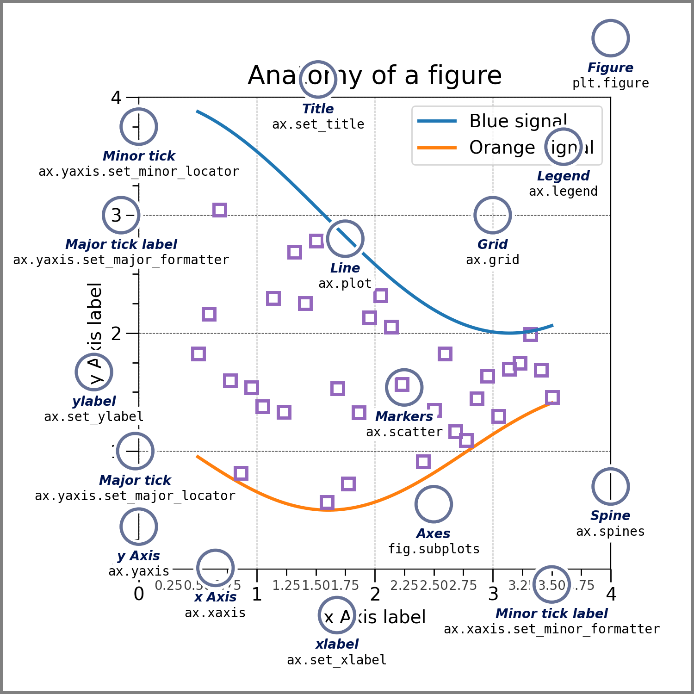

# 01 Matplotlib 库入门


## 1 安装 matplotlib 库

```sh
pip install matplotlib
```


## 2 核心组件



### 2.1 `Figure`

简写为 `fig`，它是图像绘制的容器。

一个 Figure 中绘制多个子图形，每个子图形都可以包含一个或多个组件。

例如，我们可以在一个 Figure 中绘制一个柱状图和一个折线图，并且可以通过设置不同的属性（如标题、坐标轴标签、图例等）来让这两个图形在同一个图形容器中呈现。

### 2.2 `Axes`

简写为 `ax`，它代表图形的坐标系统。

在 Figure 中可以有多个 Axes，每个 Axes 都可以独立绘制不同的图形。

- 直角坐标系：$x, y$ 轴
- 极坐标系：$r$，$xyz$

> 创建一个包含单个坐标轴的图形

```python
fig, ax = plt.subplots()
```

> 在坐标轴上绘制一些数据 (x轴, y轴)

```python
ax.plot([1, 2, 3, 4], [1, 4, 2, 3])
```

### 2.3 `Artist`

它是 Matplotlib 中图形的基本单元，包括线条、文本、图像等。在 Matplotlib 中，图形是通过将 Artist 组合在一起来实现的。

### 2.4 `Legend`

它是图例的意思，在图形中可以通过 Legend 来说明图形的含义。

### 2.5 `Text`

它代表图形中的文本，在 Matplotlib 中可以使用 Text 来添加标题、坐标轴标签、图例等文本。

### 2.6 `Line2D`

它代表图形中的线条，是 Matplotlib 中绘制线条图形的基本单元。
