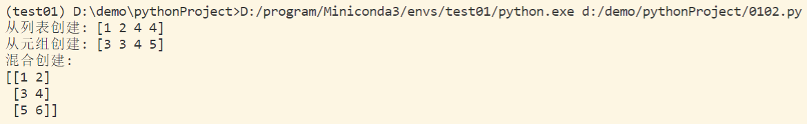
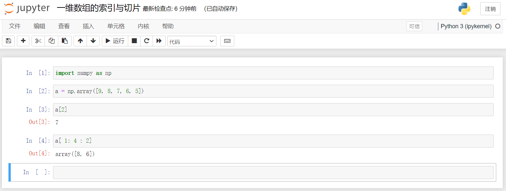

# 0102 NumPy 库基础操作

本文使用 miniconda 作为 python 版本控制及开发工具。

NumPy 是 Python 常用的第三方库，它的核心在于：

1. 数据的维度：一维、二维、多维、高维数据。。。
2. NumPy 中的 ndarray 类型：是一个表示 N 维数据的数据类型，填补了 Python 没有数组类型缺陷。

## 1 N 维数组对象：ndarray

### 1.1 原始数组与 NumPy 数组

> 原始数组代码

```python
def pySum():
    a = [1, 2, 3, 4]
    b = [1, 2, 3, 4]
    c = []
    for i in range(len(a)):
        c.append(a[i]**2+b[i]**3)
    return c
print(pySum())
```

> 引入 numpy 后

```python
import numpy as np
def npSum():
    a = np.array([1, 2, 3, 4])
    b = np.array([1, 2, 3, 4])
    c = a**2 + b**3
    return c
print(npSum())
```

### 1.2 ndarray 类型属性

参考：[菜鸟教程 - NumPy 数组属性](https://www.runoob.com/numpy/numpy-array-attributes.html)

| 名称             | 描述                                          |
| ---------------- | --------------------------------------------- |
| ndarray.ndim     | 数组的秩，即轴的数量 / 维度的数量             |
| ndarray.shape    | 数组的维度，对于矩阵，n 行 m 列               |
| ndarray.size     | 数组元素的总个数，相当于 .shape 中 n × m 的值 |
| ndarray.dtype    | ndarray 对象的元素类型                        |
| ndarray.itemsize | ndarray 对象中每个元素的大小，以字节为单位    |


## 2 创建 ndarray 的数组

### 2.1 使用 Python 中的 列表list 和 元组tuple 等类型创建

将列表或元组当作参数输入给相关的函数，可以用 `dtype` 来指定元素的数据类型。

```python
x = np.array(list/tuple, dtype=np.float32)
```

当 `np.array()` 不指定 `dtype` 时，NumPy 将根据读入的数据确定 `dtype` 类型。

- 若读入的数据 **均为** 整数，则 NumPy 将创建一个整数类型的数组
- 若读入的数据 **存在** 浮点数，则 NumPy 将创建一个浮点数类型的数组

> 从列表创建

```python
x = np.array([1, 2, 4, 4])
print(x)
```

> 从元组中创建

```python
y = np.array((3, 3, 4, 5))
print(y)
```

> 从列表和元组混合类型创建

```python
z = np.array([[1, 2], (3, 4), [5, 6]])
print(z)
```



### 2.2 【常用方法】使用 NumPy 的函数进行创建

1. [菜鸟教程 - NumPy 创建数组](https://www.runoob.com/numpy/numpy-array-creation.html)
2. [菜鸟教程 - NumPy 从已有的数组创建数组](https://www.runoob.com/numpy/numpy-array-from-existing-data.html)
3. [菜鸟教程 - NumPy 从数值范围创建数组](https://www.runoob.com/numpy/numpy-array-from-numerical-ranges.html)

| 名称                | 描述                                                         |
| ------------------- | ------------------------------------------------------------ |
| np.arrage(n)        | 类似 range() 函数，返回 ndarray 类型，生成的数组元素是整数类型 |
| np.ones(shape)      | 根据 shape 生成一个全 1 数组，shape 是元组类型，数组元素默认为浮点数 |
| np.zeros(shape)     | 根据 shape 生成一个全 0 数组，shape 是元组类型，数组元素默认为浮点数 |
| np.full(shape,val)  | 根据 shape 生成一个数组，每个元素值都是 val                  |
| np.eye(n)           | 创建一个正方的 n × n **单位矩阵**，对角线都是 1，其余为 0    |
| np.ones_like(a)     | 根据数组 a 的形状生成一个全 1 数组                           |
| np.zeros_like(a)    | 根据数组 a 的形状生成一个全 0 数组                           |
| np.full_like(a,val) | 根据数组 a 的形状生成一个数组，每个元素值都是 val            |

> 常用于大规模科学计算

| 名称                | 描述                                                    |
| ------------------- | ------------------------------------------------------- |
| np.ones_like(a)     | 根据输入的数组 a 的形状生成一个全 1 数组                |
| np.zeros_like(a)    | 根据输入的数组 a 的形状生成一个全 0 数组                |
| np.full_like(a,val) | 根据输入的数组 a 的形状生成一个数组，每个元素值都是 val |

### 2.3 使用 NumPy 中其他函数创建

| 名称             | 描述                                   |
| ---------------- | -------------------------------------- |
| np.linspace()    | 根据起止数据等间距地填充数据，形成数组 |
| np.concatenate() | 将两个或多个数组合并成一个新的数组     |


## 3 ndarray 数组的变换

创建好的 `ndarray` 数组，可以对其进行：

- 维度变换
- 元素类型变换

### 3.1 ndarray 数组的维度变换

| 名称                 | 描述                                                      |
| -------------------- | --------------------------------------------------------- |
| np.reshape(shape)    | 不改变数组元素，创建一个新的 shape 形状的数组，原数组不变 |
| np.resize(shape)     | 与 .reshape() 功能一致，但是会修改原数组                  |
| np.swapaxes(ax1,ax2) | 将数组 n 个维度中两个维度进行调换                         |
| np.flatten()         | 对数组进行降维，返回折叠后的一维数组，原数组不变          |

### 3.1 ndarray 数组的维度变换

```python
new_a = a.astype(new_type)
```

| 名称       | 描述                                      |
| ---------- | ----------------------------------------- |
| a.astype() | 拷贝原数组 a 创建一个新的数组，原数组不变 |
| a.tolist() | 将原数组 a 转化为列表                     |


## 4 ndarray 数组的索引与切片

1. [菜鸟教程 - NumPy 切片和索引](https://www.runoob.com/numpy/numpy-indexing-and-slicing.html)
2. [菜鸟教程 - NumPy 高级索引](https://www.runoob.com/numpy/numpy-advanced-indexing.html)

### 4.1 相关基础知识

1. 一维数组的索引和切片与 Python 的列表类似

2. 索引：

- 原理：寻找数组的中某个元素

- 格式：从左往右从 0 开始（0，1，2，... ），从右往左从 -1 开始（ ...，-3，-2，-1)

3. 切片：

- 原理：取出数组中某一段的全部元素形成新的数组，索引时 **不含** 终止编号

- 格式：[ 起始编号：终止编号：步长 ]，起止可以为空

### 4.2 对于一维数组

> python 文件

```python
import numpy as np
a = np.array([9, 8, 7, 6, 5])
print("一维数组索引:", a[2])
print("一维数组切片:", a[1: 4: 2])
```

>jupyter 内容



### 4.3 对于多维数组

> python 文件

```python
import numpy as np
a = np.arange(24).reshape((2, 3, 4))
print(a)
# 数组索引
print(a[1, 2, 3])
print(a[0, 1, 2])
print(a[-1, -2, -3])
# 数组切片
print(a[:, 1, -3])
print(a[:, 1:3, :])
print(a[:, :, ::2])
```

1. 多维数组的索引值使用逗号分隔
2. 通过 `:` 可以选取整个维度
3. 每个维度内部的切片方法与一维数组相同
4. 每个维度可以使用 **步长** 跳跃切片

> jupyter 内容


## 5 ndarray 数组的运算

参考：[菜鸟教程 - NumPy 数学函数](https://www.runoob.com/numpy/numpy-mathematical-functions.html)

NumPy 的设计理念在于把数组当成一个数字来对待。

### 5.1 数组与标量间的运算

运算将会作用于每一个数组元素。

| 名称     | 描述                            |
| -------- | ------------------------------- |
| a.mean() | 求数组 a 中所有元素的算术平均值 |

### 5.2 NumPy 一元函数

1. 一元函数：即只对一个数组进行运算的函数

2. 注：计算后会创建一个新的数组，原数组保持不变，在计算时要注意数组是否被真实改变。

> 部分常用函数

| 函数         | 说明                                                         |
| ------------ | ------------------------------------------------------------ |
| np.square(a) | 计算数组 a 中各元素的平方，创建一个新的数组，原数组保持不变  |
| np.sqrt(a)   | 计算数组 a 中各元素的平方根，创建一个新的数组，原数组保持不变 |
| np.modf(a)   | 将数组 a 中各元素的整数部分和小数部分分离，创建两个新的数组，原数组保持不变 |

### 5.3 NumPy 二元函数

1. 二元函数：即对两个数组进行运算的函数

2. 注：计算后会创建一个新的数组，原有数组保持不变，在计算时要注意数组是否被真实改变。

> 部分常用函数

| 函数             | 说明                                                     |
| ---------------- | -------------------------------------------------------- |
| + - * / **       | 两个数组间对应元素进行【加、减、乘、除、乘方】的对应计算 |
| > < >= <= == !=  | 算术比较，计算将产生布尔型数组                           |
| np.copysign(x,y) | 将数组 y 中各元素值的符号赋值给数组 x 对应元素           |


## 参考文章

1. [CSDN - 完美解决Anaconda打开Spyder5报错:link image0 hasn’t been detected!](https://blog.csdn.net/Netceor/article/details/124051048)
2. [菜鸟教程 - NumPy 教程](https://www.runoob.com/numpy/numpy-tutorial.html)


上一节：[0101 学习环境配置](./0101学习环境配置.md)

下一节：[0103 NumPy 官网快速入门](./0103NumPyQuickStart.md)

