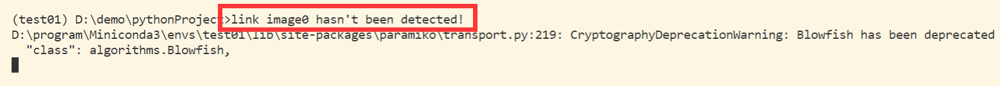
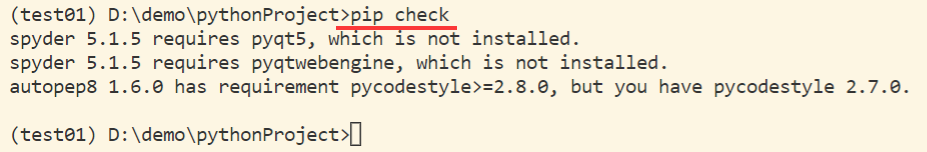
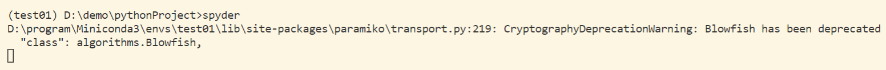
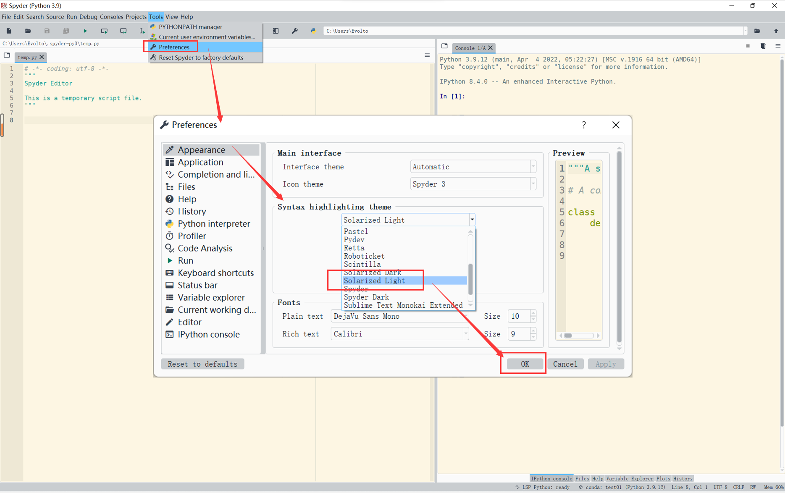
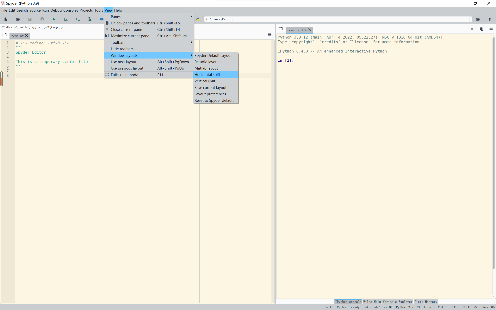

# 0101 Python 数据分析学习环境配置

本文使用 miniconda 作为 python 版本控制及开发工具。

## 1 配置环境

### 1.1 创建新的虚拟环境

> 创建新的虚拟环境

```cmd
conda create -n test01 python=3.9
```

> 激活虚拟环境

```cmd
conda activate test01
```

### 1.2  安装开发环境

> conda 安装开发软件

&emsp;&emsp;为了严格进行环境控制，我们在之前创建的虚拟环境中安装常用的御三家 python 软件：`notebook` 和 `spyder` 

```cmd
conda install -n test01 ipython notebook spyder
```

> pip 添加 numpy 包

```
pip install numpy
```

### 1.3 配置 Spyder

#### 1.3.1 初次运行并发现错误

> 运行 Spyder

```cmd
spyder
```

&emsp;&emsp;直接在控制台中输入命令即可运行，此时会报错，如下图所示。参考：[CSDN - 解决——完美解决Anaconda打开Spyder5报错:link image0 hasn’t been detected!](https://blog.csdn.net/Netceor/article/details/124051048)



> 检查依赖包

```cmd
pip check
```



&emsp;&emsp;这里我们可以发现，`spyder` 运行报错的原因是缺少了部分关联包，所以需要把他们逐一安装上。

#### 1.3.2 安装缺失的依赖包

> pip 安装 pyqt5

```cmd
pip install pyqt5==5.12.3 -i https://pypi.tuna.tsinghua.edu.cn/simple
```

> pip 安装 pyqtwebengine

```
pip install pyqtwebengine==5.12.1 -i https://pypi.tuna.tsinghua.edu.cn/simple
```

> pip 安装 pyzmq

```
pip uninstall pyzmq
pip install pyzmq==19.0.2 -i https://pypi.tuna.tsinghua.edu.cn/simple
```

> 再次启动 spyder

```cmd
spyder
```



&emsp;&emsp;可以看到，之前错误已经消失了，程序可以正常运行了。

#### 1.3.3 Spyder 内部配置

&emsp;&emsp;这里我们将原有界面调整为常用的 中意的背景 + 左编译器右交互式命令行 ipython 布局。

> 修改编辑器背景色



> Window layout 窗口布局调整




上一节：无

下一节：[0102 NumPy 库基础操作](./0102NumPy库基础操作.md)

