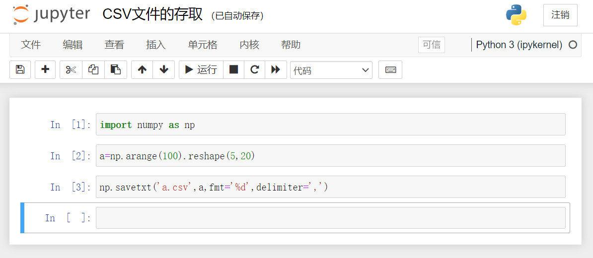

# 0201 NumPy 数据存取

## 1 CSV 文件的存取

CSV 文件：逗号分隔值文件，常见存储一维二维数据的文件格式，用于存储批量数据。

### 1.1 将数据写入 CSV 文件

```python
np.savetxt(frame, array, fmt='%.18e', delimiter=None)
```

- `frame` ：要写入的文件、字符串或产生器的名字，可以是 .`gz` 或 `.bz2` 的压缩文件。

- `array` ：存入文件的数组。

- `fmt` ：写入文件的格式，默认是科学计数法保留 18 位小数 `%.18e` 

  【用户主要修改参数】，还有其他参数如：`%d` `%.2f` ... 

- `delimiter` ：分割字符串，默认是任何空格。

【注：】
1. CSV 文件中要求的数据分割符是 `,` 
1. `np.savetxt()` 函数并不是只为生成 CSV 文件服务的，它还可以生成任何带有特定分割字符串的其他文件。

#### 1.1.1 写入 CSV 文件

&emsp;&emsp;接下来我们会生成一个元素为 0~100，形状为 5行，20列的数组。并将其写入一个名为 `a.csv` 的文件中。

> ipython



> python

```python
import numpy as np
a = np.arange(100).reshape(5, 20)
np.savetxt('a.csv', a, fmt='%d', delimiter=',')
```

#### 1.1.2 打开 CSV 文件


### 1.2 读取 CSV 文件中的数据

```python
np.loadtxt(frame, dtype=np.float, delimiter=None, unpack=False)
```

- `frame` ：要读取的文件、字符串或产生器的名字，可以是 `.gz` 或 `.bz2` 的压缩文件。
- `dtype` ：数据类型，可选，默认是 `np.float` 。
- `delimiter` ：分割字符串，默认是任何空格。
- `unpack` ：如果True，读入属性将分别写入不同变量。

&emsp;&emsp;接下来我们会把之前生成的名为 `a.csv` 的文件读取成数组形式，可以看到默认读取的数据类型为浮点数类型。

> ipython


> python

```python
import numpy as np
a = np.arange(100).reshape(5, 20)
np.savetxt('a.csv', a, fmt='%d', delimiter=',')
b = np.loadtxt('a.csv', delimiter=',')
print(b)
```

### 1.3 CSV 文件的局限性

&emsp;&emsp;CSV 只能有效存储一维和二维数组。

&emsp;&emsp;因此这里 `np.savetxt()` 和 `np.loadtxt()` 也只能有效存取一维和二维数组。


## 2 多维数组的存取


上一节：[0103 NumPy Quick Start 翻译](../01NumPy库入门/0103NumPyQuickStart.md)

下一节：无
