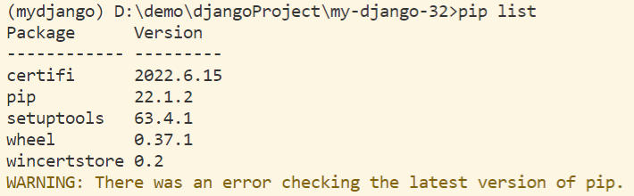
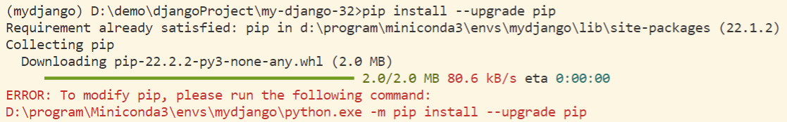
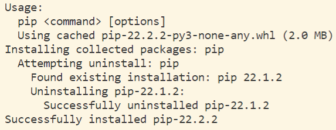
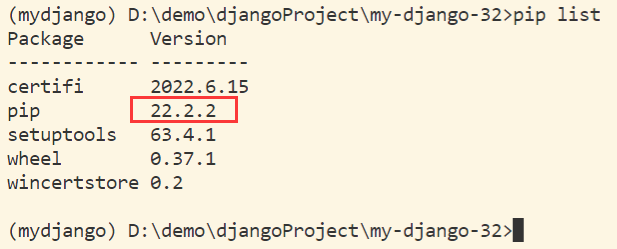
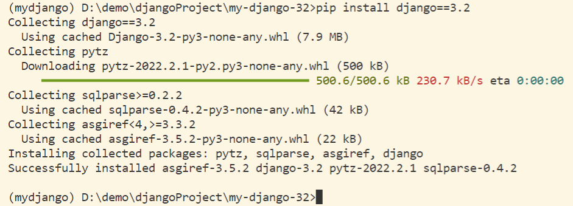
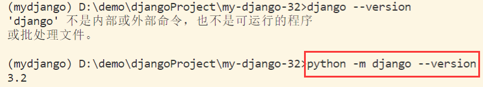

# 01 Django 开发环境配置

## 一、Python 的 Web 框架

1. Flask 自身短小精悍 + 第三方组件
2. Django 内部已集成了很多组件 + 第三方组件。【主要使用】


## 二、配置虚拟环境

【注意】：

1. 此处默认已经安装 Anaconda / Miniconda，如未安装，请参考 [Win11 安装配置 Miniconda 全过程记录](../01conda/Win11-Miniconda-install.md)
2. 以下命令均是在终端命令行中输入。

### 2.1 创建环境

```sh
conda create -n mydjango python=3.9
```

### 2.2 激活环境

```sh
conda activate mydjango
```

### 2.3 退出环境

```sh
conda deactivate mydjango
```


## 三、检查当前环境

### 3.1 查看当前安装的包

```sh
pip list
```




&emsp;&emsp;这里我们可以看到当前虚拟环境下所含的包，并没有 Django 且出现需要更新 pip 版本的警告。

### 3.2 更新 pip 版本

&emsp;&emsp;为了消除警告，我们需要对 pip 的版本进行更新。

> 错误

```sh
pip install --upgrade pip
```

&emsp;&emsp;此时虽然下载了最新的 pip 版本包，但是会报错：`ERROR: To modify pip, please run the following command`



> 正确

```sh
python -m pip install --upgrade pip
```



### 3.3 再次检查当前包的版本

```sh
pip list
```

&emsp;&emsp;可以看到，此时 pip 版本已更新至当前最新版本（22.2.2）。



### 3.4 虚拟环境的目录结构

> Miniconda3 下名为 mydjango 的虚拟环境

```
D:\Miniconda3\envs\mydjango\
    - python.exe
    - Script
        - pip3.exe  # 用于安装第三方组件
        - django-admin.exe  【工具，创建Django项目中的文件与文件夹】
    - Lib
        - 包含诸多内置模块
        - site-packages  #放置已安装的第三方模块
            - openpyxl
            - python-docx
            - flask
            - django 【框架的源码】
```


## 四、安装并检查 Django 版本

### 4.1 安装 Django 3.2

```sh
pip install django==3.2
```



### 4.2 检查 Django 版本

```sh
python -m django --version
```



【注】：这里不能只写 `django --version` 否则会报错。


上一节：无

下一节：[02 Django 官网示例](./02Django官网示例.md)

