# 02 Django 官网示例

## 前言

1. 书接上回：[01 Django 开发环境配置](./01Django开发环境配置.md)

2. 本文参考：[Django3.2 官方文档 - 编写你的第一个 Django 应用](https://docs.djangoproject.com/zh-hans/3.2/intro/tutorial01/)


## 1 创建并运行项目

### 1.1 创建项目

#### 1.1.1 创建 `mysite` 目录

```sh
django-admin startproject mysite
```

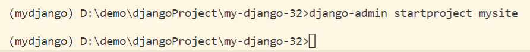

#### 1.1.2 目录结构展示

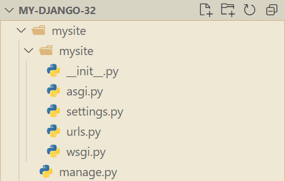

【注：官网原文】最外层的 `mysite/` 根目录只是你项目的容器， 根目录名称对 Django 没有影响，你可以将它重命名为任何你喜欢的名称。

#### 1.1.3 runserver 首次运行项目

> 切入到 mysite 文件夹内

```sh
cd mysite
```

> runserver 运行

```sh
python manage.py runserver
```

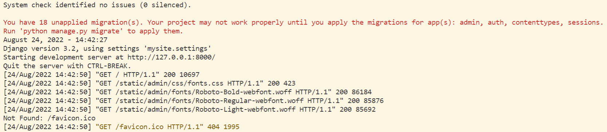

【注：官网原文】忽略有关未应用最新数据库迁移的警告，稍后我们处理数据库，另外，`ctrl+C` 可以停止项目运行。

### 1.2 创建应用

> 创建 polls 应用

```sh
python manage.py startapp polls
```

> polls 应用目录结构

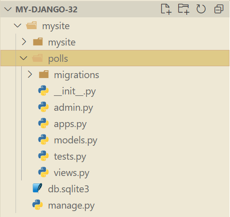

### 1.3 编写应用视图

> polls/views.py 中

```python
from django.http import HttpResponse
def index(request):
    return HttpResponse("Hello, world. You're at the polls index.")
```

> 新建 polls/urls.py 并输入

```python
from django.urls import path
from . import views
urlpatterns = [
    path('', views.index, name='index'),
]
```

> mysite/urls.py 中

```python
from django.contrib import admin
from django.urls import include, path
urlpatterns = [
    path('polls/', include('polls.urls')),
    path('admin/', admin.site.urls),
]
```

> 启动项目

```sh
python manage.py runserver
```

- 若访问地址：`http://127.0.0.1:8000/` 则会因地址错误，出现以下页面，此界面只会在开发模式中 Debug 为 True 时出现。

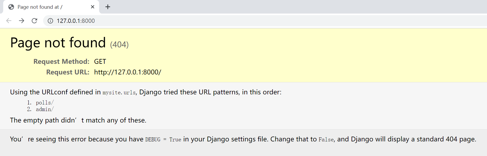

- 若访问正确地址：`http://127.0.0.1:8000/polls/` 则会显示如下界面。

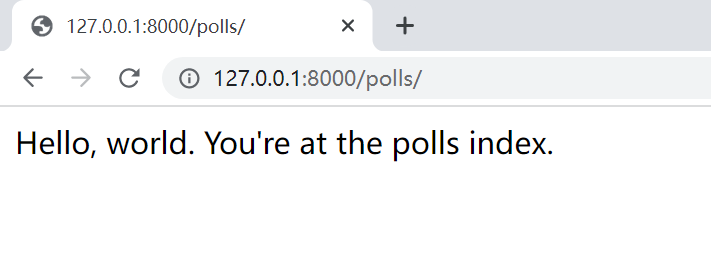

【注】：此时由于为进行迁移操作，所以在运行时还是会报错，接下来我们会对此进行处理。

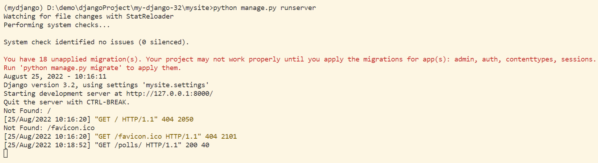


## 2 创建数据库与模型

### 2.1 Django 数据库配置


### 2.2 Django 数据模型 

####  2.2.1 数据库迁移

&emsp;&emsp;因为项目中默认开启的某些应用的运行需要至少一个数据表，所以在使用它们前需要先创建一些表，否则就会报出上文出现的错误。

```sh
python manage.py migrate
```

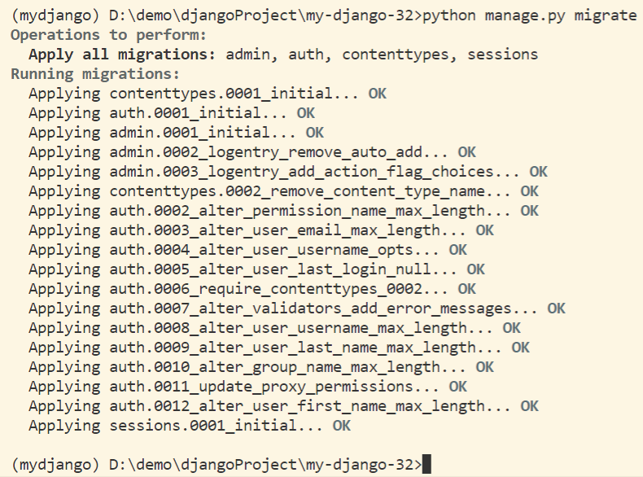

#### 2.2.2 创建模型

> polls/models.py

```python
# 导入标准 时间 模块
import datetime
from django.db import models
# 导入 Django 时区相关的工具模块
from django.utils import timezone

class Question(models.Model):
    question_text = models.CharField(max_length=200)
    pub_date = models.DateTimeField('date published')
    # 对象字符串化
    def __str__(self):
        return self.question_text
    def was_published_recently(self):
        return self.pub_date >= timezone.now()-datetime.timedelta(days=1)

class Choice(models.Model):
    question = models.ForeignKey(Question, on_delete=models.CASCADE)
    choice_text = models.CharField(max_length=200)
    votes = models.IntegerField(default=0)
    # 对象字符串化
    def __str__(self):
        return self.choice_text
```

- 常用字段名

| 字段名        | 参数           | 描述                     |
| ------------- | -------------- | ------------------------ |
| CharField     | max_length=200 | 字符字段，最大长度为 200 |
| DateTimeField |                | 时间字段                 |
| IntegerField  | default=0      | 整数字段，默认值是 0     |

- ForeignKey 外键：建立 Choice 类和 Question 类之间的关联关系。

#### 2.2.3 激活模型

- 添加 app 的点式路径

> mysite/settings.py

```python
INSTALLED_APPS = [
    'polls.apps.PollsConfig',
    ... # 原有的自动生成代码
]
```

【注：】[`INSTALLED_APPS`](https://docs.djangoproject.com/zh-hans/3.2/ref/settings/#std:setting-INSTALLED_APPS) 中不需要的应用在进行迁移前，可以自行注释或删除。

> 终端：安装 polls 应用

```python
python manage.py makemigrations polls
```

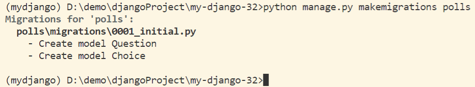

> 终端：再次进行数据迁移

```sh
python manage.py migrate
```

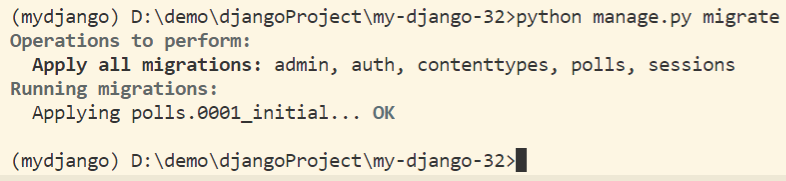

【***重点：官网原文***】每次改变模型 ***都需要*** 以下三步：

1. 编辑 `models.py` 文件，改变模型。
2. 运行 [`python manage.py makemigrations`](https://docs.djangoproject.com/zh-hans/3.2/ref/django-admin/#django-admin-makemigrations) 为模型的改变生成迁移文件。
3. 运行 [`python manage.py migrate`](https://docs.djangoproject.com/zh-hans/3.2/ref/django-admin/#django-admin-migrate) 来应用数据库迁移。


## 3 Django 管理页面

### 3.1 创建管理员账号

> 终端：创建管理员

```sh
python manage.py createsuperuser
```

后续输入用户名、邮箱、密码即可。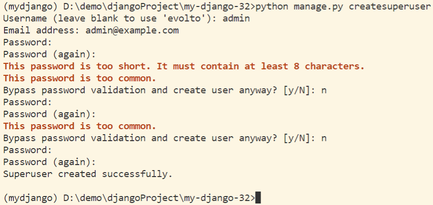

【注：】

- 在 cmd 中，键入的密码是不显示
- 此时会进行密码检查，过于简单或长度小于 8 个字符都会报错，也可以直接键入 y 确认
- 这里我们设置管理员用户名为 `admin` ，密码为 `qwer123456`

> 终端：修改 admin 管理员账号密码

```sh
python manage.py changepassword admin
```

### 3.2 启动开发服务器

> 终端：启动项目

```sh
python manage.py runserver
```

- 管理员登录界面

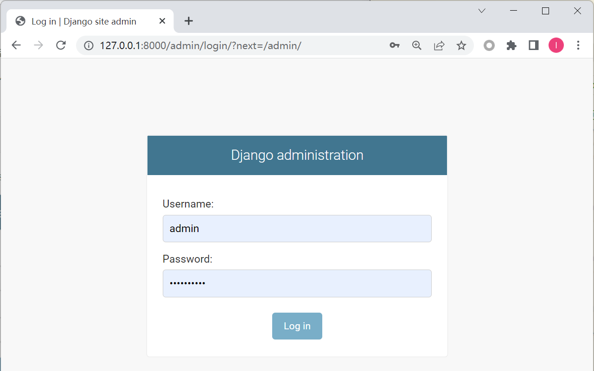

- 管理员站点界面

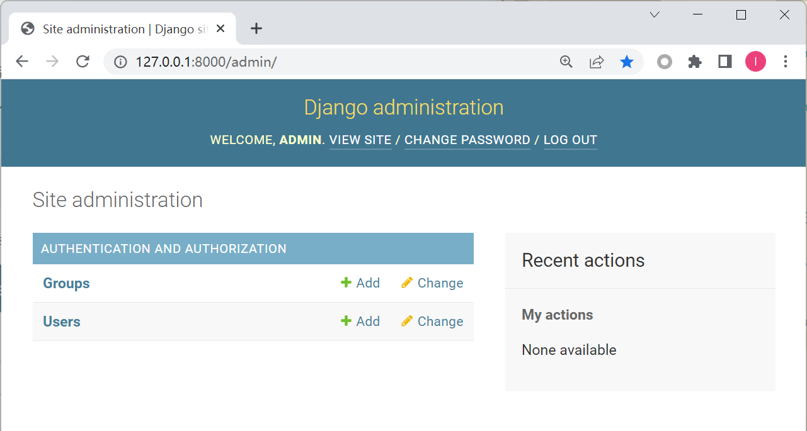

&emsp;&emsp;此时，我们可以看到，这里全是纯英文内容，为了方便起见我们改为中文显示。

> mysite/setting.py

&emsp;&emsp;先找到对应的语言设置 `LANGUAGE_CODE` 以及时区设置 `TIME_ZONE` 然后将其修改为：

```python
# 使用中文显示
LANGUAGE_CODE = 'zh-Hans'
# 修改时区为上海时间
TIME_ZONE = 'Asia/Shanghai'
```

- 此时保持运行状态，刷新页面即可

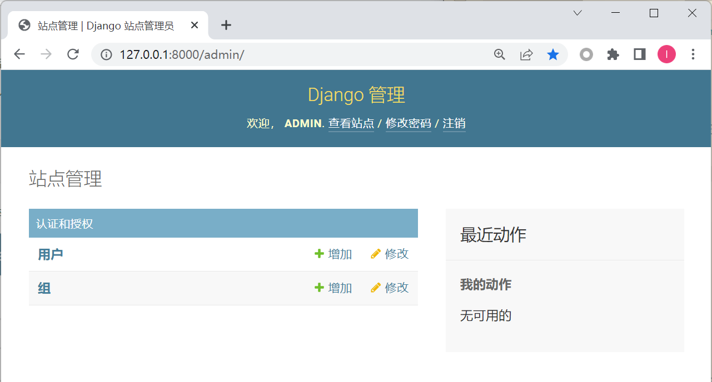

### 3.3 向管理页加入投票应用

&emsp;&emsp;向管理页面注册问题 Question 类，以此来为 Question 提供后台管理接口。

> polls/admin.py

```python
from django.contrib import admin
from .models import Question
admin.site.register(Question)
```

- 界面展示

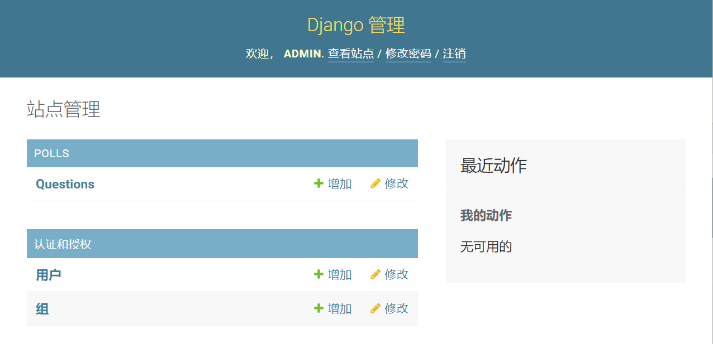


## 4 创建公用界面

### 4.1 添加多个视图

向 polls 应用中添加能够接收参数的视图函数。

> polls/views.py

```python
def detail(request, question_id):
    return HttpResponse("You're looking at question %s." % question_id)

def results(request, question_id):
    response = "You're looking at the results of question %s."
    return HttpResponse(response % question_id)

def vote(request, question_id):
    return HttpResponse("You're voting on question %s." % question_id)
```

添加 `url()` 函数调用视图函数。

> polls/urls.py

```python
urlpatterns = [
    # ex: /polls/
    path('', views.index, name='index'),
    # ex: /polls/5/
    path('<int:question_id>/', views.detail, name='detail'),
    # ex: /polls/5/results/
    path('<int:question_id>/results/', views.results, name='results'),
    # ex: /polls/5/vote/
    path('<int:question_id>/vote/', views.vote, name='vote'),
]
```

-  `<数据转换的数据类型:定义好的模式名/参数名>`
- 如 `<int:question_id>` 即为：将输入的 `question_id` 参数转换为整数类型

### 4.2 修改首页视图


> 创建应用的 `templates` 模板

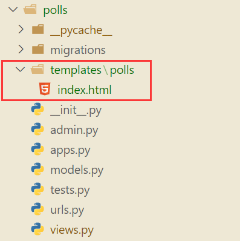

> polls/templates/polls/index.html

```python
<!DOCTYPE html>
<html lang="zh">
  <head>
    <meta charset="UTF-8" />
    <title>投票 - 首页</title>
  </head>
  <body>
    
    <ul>
      
      <li>
        <a href="/polls/{{ question.id }}/">{{ question.question_text }}</a>
      </li>
      
    </ul>
    
    <p>No polls are available.</p>
    
  </body>
</html>
```

载入上述模板文件内容，并向其传递字典对象的上下文。

> polls/views.py

```python
from django.http import HttpResponse
from django.template import loader
from .models import Question

def index(request):
    latest_question_list = Question.objects.order_by('-pub_date')[:5]
    template = loader.get_template('polls/index.html')
    context = {
        'latest_question_list': latest_question_list,
    }
    return HttpResponse(template.render(context, request))

# Leave the rest of the views (detail, results, vote) unchanged
```

使用快捷函数 `render()` 重构 `index()` 视图。

>polls/views.py

```python
from django.http import HttpResponse
from django.shortcuts import render
from .models import Question

def index(request):
    latest_question_list = Question.objects.order_by('-pub_date')[:5]
    context = {'latest_question_list': latest_question_list}
    return render(request, 'polls/index.html', context)
# ...
```

### 4.3 修改详情视图

#### 4.3.1 抛出 404 错误

>polls/views.py

```python
from django.http import HttpResponse, Http404
from django.shortcuts import render
from .models import Question
# ...
def detail(request, question_id):
    try:
        question = Question.objects.get(pk=question_id)
    except Question.DoesNotExist:
        raise Http404("Question does not exist")
    return render(request, 'polls/detail.html', {'question': question})
# ...
```

使用快捷函数 `get_object_or_404()` 重构 `detail()` 视图。

> polls/views.py

```python
from django.http import HttpResponse
from django.shortcuts import render, get_object_or_404
from .models import Question
# ...
def detail(request, question_id):
    question = get_object_or_404(Question, pk=question_id)
    return render(request, 'polls/detail.html', {'question': question})
# ...
```

#### 4.3.2 修改模板

> polls/templates/polls/detail.html

```python
<!DOCTYPE html>
<html lang="zh">
  <head>
    <meta charset="UTF-8" />
    <title>投票 - 详情</title>
  </head>
  <body>
    <h1>{{ question.question_text }}</h1>
    <ul>
      
      <li>{{ choice.choice_text }}</li>
      
    </ul>
  </body>
</html>
```

### 4.4 去除模板中的硬编码 URL

对首页模板的 a 标签链接进行修改。

> polls/templates/polls/index.html

```html
<a href="">
    {{ question.question_text }}
</a>
```

### 4.5 为 URL 名称添加命名空间

&emsp;&emsp;为了防止以后出现同名 URL 冲突，我们可以在 `polls/urls.py` 中加上 `app_name = 'polls'`  设置命名空间。

>polls/urls.py

```python
# ...
app_name = 'polls'
urlpatterns = [
    # ...
]
```

> polls/templates/polls/index.html

```html
<a href="">
    {{ question.question_text }}
</a>
```


## 5 详情页的表单处理

### 5.1 编写表单

> polls/templates/polls/detail.html

```html
<form action="" method="post">
    
    <fieldset>
        <legend><h1>{{ question.question_text }}</h1></legend>
        <p><strong>{{ error_message }}</strong></p>
        
        <input type="radio" name="choice" id="choice{{ forloop.counter }}" value="{{ choice.id }}">
        <label for="choice{{ forloop.counter }}">{{ choice.choice_text }}</label><br>
        
    </fieldset>
    <input type="submit" value="Vote">
</form>
```


> polls/views.py

```python
from django.http import HttpResponse, HttpResponseRedirect
from django.shortcuts import render, get_object_or_404
from django.urls import reverse
from .models import Choice, Question
# ...
def vote(request, question_id):
    question = get_object_or_404(Question, pk=question_id)
    try:
        selected_choice = question.choice_set.get(pk=request.POST['choice'])
    except (KeyError, Choice.DoesNotExist):
        # Redisplay the question voting form.
        # 重新显示问题投票表单
        return render(request, 'polls/detail.html', {
            'question': question,
            'error_message': "You didn't select a choice.",
        })
    else:
        selected_choice.votes += 1
        selected_choice.save()
        # Always return an HttpResponseRedirect after successfully dealing
        # with POST data. This prevents data from being posted twice if a
        # user hits the Back button.
        # 在成功处理 POST 数据后总是返回一个 HttpResponseRedirect,这可以防止用户点击后退按钮时数据被两次发布。
        return HttpResponseRedirect(reverse('polls:results', args=(question.id,)))
```


上一节：[01 Django 开发环境配置](./01Django开发环境配置.md)

下一节：[03 Django 项目实战（一）](./03Django项目实战(一).md)
