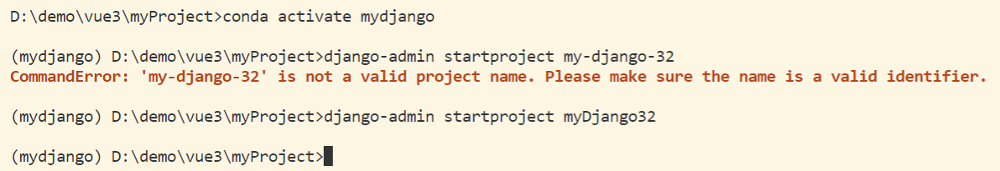
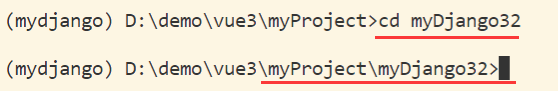
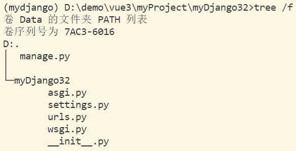
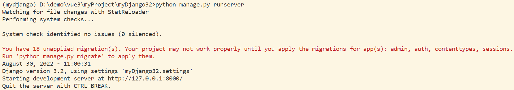
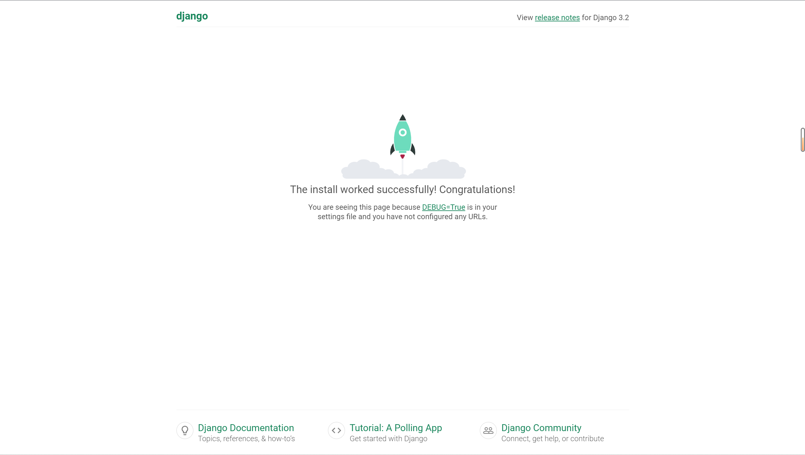
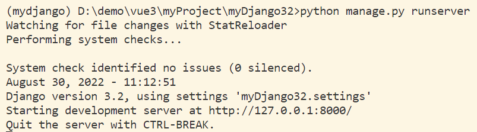
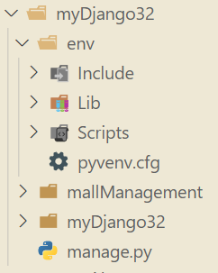
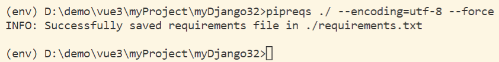
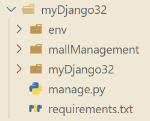
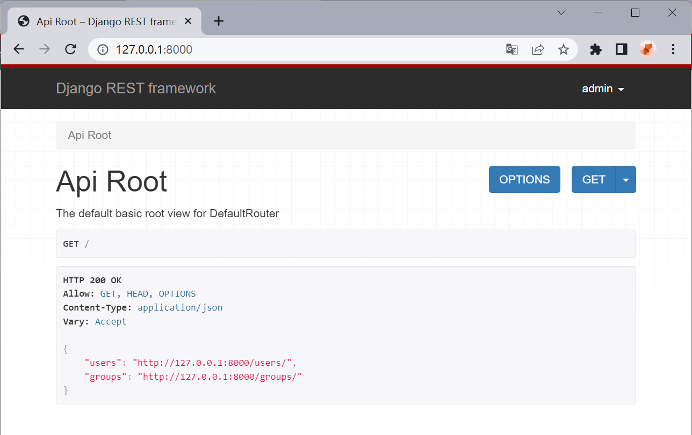

# 03 Django 项目实战（一）

&emsp;&emsp;本项目使用 Django3.2 版本进行开发，安装过程请参考 [Django 开发环境配置](./01Django开发环境配置.md) 。

## 一、创建项目

### 1.1 创建项目

>模板

```sh
django-admin startproject [项目名称]
```
> 创建名为 myDjango32 的 Django 项目

```sh
django-admin startproject myDjango32
```

【注】：

1. django 创建的新项目中会有一些默认的文件和文件夹
2. django 项目有命名规则，不得有空格和符号，不遵守就会报错，这里我们尽量采用驼峰命名法。



### 1.2 查看项目目录

> 切换到项目路径内

```sh
cd myDjango32
```



### 1.3 项目默认文件的介绍

> 查询当前目录所有子文件的树形结构

```sh
tree /f
```


> 当前项目目录结构说明

```
myDjango32
├─ manage.py            【项目管理,启动项目,创建app,数据库管理...】【不用改】【**经常使用**】
└─ myDjango32
    ├─ __init__.py		【标记本文件夹为应用目录】
    ├─ settings.py      【项目配置文件】【**经常修改**】
    ├─ urls.py          【全部的 URL 和函数对应关系】【**经常修改**】
    ├─ asgi.py          【默认接收网络请求】【不用改】
    └─ wsgi.py          【默认接收网络请求】【不用改】
```


## 二、创建应用

### 2.1 多 APP 共存

```
- 项目
    - app,用户管理【表结构、函数、HTML模板、CSS...】
    - app,订单管理【表结构、函数、HTML模板、CSS...】
    - app,后台管理【表结构、函数、HTML模板、CSS...】
    - app,网站【表结构、函数、HTML模板、CSS...】
    - app,API【表结构、函数、HTML模板、CSS...】
    ...
```
【注】：小型项目开发简洁,用不到多 APP，一般情况下项目只创建 1 个 APP 即可。

### 2.2 创建应用

> 模板

```sh
python manage.py startapp [APP名称]
```
> 创建名为 firstApp 的应用

```sh
python manage.py startapp mallManagement
```

【注】：此时一定要注意当前所在目录为项目根目录，同时也要遵守命名规则。

> 当前项目目录结构说明

```
├─ mallManagement
│  ├─ admin.py          【固定,不动】【django默认提供的admin后台管理】
│  ├─ apps.py           【固定,不动】【App启动类】
│  ├─ tests.py          【固定,不动】【单元测试】
│  ├─ models.py         【**重要**】【操作数据库】
│  ├─ views.py          【**重要**】【函数】
│  ├─ __init__.py       
│  │
│  └─migrations
│      └─ __init__.py   【固定,自生成】【数据迁移后的数据库变更记录】
|
├─ manage.py 
|
└─ myDjango32
    ├─ asgi.py
    ├─ settings.py
    ├─ urls.py          【URL -> 函数】
    ├─ wsgi.py
    └─ __init__.py
```

### 2.3 启动项目

#### 2.3.1 第一次运行

> 启动项目

```sh
python manage.py runserver
```

- 在终端启动项目：此时可以看到，因为未进行数据迁移操作，出现报错信息，但项目仍然成功启动。



- 项目页面：在浏览器输入 http://127.0.0.1:8000/ 即可访问当前本地运行的项目。



#### 2.3.2 数据迁移

&emsp;&emsp;由于之前未进行数据迁移，导致项目虽然成功运行，但仍然出现报错，所以我们需要先停止项目运行，在进行数据迁移后再运行项目。

> 停止项目运行 (键盘)

```
crtl + c
```

> 数据迁移

```sh
python manage.py migrate
```

> 再次启动项目

```sh
python manage.py runserver
```

&emsp;&emsp;此时我们可以看到，错误信息已经消失。每次对数据模型 `model` 进行修改后，都要进行数据迁移操作，这个我们后面再详细讲解。



#### 2.3.3 `runserver` 命令解析

&emsp;&emsp;在每次使用 `runserver` 启动项目时，都会使用 StatReloader 监视文件更改并执行系统检查，系统检查没有发现任何问题才能正式启动项目。同时，还能够查看当前项目使用的 Django 版本以及使用的 `settings` 设置为 `myDjango32.settings` 。在 http://127.0.0.1:8000/ 上启动开发服务器，使用 CTRL-BREAK 退出服务器。

## 三、使用 Django-admin 管理项目

### 3.1 创建超级用户

&emsp;&emsp;创建名为 `admin` ，邮箱为 `admin@example.com` 的超级管理用户，之后设置密码即可。

```sh
python manage.py createsuperuser --email admin@example.com --username admin
```

### 3.2 进入 admin 管理页

> 运行项目

```sh
python manage.py runserver
```

&emsp;&emsp;在浏览器中打开地址 http://127.0.0.1:8000/admin/ 后，输入密码可进入管理页面。


## 四、项目依赖包管理

### 4.1 创建项目虚拟环境

&emsp;&emsp;虽然我们使用了 conda 来管理 python 虚拟环境，但是对于不同项目，其所在的项目依赖各不相同，所以最好是对每个项目的依赖环境也进行隔离操作。

> python venv 创建项目虚拟环境

```python
python -m venv env
```

&emsp;&emsp;使用 `python -m venv` 命令创建名为 `env` 的虚拟环境，此时项目目录如下图所示。



> 激活虚拟环境

&emsp;&emsp;先确保当前所在目录为项目根目录，此时运行的操作系统为 Windows。

```sh
env\Scripts\activate
```

### 4.2 项目依赖包版本

参考文章：

1. [CSDN - python生成requirements.txt的两种方法](https://blog.csdn.net/weixin_45816954/article/details/124360305)
2. [CSDN - Python学习笔记（三）生成requirements.txt文件](https://blog.csdn.net/Xuanze_xx/article/details/107948638)

#### 4.2.1 安装 pipreqs

> 在 `env` 虚拟环境中安装 `pipreqs`

```sh
pip install pipreqs
```

#### 4.2.2 收集依赖包信息

&emsp;&emsp;使用 `pipreqs` 在指定目录下生成名为 `requirements.txt` 的文件，其内存放着本项目中所用到的所有依赖包的版本信息。

> 收集本项目依赖包版本信息

```sh
pipreqs ./ --encoding=utf-8 --force
```

- `./` ：在当前项目根目录（即 `manage.py` 所在的同目录）生成依赖包信息文件。

- `--encoding=utf-8` ：使用 `utf-8` 编码。
- `--force` ：若已存在 `requirements.txt` 文件，将强行覆盖原文件。



> 生成后的项目目录



#### 4.2.3 安装项目依赖

&emsp;&emsp;当项目在一个新的环境下运行时，直接执行以下命令，即可安装项目所需的依赖包。

```sh
pip install -r requirements.txt
```


## 五、配置项目的 `settings.py` 

&emsp;&emsp;以下操作均在 `myDjango32/settings.py` 中进行。下面我们将逐个讲解项目中常用的配置项。

&emsp;&emsp;有关此文件的更多信息，请参见：

- Django 官方中文：[Django 配置指南](https://docs.djangoproject.com/zh-hans/3.2/topics/settings/)，[Django 配置列表](https://docs.djangoproject.com/zh-hans/3.2/ref/settings/)
- Django 官方英文：[Django settings](https://docs.djangoproject.com/en/3.2/topics/settings/)

### 5.1 修改 `DATABASES` 配置

#### 5.1.1 系统默认配置

```python
DATABASES = {
    'default': {
        'ENGINE': 'django.db.backends.sqlite3',
        'NAME': BASE_DIR / 'db.sqlite3',
    }
}
```

#### 5.1.2 连接 mysql 数据库

参考文章：

1. [CSDN - django如何连接Mysql中已有的数据库](https://blog.csdn.net/changyana/article/details/122790568)
2. [知乎 - Python Django 3.2 学习第八天：数据库](https://zhuanlan.zhihu.com/p/387086739)

> `settisng.py` 中的 `DATABASES` 配置

```python
DATABASES = {
    'default': {
        'ENGINE': 'django.db.backends.mysql',
        'HOST': '127.0.0.1',    # 数据库主机
        "PORT" : "3306",    # 数据库端口
        "USER" : "*******",    # 数据库用户名
        "PASSWORD" : "******",   # 数据库用户密码
        "NAME" : "student"  # 数据库名字
    }
}
```

> 与 `settisng.py` 同目录下的 `__init__.py`

```python
import pymysql
pymysql.install_as_MySQLdb()
```

【注】：这里不写就无法正常连接 mysql 数据库。

#### 4.1.3 再次进行数据迁移

> 终端中输入

```sh
python manage.py migrate
```

### 5.2 注册 APP

&emsp;&emsp;项目中每个创建的应用如需正常使用，都需要在 `settings.py` 中添加应用。

> 在 `INSTALLED_APPS` 中添加应用

```python
INSTALLED_APPS = [
    ...
    'mallManagement.apps.MallmanagementConfig',
]
```

### 5.3 修改语言和时区

#### 5.3.1 系统默认配置

&emsp;&emsp;系统默认为英语 + UTC 世界时间。

```python
LANGUAGE_CODE = 'en-us'

TIME_ZONE = 'UTC'
```

#### 5.3.2 修改语言和时区

&emsp;&emsp;现在我们修改为中文 + 上海时间。

```python
LANGUAGE_CODE = 'zh-hans'

TIME_ZONE = 'Asia/Shanghai'
```


## 编写URL和视图函数对应关系 `urls.py`


## 使用 Django Rest Framework

- Django Rest Framework 官网：https://www.django-rest-framework.org/

- 以下将 Django Rest Framework 简称为 DRF。
- 需要哪一个应用使用 DRF 就在哪一个应用目录下进行相关配置。

### 1 快速启动

#### 1.1 安装 DRF

```sh
pip install djangorestframework
```

#### 1.2 添加 `serializers.py` 文件

&emsp;&emsp;在项目的应用目录下，新建 `serializers.py` 文件，下面我们将用它来表示数据。

```python
from django.contrib.auth.models import User, Group
from rest_framework import serializers

class UserSerializer(serializers.HyperlinkedModelSerializer):
    class Meta:
        model = User
        fields = ['url', 'username', 'email', 'groups']

class GroupSerializer(serializers.HyperlinkedModelSerializer):
    class Meta:
        model = Group
        fields = ['url', 'name']
```

#### 1.4 Views 视图配置

&emsp;&emsp;在项目的应用目录下的 `views.py` 文件内添加如下内容：

【注】： `serializers.py` 的位置根据实际情况对引入路径进行修改。

```python
from django.contrib.auth.models import User, Group
from rest_framework import viewsets
from rest_framework import permissions
from mallManagement.serializers import UserSerializer, GroupSerializer


class UserViewSet(viewsets.ModelViewSet):
    """
    API endpoint that allows users to be viewed or edited.
    """
    queryset = User.objects.all().order_by('-date_joined')
    serializer_class = UserSerializer
    permission_classes = [permissions.IsAuthenticated]


class GroupViewSet(viewsets.ModelViewSet):
    """
    API endpoint that allows groups to be viewed or edited.
    """
    queryset = Group.objects.all()
    serializer_class = GroupSerializer
    permission_classes = [permissions.IsAuthenticated]
```

#### 1.5 Urls 路由配置

```python
from django.contrib import admin
from django.urls import include, path
from rest_framework import routers
from mallManagement import views

router = routers.DefaultRouter()
router.register(r'users', views.UserViewSet)
router.register(r'groups', views.GroupViewSet)

# Wire up our API using automatic URL routing.
# Additionally, we include login URLs for the browsable API.
urlpatterns = [
    path('admin/', admin.site.urls),
    path('', include(router.urls)),
    path('api-auth/', include('rest_framework.urls', namespace='rest_framework'))
]
```

#### 1.6 配置 `settings`

> 添加分页

```python
REST_FRAMEWORK = {
    # 分页控制每页返回多少对象
    'DEFAULT_PAGINATION_CLASS': 'rest_framework.pagination.PageNumberPagination',
    'PAGE_SIZE': 10
}
```

> 注册 app

&emsp;&emsp;在 `settings.py` 的 `INSTALLED_APPS` 中添加 `'rest_framework'`

```python
INSTALLED_APPS = [
    ...
    'rest_framework',
]
```

#### 1.7 登录页面

> 运行项目

```sh
python manage.py runserver
```

&emsp;&emsp;在浏览器中打开地址 http://127.0.0.1:8000/ 后即可进入 DRF 页面。



### 2 


上一节：[02 Django 官网示例](./02Django官网示例.md)

下一节：[04 Django 项目实战（二）](./04Django项目实战(二).md)
