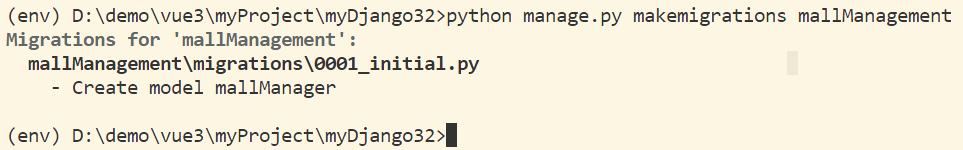
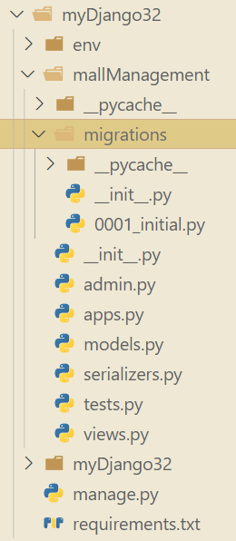
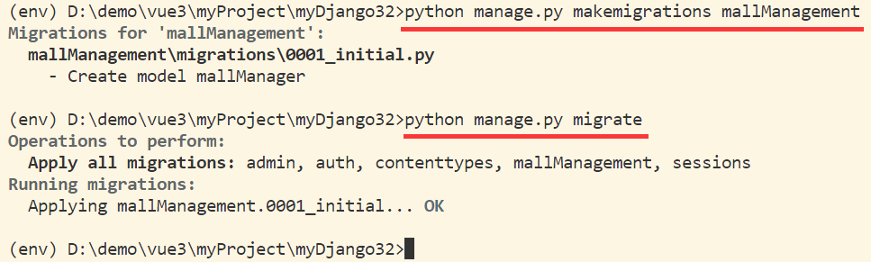
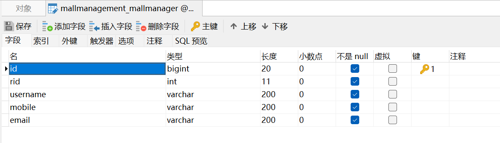

# 04 Django 项目实战（二）

书接上回：[03 Django 项目实战（一）](./03Django项目实战(一).md)

## 一、用户数据配置

### 1.1 创建用户模型

&emsp;&emsp;在应用中的 `models.py` 即 `mallManagement/models.py` 中定义数据模型。

> 创建商场管理员数据模型

```python
class mallManager(models.Model):
    # 用户角色 ID
    rid = models.IntegerField()
    username = models.CharField(max_length=200)
    mobile = models.CharField(max_length=200)
    email = models.EmailField(max_length=200)
```

### 1.2 激活模型

> mallManagement/settings.py

&emsp;&emsp;向 Django 告知 `mallManagement` 应用下 `apps.py` 文件中定义的一个应用配置类。

```python
INSTALLED_APPS = [
    'mallManagement.apps.MallmanagementConfig',
    ...
]
```

### 1.3 数据迁移

>生成数据库迁移脚本

```sh
python manage.py makemigrations mallManagement
```

&emsp;&emsp;这条命令是让 Django 去查看 `mallManagement` 这个 app 下的 `models.py` 文件，我们已经修改了数据定义， 你现在去产生对应的更新脚本。

- 终端运行结果



&emsp;&emsp;在执行后会产生 `migrations` 文件夹，其内的 `0001_initial.py` 即为接下来对数据库进行操作的代码。

- 当前项目目录



> 应用迁移脚本迁移数据

```sh
python manage.py migrate
```

&emsp;&emsp;此时根据前面生成的数据库操作代码，就可以创建用户数据表了。

- 数据库迁移的生成和应用



**【特别注意】**：每次修改 models.py 文件都要进行以上操作，使得数据库同步修改结果。

### 1.4 查看生成的数据表



### 1.5 Django-admin 管理数据

&emsp;&emsp;为了方便管理数据表，我们需要在管理员配置文件中插入定义好的数据模型。

> mallManagement/admin.py

```python
...
from .models import mallManagement
admin.site.register(mallManagement)
```


上一节：[03 Django 项目实战（一）](./03Django项目实战(一).md)

下一节：暂无